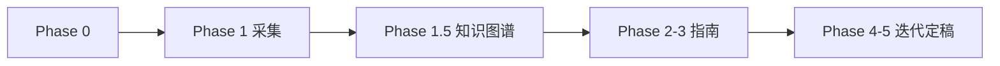

# CG 课程 × NotebookLM 学习 Skill

> **课程**：计算机图形学（CG）  
> **Notebook**：`c46f03a0-be2e-4cbb-8172-24a3ee0fce88`（计算机图形学 Notebook；短前缀在 Python API 下会 RPC 失败）  
> **仓库根**：含 `notebooklm-raw/` 与 `guides/` 的项目目录

## 何时启用

- 新周次/新模块：设计 manifest → 采集 → 知识图谱 → 学习指南
- 补采：`supplement-*` batch 或 `--only` 续跑
- 整合迭代：Review 追问回写指南

**不启用**：纯概念答疑（无新周次产出）、与课程流水线无关的任务。

## 角色分工

| 角色 | 职责 |
|------|------|
| NotebookLM | 单问单答，标注来源 |
| `nlm-collect.py` | 认证、代理、采集、重试、落盘 |
| Agent | manifest、通读 raw、知识图谱、叙事整合、追问回写 |
| 用户 | Review、定稿、Windows 侧刷新认证 |

**原则**：Agent 以 raw 为素材，必须补：全景节、空间/几何直觉、公式与矩阵含义、渲染管线图、易混对比、追问直观块。

## 六阶段流程

```
Phase 0   资料盘点（本地目录 + NotebookLM source 对齐）
Phase 1   采集（manifest + nlm-collect.py → notebooklm-raw/）
Phase 1.5 通读全部 *.answer.md → knowledge-graph.md  ★不可跳过
Phase 2   按图谱写 guides/CG-Week*-学习指南.md
Phase 3   叙事线、mermaid、追问块  ★不可跳过
Phase 4   用户 Review 迭代
Phase 5   定稿（checklist.md）
```



## Phase 0：资料盘点

1. 对齐本地计算机图形学课件、课堂记录、作业/项目说明与 NotebookLM source list
2. 更新 `guides/CG课程-内容梳理.md` 进度
3. 标注缺失周次、缺失课件与作业关联

## Phase 1：采集

### 命令（在仓库根目录执行）

```bash
cd <repo>
export HTTPS_PROXY=http://127.0.0.1:7897 HTTP_PROXY=http://127.0.0.1:7897
NLM=.cursor/skills/cg-course-notebooklm/scripts/nlm-collect.py

# 预览
python $NLM notebooklm-raw/manifests/<module>.json --dry-run

# 完整采集
python $NLM notebooklm-raw/manifests/<module>.json --delay 8

# 续跑 / 补采
python $NLM notebooklm-raw/manifests/<module>.json \
  --resume notebooklm-raw/<module>/runs/latest

python $NLM notebooklm-raw/manifests/<module>.json \
  --only <batch-id> --resume notebooklm-raw/<module>/runs/latest

# 合并补采 run
python $NLM merge-runs <src_run> <dst_run>
```

### Manifest 设计原则

- **一个 batch = 一个 chat**（`clear_conversation: true`）
- 复杂主题拆开（如变换矩阵 / 投影 / 光照模型 / 光栅化 / 纹理映射各一问）
- 字段：`id`, `layer`, `priority`, `title`, `prompt`, `clear_conversation`
- 模板：`templates/manifest-template.json`
- 范例路径：`notebooklm-raw/manifests/weekX-Y.json`

### Prompt 必含

中文；点名周次+课件编号；要求标注来源；L1 要几何/视觉直觉，L3 要矩阵、坐标或数值例；禁止一 prompt 多问。

### 采集产出

```
notebooklm-raw/<module>/runs/<ts>/
  run.meta.json, run.log, *.prompt.txt, *.answer.md
notebooklm-raw/<module>/runs/latest → 最近 completed run
```

完成判定：存在非空 `*.answer.md`。详见 `docs/raw-data.md`。

## Phase 1.5：知识图谱（必须先于指南正文）

1. **通读** `runs/latest/*.answer.md` 全部 batch
2. **审计**与课纲偏差（NotebookLM 可能混入其他周内容）
3. 产出 `notebooklm-raw/<module>/knowledge-graph.md`：

| 必填节 | 内容 |
|--------|------|
| 认知阶梯 | mermaid flowchart，顺序≠采集顺序 |
| 节点清单 | 认知目标 \| batch \| 关键素材 \| Agent 须补充 |
| 叙事承接表 | 章节 \| 要回答 \| 承接 \| 引出 \| raw |
| batch→章节映射 | 整合深度标注 |
| 课纲审计 | 偏差说明 |

## Phase 2–3：整合学习指南

**详细规范**：`docs/integration-guide.md`（叙事、语言、mermaid、文档结构）

**硬性要求**：

- 每个大模块（几何变换、投影、光照、光栅化、纹理、曲线曲面等）先有**全景节**（学什么、学完能做什么），再进公式
- 章级「叙事线」+ 节级「本节要回答」+ 小结→承接
- ≥3 张 mermaid/ASCII 管线图，≥2 组易混对比表，≥3 处追问/直观理解块
- 公式和代码必须解释几何意义、坐标系位置、输入输出与常见误差

**产出**：`guides/CG-Week{N}-学习指南.md` 或 `guides/CG-Week{N-M}-学习指南.md`

## Phase 4：用户追问补充

1. 追加 manifest batch：`supplement-<主题>`
2. `--only supplement-xxx --resume runs/latest`
3. 回写指南：`> **追问：**` / `> **直观理解：**` / 对比表 / 管线图

## Phase 5：定稿

跑 `docs/checklist.md`，更新 `guides/CG课程-内容梳理.md`，用户确认。

## 环境与排错

**认证 SOP（权威）**：`~/service/openclaw/workspace/skills/notebooklm-integration/docs/auth-sop.md`

见 `docs/troubleshooting.md`：认证、代理 `127.0.0.1:7897`、超时重试。

**能力检查记录**：`notebooklm-raw/capability-check.md`。2026-06-25 已复用 Windows 侧 storage，同步后 `sync-auth --check`、`notebooklm list --json`、CG Notebook `source list --json` 通过。

**Agent 禁止**：`notebooklm login`、WSL 浏览器、从 WSL 调 Windows 登录、`sync-auth --refresh`。

## 本 Skill 目录

```
.cursor/skills/cg-course-notebooklm/
├── SKILL.md
├── scripts/nlm-collect.py
├── docs/
│   ├── integration-guide.md
│   ├── raw-data.md
│   ├── checklist.md
│   └── troubleshooting.md
└── templates/
    └── manifest-template.json
```

## 禁止事项

- 未通读 raw / 未产出知识图谱就写指南
- 大模块无全景节直接推导
- 只粘贴 NotebookLM 输出不做叙事串联
- 一次 prompt 问整周内容
- Agent 在 WSL 尝试 `notebooklm login` 或浏览器登录（见 auth-sop.md）
- Agent 编造公式、图示或坐标推导不标注来源
