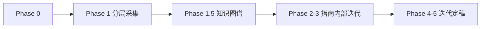

# CG 课程 × NotebookLM 学习 Skill

> **课程**：计算机图形学（CG）  
> **Notebook**：`c46f03a0-be2e-4cbb-8172-24a3ee0fce88`（计算机图形学 Notebook；短前缀在 Python API 下会 RPC 失败）  
> **仓库根**：含 `notebooklm-raw/` 与 `guides/` 的项目目录

## 何时启用

- 新周次/新模块：设计 manifest → 采集 → 知识图谱 → 学习指南
- 补采：`supplement-*` batch 或 `--only` 续跑
- 整合迭代：Review 追问回写指南

**不启用**：纯概念答疑（无新周次产出）、与课程流水线无关的任务。

## 角色分工

| 角色 | 职责 |
|------|------|
| NotebookLM | 单问单答，标注来源 |
| `nlm-collect.py` | 认证、代理、采集、重试、落盘 |
| Agent | manifest、通读 raw、知识图谱、叙事整合、追问回写 |
| 用户 | Review、定稿、Windows 侧刷新认证 |

**原则**：raw 收集阶段覆盖优先于精炼，宁可多问骨架、拆分、例题和难点；指南整合阶段再按重要程度取舍。Agent 以 raw 为素材，必须补：全景节、空间/几何直觉、公式与矩阵含义、渲染管线图、易混对比、追问直观块。

## 六阶段流程

```
Phase 0   资料盘点（本地目录 + NotebookLM source 对齐）
Phase 1   分层采集（manifest + nlm-collect.py → notebooklm-raw/）
Phase 1.5 通读全部 *.answer.md → knowledge-graph.md  ★不可跳过
Phase 2   按图谱写 guides/CG-Week*-学习指南.md 基础框架
Phase 3   补充、重点深挖、Mermaid、内部 Review 迭代  ★不可跳过
Phase 4   用户 Review 迭代
Phase 5   定稿（checklist.md）
```



## Phase 0：资料盘点

1. 对齐本地计算机图形学课件、课堂记录、作业/项目说明与 NotebookLM source list
2. 更新 `guides/CG课程-内容梳理.md` 进度
3. 标注缺失周次、缺失课件与作业关联

## Phase 1：动态分层采集（v4.1）

### 命令（在仓库根目录执行）

```bash
cd <repo>
export HTTPS_PROXY=http://127.0.0.1:7897 HTTP_PROXY=http://127.0.0.1:7897
export https_proxy=http://127.0.0.1:7897 http_proxy=http://127.0.0.1:7897
NLM=.cursor/skills/cg-course-notebooklm/scripts/nlm-collect.py

# 预览
python $NLM notebooklm-raw/manifests/<module>.json --dry-run

# 完整采集
python $NLM notebooklm-raw/manifests/<module>.json --delay 8

# 续跑 / 补采
python $NLM notebooklm-raw/manifests/<module>.json \
  --resume notebooklm-raw/<module>/runs/latest

python $NLM notebooklm-raw/manifests/<module>.json \
  --only <batch-id> --resume notebooklm-raw/<module>/runs/latest

# 合并补采 run
python $NLM merge-runs <src_run> <dst_run>
```

### Manifest 设计原则（multi-stage dynamic manifest）

- **raw 覆盖优先**：raw 阶段获取足够全面、优质、可选择的材料；指南阶段再判断取舍、易混对比和最终叙事。
- **Manifest 必须动态生成**：不要一次性写完整 Part 的所有固定 batch。每个正式阶段跑完后，Agent 必须通读上一阶段 raw，写出 summary / focus map，再生成下一阶段 manifest。
- **仍按 Part / module 组织**：每个 Part 独立 manifest、run、stage summary、focus map、knowledge-graph；必要时为同一 Part 增加 `stage4-*` 或 `supplement-*`。
- 复杂主题拆开（如变换矩阵 / 投影 / 光照模型 / 光栅化 / 纹理映射各一问），但拆分依据必须来自 stage-1/2 raw，而不是只凭通用 CG 常识。
- 字段：`id`, `stage`, `layer`, `priority`, `title`, `prompt`, `clear_conversation`；metadata 建议写入 `stage_input_summary` 或 `focus_map_ref`。
- 模板：`templates/manifest-template.json`
- 范例路径：`notebooklm-raw/manifests/weekX-Y-stage1.json`、`weekX-Y-stage2.json`、`weekX-Y-stage3.json`

### clear_conversation 策略

- **正式主路径**：一个 batch = 一个可追溯 raw 样本，`clear_conversation: true`。这样每个回答不依赖 NotebookLM chat history，便于复现、审计和定位污染。
- **跨阶段反馈**：上一阶段结果不靠 NotebookLM 历史上下文传递。Agent 读取 `*.answer.md` 后，把 stage summary / focus map 明确写入下一阶段 prompt 或 manifest metadata。
- **探索性连续追问**：可以临时设 `clear_conversation: false`，但 batch 必须标记 `exploratory: true`，落盘到探索记录；不得作为最终可复现 raw 主路径，除非重写成正式 batch 并重新采集。

### Stage 设计与 raw 获取顺序

| Stage | batch id 建议 | 目标 | 进入下一阶段的 Agent 产物 |
|-------|---------------|------|--------------------------|
| Stage 1 skeleton / slide-skeleton | `overview-skeleton`、`slide-skeleton-<slides>` | 固定少量总结类问题；按 Part / 课件原序梳理真实内容骨架、顺序、重点、来源 | `stage1-summary.md`；列出真实模块、source 匹配、缺失和 stage-2 问题草案 |
| Stage 2 module expansion / concept breakdown | `concept-breakdown-<module>`、必要的 `slide-module-detail-*` | 根据 stage-1 真实模块展开子知识点、基础解释、管线/坐标位置 | `focus-map.md`；标注 critical / important / normal、难点、缺口和 stage-3 目标 |
| Stage 3 targeted deep dive / examples / visual explanation | `deep-dive-<topic>`、`examples-<topic>`、`visual-explain-<topic>` | 仅对重点难点或高价值主题深挖公式、例题、图形直觉、视觉解释 | 可直接进入 knowledge-graph，或列出 stage-4 候选 |
| Optional Stage 4 | `misconceptions-<topic>`、`project-bridge`、`glossary-raw`、`supplement-*` | 仅当 stage-2/3 显示确有价值时追加易混点、项目桥接、术语 raw 或缺口补采 | `review-iteration.md` 记录为什么追加 |

反例：`misconceptions-*`、`project-bridge` 不宜放在最早固定 raw 中一次跑完。它们更适合作为 Agent 读完 stage-2/3 后的追问或整合项。

### Prompt 必含

中文；点名 Part、周次和课件编号；明确 source 范围；要求标注来源；L1 要几何/视觉直觉，L3 要矩阵、坐标或数值例；禁止一 prompt 多问。课件 prompt 必须包含“请仅依据/仅限以下课件”，并要求按课件顺序输出模块、重要图片、示例和例题。

### 采集产出

```
notebooklm-raw/<module>/runs/<ts>/
  run.meta.json, run.log, *.prompt.txt, *.answer.md
notebooklm-raw/<module>/runs/latest → 最近 completed run
```

完成判定：存在非空 `*.answer.md`。详见 `docs/raw-data.md`。

## Phase 1.5：知识图谱（必须先于指南正文）

1. **通读** `runs/latest/*.answer.md` 全部 batch
2. **审计**与课纲偏差（NotebookLM 可能混入其他周内容）
3. 产出 `notebooklm-raw/<module>/knowledge-graph.md`：

| 必填节 | 内容 |
|--------|------|
| 认知阶梯 | Mermaid flowchart，顺序≠采集顺序 |
| 节点清单 | 认知目标 \| batch \| 关键素材 \| Agent 须补充 |
| 叙事承接表 | 章节 \| 要回答 \| 承接 \| 引出 \| raw |
| batch→章节映射 | 整合深度标注 |
| 课纲审计 | 偏差说明 |

## Phase 2–3：整合学习指南

**详细规范**：`docs/integration-guide.md`（叙事、语言、Mermaid、文档结构）

**硬性要求**：

- 每个大模块（几何变换、投影、光照、光栅化、纹理、曲线曲面等）先有**全景节**（学什么、学完能做什么），再进公式
- 章级「叙事线」+ 节级「本节要回答」+ 小结→承接
- ≥3 张 Mermaid/ASCII 管线图，≥2 组易混对比表，≥3 处追问/直观理解块
- 公式和代码必须解释几何意义、坐标系位置、输入输出与常见误差
- 非代码数学表达优先使用 Markdown LaTeX 渲染；公式、矩阵、参数方程、齐次坐标点/向量表示不要误放进 `text` 代码块
- 期末为英语考试：术语表和正文首次出现的专业术语必须写成 `中文(English)`；英文缩写写成 `Abbr(Full English Name，中文对照)`，并用一句话解释
- 首次出现的专业术语、算法名、坐标空间、矩阵名必须纳入术语表或局部术语块；内部 Review 要专门排查未解释术语
- 核心章节附近使用简短 `参考 raw` 引用块；最终指南不得用末尾长表集中堆“资料索引”
- 最终指南不得包含 `Step 4 补充采集说明`、补采计划或 manifest 计划；这些内容放到 `review-iteration.md`、`focus-map.md` 或采集说明文档
- Markdown 表格要检查未转义竖线，表格内绝对值优先写为 `abs(m)`，避免竖线绝对值写法破坏渲染
- 不得一次写完就交付：必须经历「基础框架 → 基础补充 → 重难点深挖 → 内部 Review → 迭代整合 → 再 Review」后，才进入用户 Review。

**产出**：`guides/CG-Week{N}-学习指南.md` 或 `guides/CG-Week{N-M}-学习指南.md`

## Phase 4：用户追问补充

Phase 4 是用户 Review，不替代 Agent 内部自审。用户看到前，Agent 应已完成至少一轮内部 Review 和迭代整合。

1. 追加 manifest batch：`supplement-<主题>`
2. `--only supplement-xxx --resume runs/latest`
3. 回写指南：`> **追问：**` / `> **直观理解：**` / 对比表 / 管线图

## Phase 5：定稿

跑 `docs/checklist.md`，更新 `guides/CG课程-16周内容梳理.md`，用户确认。

## 环境与排错

**认证 SOP（权威）**：`~/service/openclaw/workspace/skills/notebooklm-integration/docs/auth-sop.md`

**代理要求**：WSL 访问 `notebooklm.google.com` 必须走 `http://127.0.0.1:7897`。`nlm-collect.py` 会为 `sync-auth`、NotebookLM CLI、`notebooklm-py/httpx` 同时设置 `HTTP_PROXY`、`HTTPS_PROXY`、`http_proxy`、`https_proxy`；手工探测时也要导出四个变量。

**notebooklm-py v0.3.4 API**：Python API 需先用 storage cookies 异步构造 `AuthTokens`（会 fetch `csrf_token`/`session_id`），再传给 `NotebookLMClient(auth, timeout=...)`；`ask` 结果正文使用 `AskResult.answer`，脚本保留 `text` fallback。

见 `docs/troubleshooting.md`：认证、代理 `127.0.0.1:7897`、超时重试。

**能力检查记录**：`notebooklm-raw/capability-check.md`。2026-06-25 已复用 Windows 侧 storage，同步后 `sync-auth --check`、`notebooklm list --json`、CG Notebook `source list --json` 通过。

**Agent 禁止**：`notebooklm login`、WSL 浏览器、从 WSL 调 Windows 登录、`sync-auth --refresh`。

## 本 Skill 目录

```
.cursor/skills/cg-course-notebooklm/
├── SKILL.md
├── scripts/nlm-collect.py
├── docs/
│   ├── integration-guide.md
│   ├── raw-data.md
│   ├── checklist.md
│   └── troubleshooting.md
└── templates/
    └── manifest-template.json
```

## 禁止事项

- 未通读 raw / 未产出知识图谱就写指南
- 大模块无全景节直接推导
- 只粘贴 NotebookLM 输出不做叙事串联
- 一次 prompt 问整周内容
- Agent 在 WSL 尝试 `notebooklm login` 或浏览器登录（见 auth-sop.md）
- Agent 编造公式、图示或坐标推导不标注来源
- 最终学习指南中保留采集计划、补采说明或长篇 raw 索引
- 专业术语首次出现不解释，或未按英语考试格式提供英文对照
- Markdown 表格中使用未转义 `|` 导致渲染破坏
- 非代码公式、矩阵或参数方程误用行内代码 / `text` 代码块，导致 Markdown 渲染效果差
