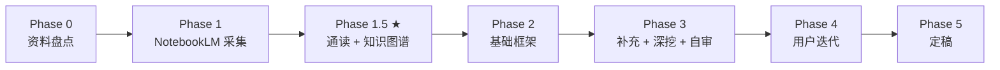

# 学习指南整合规范

> **版本**：v2.1（动态分层 raw + 内部迭代版）  
> **配套**：`.cursor/skills/cg-course-notebooklm/SKILL.md`  
> **标杆产出**：`guides/CG-Week*-学习指南.md`  
> **标杆图谱**：`notebooklm-raw/<module>/knowledge-graph.md`

---

## 1. 整合工作流（六阶段）



| 阶段 | 输入 | 输出 | 禁止跳过 |
|------|------|------|---------|
| **1.5 通读** | `runs/<ts>/*.answer.md` 全部 | `notebooklm-raw/<module>/knowledge-graph.md` | 必须 |
| **2 框架** | 知识图谱 + raw | `guides/CG-Week*-学习指南.md` 基础框架 | - |
| **3 迭代** | 基础框架 + raw | 补齐内容、重难点、Mermaid/ASCII、追问块、自审记录 | 必须 |

**Phase 1.5 必做三件事**：

1. **通读**该模块全部 `*.answer.md`（不是只看摘要或 Agent 记忆）
2. **审计**：与课纲/课程索引对照，标注 NotebookLM 偏差
3. **产出知识图谱**：认知阶梯、节点→raw 映射、叙事承接表、管线/坐标图草图
4. **标注深度**：每个节点标为 `核心 / 重要 / 了解`，并列出需要补采或 Agent 深挖的缺口

未完成 Phase 1.5 **不得**开始写指南正文。

### 1.1 内部迭代流

用户 Review 前，Agent 至少完成一轮内部「整合 → Review → 迭代整合 → Review」。不要把第一次拼出的初稿直接交给用户。

| 轮次 | 目标 | 必做动作 | 输出检查 |
|------|------|----------|----------|
| Draft 0 | 基础框架 | 按知识图谱搭章节层次，先写清全景、核心问题、术语表、资料索引 | 结构完整但可暂缺细节 |
| Draft 1 | 基础补充 | 回到 raw 补齐每节基础解释、来源、公式/坐标含义、管线位置 | 每节能独立读懂 |
| Draft 2 | 重难点深挖 | 对核心/难点补直观解释、例题、形象比喻、易混对比、常见错误 | 重点不只停留在定义 |
| Draft 3 | 可视化与串联 | 引入合适 Mermaid/ASCII 图；补章间承接、前后周/Project 桥接 | 知识点之间连成线 |
| Review | 自审迭代 | 按 `checklist.md` 找缺口；必要时追加 `supplement-*` raw | 进入用户 Review 前已修过一轮 |

---

## 2. 认知编排原则

### 2.1 先「图形问题」，再「数学工具」

每个大模块正文开始前，必须有**全景节**：

| 要素 | 要求 |
|------|------|
| 模块解决什么图形问题 | 一句话 + 与前后模块衔接 |
| 学完能做什么 | 3–5 条可检验能力（画管线 / 推矩阵 / 写伪代码 / 判断易错点） |
| 内部结构预告 | 问题链、渲染管线或坐标变换图 |
| 自检问题 | 「读完本节你应该能回答…」 |

**反例**：直接进入齐次坐标矩阵，读者不知道这个矩阵在屏幕成像中负责什么。  
**正例**：先讲「模型如何从局部坐标走到屏幕像素」，再讲 Model/View/Projection 矩阵。

### 2.2 认知阶梯（由浅入深）

```text
L0 定位与动机 → L1 几何/视觉直觉 → L2 符号、坐标系与对象
  → L3 公式、矩阵、算法机制 → L4 数值/图形例子
  → L5 工程管线 / 伪代码 → L6 跨模块串联
```

整合顺序按**读者认知阶梯**，不是 manifest 采集顺序。

### 2.3 raw 深度取舍

raw 采集尽量全，指南整合要分层：

| raw 类型 | 指南处理 |
|----------|----------|
| Stage 1 `overview-skeleton` / `slide-skeleton-*` | 转成真实课程骨架、章节顺序和 source 对齐，不直接大段粘贴 |
| `stage1-summary.md` | 作为 stage-2 manifest 的显式输入，记录真实模块、偏差和缺失 |
| Stage 2 `concept-breakdown-*` / `slide-module-detail-*` | 作为核心知识的基础解释，合并重复、补来源 |
| `focus-map.md` | 标注 critical / important / normal、难点、缺口，决定 stage-3 是否追问 |
| Stage 3 `deep-dive-*` / `examples-*` / `visual-explain-*` | 放入重难点、追问、直观理解、公式/矩阵意义和可跟读例题 |
| Optional Stage 4 `misconceptions-*` / `project-bridge` / `glossary-raw` | 仅当 focus map 显示确有价值时汇总到易混点、Project/代码/考试复习或术语表 |

### 2.4 三层叙事（每章必查）

**（1）章级叙事线**，大节开头：

```markdown
> **本节叙事线**：
> A. [图形问题是什么？] → B. [坐标/数据如何表示？] → C. [算法如何处理？] → …
```

**（2）节级「要回答」**，每子节首行：

```markdown
> **本节要回答**：[一个具体、可检验的问题]
```

**（3）节间衔接**，每节末尾：

```markdown
**A 节小结**（≤3 条）→ 抛出追问「…？」

---

#### B. [下节]
> **承接 A 节**：[A 留下了什么未解决问题；B 为何必要]
```

---

## 3. 语言风格

### 3.1 基调

| 做 | 不做 |
|----|------|
| 完整句、口语化但准确 | 电报式罗列、标题堆砌 |
| 视觉直觉 + 几何意义 + 数学意义 | 只有公式没有「它在图形管线里干什么」 |
| 「你」称呼读者；主动语态 | 被动堆砌 |
| 先直觉后公式 | 先矩阵后补一句解释 |

### 3.2 固定块格式

| 块类型 | 语法 | 何时用 |
|--------|------|--------|
| **追问** | `> **追问：…**` + 解答 | 读者自然会问的「为什么」 |
| **直观理解** | `> **直观理解：…**` | 矩阵、投影、光照、采样不直观时 |
| **对比表** | Markdown 表格 | 易混概念对（≥2 组/模块） |
| **代码直觉** | fenced `cpp` / `python` / `glsl` | 渲染管线、光栅化、着色器、作业相关处 |

### 3.3 来源标注

- 节末：`（来源：Week N 记录、课件 0N、Project 文档）`
- 课纲冲突：`> **课纲注**：[以课堂记录/课件为准]`

### 3.4 详细程度基准

| 类型 | 深度 |
|------|------|
| **核心** | 几何直觉 + 符号表 + 公式/矩阵 + 数值或图形例 + 易错点 |
| **重要** | 机制讲清 + 管线位置 + 一句伪代码/工程对应 |
| **了解** | 1–2 段 + 标「了解即可」 |

---

## 4. 可视化（Mermaid）规范

每个模块指南至少：

| 图类型 | 用途 |
|--------|------|
| `flowchart` | 渲染管线、坐标变换链、算法流程 |
| `mindmap` 或 ASCII 链 | 章内子主题总览 |
| 小型矩阵/坐标示意 | 解释向量、齐次坐标、投影、插值或采样 |

指南中的图从 `knowledge-graph.md` 精炼迁入，保持一致。

Mermaid 图只在能降低理解成本时使用，优先表达：

- 渲染管线、坐标变换链、光栅化/着色流程；
- 大知识点之间的依赖；
- 算法输入、处理、输出；
- Project 中的数据流或调试路径。

---

## 5. 文档结构（固定）

```markdown
# Week X–Y 学习指南：[主题]
## 0. 术语表
## 1. 知识地图（L0）
## 2. 核心知识（含全景节 + 叙事线）
## 3. 重难点与易错点
## 4. 知识串联（L4）
## 5. 资料索引（含 raw run 路径）
## 6. Step 4 补充采集说明
```

---

## 6. 从 raw 选取与 Agent 补写

| 动作 | 规则 |
|------|------|
| **选取** | 按 `knowledge-graph.md` 节点映射 |
| **压缩** | `priority: normal`、L0 重复合并 |
| **补写** | 全景节、承接、追问、几何直觉、示例、重点深挖、跨周桥接 |
| **禁止** | 未读 raw 编造；粘贴 raw 无叙事；公式无坐标/单位解释 |

---

## 7. 文件约定

| 文件 | 位置 |
|------|------|
| 知识图谱 | `notebooklm-raw/<module>/knowledge-graph.md` |
| 学习指南 | `guides/CG-Week*-学习指南.md` |
| 分阶段 manifest | `notebooklm-raw/manifests/<module>-stageN.json` |
| 阶段摘要 / focus map | `notebooklm-raw/<module>/stage1-summary.md`、`focus-map.md` |
| 原始回答 | `notebooklm-raw/<module>/runs/latest/` |

定稿检查项见同目录 `checklist.md`。
