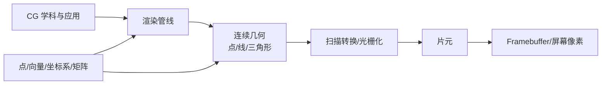
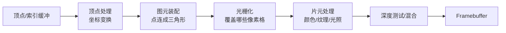
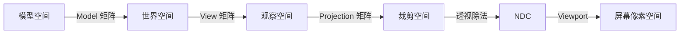

# CG Week 1-2 学习指南：图形学地图、扫描转换与数学语言

> **对应 Part**：P1 / `week1-2`  
> **raw run**：`notebooklm-raw/week1-2/runs/latest`  
> **知识图谱**：`notebooklm-raw/week1-2/knowledge-graph.md`  
> **状态**：Agent 内部 Review 后的用户 Review 版；已按术语首现、英语考试对照、章节就近引用标准修订。

## 0. 术语表

| 术语 | 本 Part 中的含义 | 你要先记住的直觉 |
|------|------------------|------------------|
| CG(Computer Graphics，计算机图形学) | 用计算机生成、处理并显示图像的学科 | 把数学世界变成可见画面 |
| 建模(Modeling) | 描述物体形状、材质、层级和动画状态 | 先有“场景说明书” |
| 渲染(Rendering) | 根据场景、相机、光照算出图像 | 把说明书拍成照片 |
| 光栅化(Rasterization) / 扫描转换(Scan Conversion) | 将连续几何图元转换成离散像素或片元 | 在像素格纸上决定哪些格子被涂色 |
| 动画(Animation) | 让场景状态随时间变化 | 给模型和相机加时间轴 |
| 感知(Perception) | 研究人眼、显示和视觉效果如何影响图像理解 | 画得“对”还要看起来“对” |
| 着色器(Shader) | GPU 上处理顶点、片元等数据的小程序 | 管线中可编程的小工位 |
| DDA(Digital Differential Analyzer，数字微分分析器) | 用斜率增量逐步生成直线像素的算法 | 每走一步就按斜率累加另一个坐标 |
| Bresenham 直线算法(Bresenham Line Algorithm) | 用整数决策参数选择更接近直线的候选像素 | 不反复算真实 y，而是做“上/下像素”选择 |
| 顶点(Vertex) | 几何输入的点，通常带位置、颜色、法线等属性 | 管线入口处的原材料 |
| 片元(Fragment) | 光栅化后生成的像素候选 | 还没通过深度测试的“准像素” |
| 深度测试(Depth Test) | 用深度值判断候选片元是否被挡住 | 谁离相机近，谁更可能留下 |
| 混合(Blending) | 将新片元颜色与已有 framebuffer 颜色合成 | 处理透明、半透明和叠加 |
| Framebuffer(Frame Buffer，帧缓冲) | 存储最终像素颜色/深度的缓冲区 | 屏幕图像的内存画布 |
| 点(Point) | 空间中的位置 | 会受平移影响 |
| 向量(Vector) | 方向和长度 | 不应受平移影响 |
| 坐标系(Coordinate System) | 描述坐标数值所依赖的原点和坐标轴 | 同一点换参考系会换数字 |
| 基(Basis) | 坐标系中用于展开向量的一组方向 | 决定“x/y/z 分量”各沿哪边 |
| 齐次坐标(Homogeneous Coordinates) | 给坐标增加 $w$ 分量，用统一矩阵处理平移、投影等 | 用 $w=1/0$ 区分位置和方向 |
| MVP(Model-View-Projection，模型-观察-投影) | 后续 3D 管线中把顶点从模型空间搬到裁剪空间的矩阵链 | Week 3-4 的坐标变换主线 |

## 1. 知识地图

Week 1-2 的任务不是直接写复杂着色器(Shader)，而是先建立三件事：

1. 你知道图形学在研究什么，为什么 AI 能帮你写代码但不能替你理解管线。
2. 你知道一条从“场景数据”到“屏幕像素”的渲染生产线长什么样。
3. 你知道连续几何最终必须落到离散像素，而这个落地过程需要坐标、向量、矩阵和高效算法。

> **追问：为什么第一周讲应用和 AI，第二周却立刻讲画线、填充、多边形？**  
> 因为图形学的核心矛盾很早就出现了：人脑和数学喜欢连续形状，显示器只认识像素格。画线、画曲线、填多边形是“连续到离散”的最小样例；后面三角形光栅化、纹理采样、抗锯齿都在反复解决同一类问题。

## 2. 核心知识

### 2.1 图形学到底解决什么问题

> **本节叙事线**：应用场景很多 → 抽象成建模/渲染/动画/感知 → 这些都要经过管线和数学表示。

> **本节要回答**：CG 为什么不是“会调库画图”这么简单？

计算机图形学的核心是用计算机生成和显示图像。课件01把它拆成建模、渲染、动画和感知等范畴：建模负责描述形状和场景，渲染负责把场景算成图像，动画负责让状态随时间变化，感知关心人眼和显示效果。电影、游戏、CAD、医疗可视化、仿真、VR/AR、数字人和神经渲染都是这些基础问题的不同落点。

在 AI 编程助手普及之后，课程仍强调底层原理，因为图形程序最常见的问题不是“不会生成一段代码”，而是黑屏、坐标错乱、锯齿、闪烁、性能异常、shader 输入输出不匹配。AI 可以给你一份 OpenGL/Vulkan/Unity 代码，但你要能判断顶点在哪个坐标空间、片元为什么没进 framebuffer、某个矩阵顺序是否反了。

**小结**：应用场景只是动机，真正贯穿课程的是“用数学表示场景，再用管线把它变成图像”。下一节进入这条管线。

> **参考 raw：** `overview-skeleton.answer.md`、`concept-breakdown-graphics-overview.answer.md`；对应来源：Week 1 记录、课件01。

### 2.2 从场景数据到屏幕像素

> **本节叙事线**：顶点输入 → 图元装配 → 光栅化 → 片元处理 → framebuffer。

> **本节要回答**：一个三角形怎样一步步变成屏幕上的像素？

渲染管线可以先理解成一条数据生产线：

以一个红色三角形为例：

1. CPU 把三个顶点坐标传给 GPU。
2. 顶点着色器把局部坐标逐步变换到屏幕相关坐标。
3. 图元装配确认这三个点构成一个三角形。
4. 光栅化(Rasterization)检查哪些像素中心落在三角形覆盖范围内，并生成片元(Fragment)。
5. 片元着色器(Fragment Shader)给每个片元计算颜色。
6. 深度测试(Depth Test)和混合(Blending)决定哪些片元真正写入 Framebuffer(Frame Buffer，帧缓冲)，成为屏幕像素。

> **直观理解：片元不是像素。**  
> 片元像“候选像素”。它已经知道自己可能落在哪个屏幕位置，也可能有颜色和深度，但如果它被另一个更近的片元挡住，就会在深度测试中被丢弃，不会成为最终像素。

**小结**：渲染管线解释了“数据怎么流动”，但其中最关键的一步是从连续几何到离散片元。下一节看 Week 2 的扫描转换。

> **参考 raw：** `concept-breakdown-rendering-pipeline.answer.md`、`deep-dive-pipeline-dataflow.answer.md`；对应来源：Week 1-2 记录、课件01。

### 2.3 扫描转换：连续几何如何落到像素格

> **本节叙事线**：连续线段/曲线/多边形 → 采样 → 选像素 → 用连贯性和增量计算提效。

> **本节要回答**：数学上的线无限细，显示器只有像素，应该点亮哪些格子？

扫描转换就是把连续几何原语转成离散像素表示。课件02从直线、曲线、多边形和填充算法讲起，核心思想包括采样、连贯性、增量计算和硬件友好的数学运算。

#### DDA 与 Bresenham

DDA(Digital Differential Analyzer，数字微分分析器) 是一种增量式直线扫描转换算法：沿主方向步进，例如斜率 $0 \le m \le 1$ 时，每一步可写成 $x_{k+1}=x_k+1$、$y_{k+1}=y_k+m$，再把 $y$ 取整成像素。它直观，但依赖浮点数和 `round()`，会有累积误差。

Bresenham 直线算法(Bresenham Line Algorithm) 的思路是只在两个候选像素之间做整数决策。对 $0 \le m \le 1$ 的直线，令：

$$
\begin{aligned}
\Delta x &= x_1 - x_0,\\
\Delta y &= y_1 - y_0,\\
p_0 &= 2\Delta y - \Delta x.
\end{aligned}
$$

如果 $p_k < 0$，选右边像素 $(x+1, y)$；否则选右上像素 $(x+1, y+1)$。更新也只需要整数加减：

$$
\begin{cases}
p_{k+1}=p_k+2\Delta y, & \text{选右边像素}\\
p_{k+1}=p_k+2\Delta y-2\Delta x, & \text{选右上像素}
\end{cases}
$$

> **直观理解：Bresenham 不是“算出真实 y 再四舍五入”，而是在问下一格到底更接近直线的上方候选还是下方候选。**  
> 这就是它硬件友好、误差可控的原因。

#### 曲线、多边形和填充

曲线可以用参数方程表示，例如 $x=f(u),\ y=g(u)$。课件02提到中点测试细分法：如果曲线中点与用线段近似的中点差距太大，就继续递归细分，直到误差足够小。它的本质仍然是“用足够短的线段逼近连续曲线”。

多边形扫描转换关注区域内部像素。扫描线算法按行求多边形边界交点，成对填充中间区间；区域填充则像油漆桶，从种子像素沿 4-连通或 8-连通邻居扩散。两者目的都像“填充”，但输入不同：扫描线依据几何边界，区域填充依据像素连通性。

| 易混点 | 正确理解 |
|--------|----------|
| DDA vs Bresenham | DDA 用浮点增量和取整；Bresenham 用整数决策参数 |
| $\operatorname{abs}(m) \le 1$ vs $\operatorname{abs}(m) > 1$ | 哪个轴变化更快，就沿哪个轴步进，避免断线 |
| 扫描线 vs 区域填充 | 扫描线从几何边求交；区域填充从已有像素区域扩散 |
| 4-连通 vs 8-连通 | 4 看上下左右，8 还看对角，可能填得更满也可能穿过斜向缝隙 |

**小结**：扫描转换让你看到图形学最底层的取舍：质量、效率和离散误差。下一节回到这些算法上游，解释点、向量、坐标和矩阵为什么是必须的语言。

> **参考 raw：** `slide-skeleton-lecture02.answer.md`、`examples-pipeline-and-math.answer.md`、`misconceptions-part1.answer.md`；对应来源：Week 2 记录、课件02。

### 2.4 点、向量、坐标系与齐次坐标

> **本节叙事线**：位置/方向要区分 → 坐标必须依赖参考系 → 矩阵负责变换 → 齐次坐标统一平移和线性变换。

> **本节要回答**：为什么图形学反复讲点、向量、坐标系和矩阵？

点(Point) 表示位置，向量(Vector) 表示方向和长度。这个区别在图形学里非常重要：如果你把场景整体向东平移 10 米，房子的位置应该改变，但“北方”这个方向不应该改变。

齐次坐标(Homogeneous Coordinates) 用 $w$ 分量把这种区别写进数学表示：

$$
\text{点}=(x, y, z, 1), \qquad \text{向量}=(x, y, z, 0)
$$

当它们乘以带平移项的矩阵时，点的 $w=1$ 会吃到平移，向量的 $w=0$ 会让平移项消失。

$$
\begin{bmatrix}
1 & 0 & t_x\\
0 & 1 & t_y\\
0 & 0 & 1
\end{bmatrix}
\begin{bmatrix}
x\\
y\\
1
\end{bmatrix}
=
\begin{bmatrix}
x+t_x\\
y+t_y\\
1
\end{bmatrix}
$$

> **追问：为什么不用普通坐标直接写 `x + tx`？**  
> 因为图形管线要对成千上万个顶点批量处理。把缩放、旋转、平移都写成同一种矩阵乘法，GPU 才能高效并行，多个变换也能预先复合成一个矩阵。

坐标系(Coordinate System) 和基(Basis) 则回答“这些数字相对于谁”。同一个点在模型空间(Model Space)、世界空间(World Space)、观察空间(View Space)、裁剪空间(Clip Space) 和屏幕空间(Screen Space) 会有不同坐标。后续 Week 3-4 的 MVP(Model-View-Projection，模型-观察-投影) 矩阵，本质就是让顶点沿这些坐标系一步步搬运。

> **课纲注**：课件02本身主要讲扫描转换，并未完整推导矩阵、基变换和齐次坐标；本节根据 Week 2 笔记与 raw 中的后续承接整理，用来为 Week 3-4 的 3D 变换和投影预热。

**小结**：扫描转换解决“怎么落到像素”，坐标和矩阵解决“几何在落到像素前如何被表示和搬运”。两者合起来，构成后续 3D 管线的基础。

> **参考 raw：** `concept-breakdown-math-foundations.answer.md`、`deep-dive-coordinates-homogeneous.answer.md`；对应来源：Week 2 记录与后续承接 raw。

## 3. 重难点与易错点

### 3.1 把光栅化误解成“直接画像素”

光栅化生成的是片元，片元还要经历片元着色、深度测试、混合等步骤才可能写入 framebuffer。调试黑屏或遮挡错误时，要分清“没有生成片元”和“生成了但没通过后续测试”。

### 3.2 忽略主步进轴

画线时如果对所有斜率都沿 $x$ 步进，陡峭线段会断裂。判断 $\operatorname{abs}(m) \le 1$ 还是 $\operatorname{abs}(m) > 1$ 的意义，就是保证沿变化更快的方向连续采样。

### 3.3 混淆点和向量

平移会改变点，不应改变方向向量。法线、光线方向、相机朝向如果被错误地当作点处理，后续光照和观察变换会产生很隐蔽的错误。

### 3.4 认为矩阵乘法顺序无关

矩阵乘法不满足交换律。先旋转再平移，和先平移再旋转，几何含义完全不同。后续写 MVP 时，要始终问自己：这个矩阵是在把点从哪个空间搬到哪个空间？

## 4. 知识串联

Week 1-2 是全课地基：

- 对 Week 3-4：点、向量、矩阵、齐次坐标会变成模型变换、视图变换和投影变换。
- 对 Week 5-6：扫描转换、采样、锯齿和连贯性会变成三角形光栅化、深度缓冲、抗锯齿。
- 对 Week 7-9：片元、shader、framebuffer 的位置会帮助你理解光照、纹理和 GLSL 数据流。
- 对 Project：Week 2 已出现开发环境配置、AI 插件、Unity/VS 等要求；raw 中未见完整 Project 需求，因此这里只能把“记录 AI 互动过程、能解释代码效率和调试原因”作为当前可确认落点。

> **参考 raw：** `project-bridge.answer.md`、`overview-skeleton.answer.md`；完整 raw 映射见 `notebooklm-raw/week1-2/knowledge-graph.md` 与 `notebooklm-raw/week1-2/review-iteration.md`。

## 5. 复习路线与自检

1. 先能用自己的话解释 CG(Computer Graphics，计算机图形学) 的四类任务：建模(Modeling)、渲染(Rendering)、动画(Animation)、感知(Perception)。
2. 再画出“顶点(Vertex) → 光栅化(Rasterization) → 片元(Fragment) → Framebuffer(Frame Buffer，帧缓冲)”的数据流。
3. 最后手推一个 DDA(Digital Differential Analyzer，数字微分分析器) 或 Bresenham 直线算法(Bresenham Line Algorithm) 的小例子，并说明为什么主步进轴要看 $\operatorname{abs}(m)$。
