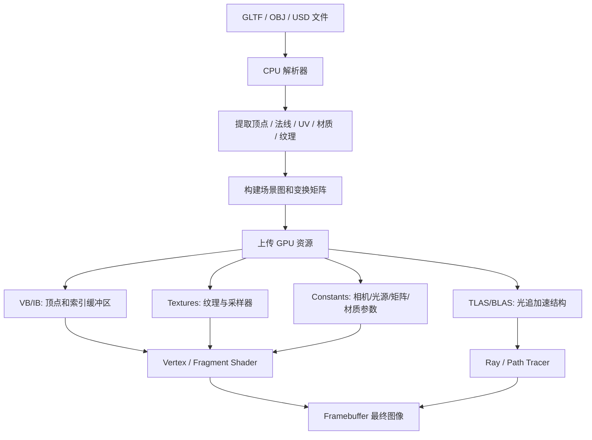
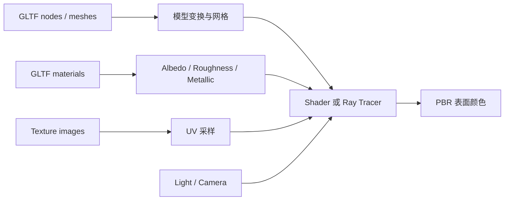

# CG Week 10-11 学习指南：模型加载、场景表示与 PBR 过渡

> **Part 5 / Week 10-11**  
> **定位**：当前 NotebookLM raw 显示，本 Part 并不是资料完备的传统“曲线曲面 / mesh processing”理论课，而是围绕模型加载、场景标准、GLTF/PBR 过渡，以及几何表示概览展开。  
> **学习目标**：理解 3D 模型文件如何变成渲染器输入；掌握 GLTF、PBR、材质、纹理与几何表示的关系；知道哪些曲线曲面 / 网格处理内容当前属于资料缺口。

---

## 1. 全景：P5 在整条图形管线中的位置

P4 已经讲完着色(Shading)、纹理映射(Texture Mapping)和片元阶段的材质表现。P5 回到一个更靠前的问题：**这些几何、材质、纹理和场景层级数据从哪里来，如何进入渲染管线？**

本 Part 的核心不是“手推所有曲线曲面算法”，而是从工程视角回答：

- 一个模型文件保存了哪些信息？
- CPU 如何解析并组织场景？
- GPU 如何拿到顶点、纹理、材质、常量和加速结构？
- PBR(Physically Based Rendering，基于物理的渲染) 与 P6 的全局光照(Global Illumination)如何分工？

> **参考 raw**：`overview-skeleton`、`stage1-summary.md`、`concept-breakdown-model-loading-standards`、`visual-explain-model-data-pipeline`

---

## 2. 从模型文件到最终图像

常见模型 / 场景格式包括 OBJ(Wavefront OBJ，经典几何格式)、FBX(Filmbox，动画和层级场景格式)、GLTF(Graphics Language Transmission Format，图形语言传输格式)、GLB(GLTF Binary，GLTF 二进制格式)，以及 USD(Universal Scene Description，通用场景描述)。它们不是“图片”，而是把几何、材质、纹理、层级和动画打包给渲染器。

关键数据包括：

| 数据 | 英文术语 | 作用 |
|------|----------|------|
| 顶点位置 | Position | 定义几何形状在局部空间的位置 |
| 法线 | Normal | 告诉着色器表面朝向，用于光照计算 |
| UV 坐标 | UV Coordinates | 把二维纹理贴到三维表面 |
| 材质 | Material | 描述表面颜色、粗糙度、金属度等反射属性 |
| 纹理 | Texture | 用图像承载颜色、法线、粗糙度等空间变化 |
| 场景图 | Scene Graph | 用层级结构组织对象和变换 |
| 加速结构 | Acceleration Structure | 为 ray tracing 快速求交服务 |

> **参考 raw**：`visual-explain-model-data-pipeline`、`examples-gltf-pbr-material-flow`

---

## 3. GLTF 与 PBR：P5 的实践核心

GLTF 常被称为“3D 界的 JPEG”，因为它面向高效传输和现代实时渲染。对 P5 来说，GLTF 的价值在于它能把**几何数据**和 **PBR 材质参数**一起带进渲染器。

PBR 关注的是：光线打到某个表面后，这个表面应该怎样反射光。它通常使用如下参数：

- 反照率(Albedo)：表面基础颜色，不包含阴影。
- 粗糙度(Roughness)：微平面分布越散，表面越哑光。
- 金属度(Metallic)：决定材质更像金属还是电介质。
- 法线贴图(Normal Map)：不增加几何复杂度，也能制造细微凹凸。
- BRDF(Bidirectional Reflectance Distribution Function，双向反射分布函数)：描述入射光如何被表面反射到观察方向。

一个简化的 GLTF/PBR 数据流是：

### PBR 和 GI 的分界

PBR 解决“**表面如何反射**”：给定一束入射光，材质如何把它反射出去。

GI(Global Illumination，全局光照)解决“**光从哪里来**”：除了直接光源，还要考虑光线在场景中多次反弹后的间接光。

因此，P5 让场景数据和材质变得“物理化”；P6 再用 ray tracing / path tracing 去模拟完整光能传递。

> **参考 raw**：`concept-breakdown-gltf-pbr-bridge`、`examples-gltf-pbr-material-flow`

---

## 4. 几何表示：知道它们适合什么

当前 raw 支持的是几何表示(Object Representations)的概览，而不是完整算法推导。复习时重点是识别不同表示的适用场景。

| 表示方法 | 英文术语 | 适用场景 | 当前 raw 覆盖 |
|----------|----------|----------|---------------|
| 多边形网格 | Polygon Mesh | 游戏、实时渲染、通用模型输入 | 覆盖较多 |
| 点云 | Point Cloud | LiDAR、SLAM、逆向工程 | 部分覆盖 |
| 细分曲面 | Subdivision Surface | 影视角色、平滑模型 | 概念覆盖 |
| 参数曲面 / NURBS | NURBS(Non-Uniform Rational B-Splines，非均匀有理 B 样条) | CAD、汽车、航空工业设计 | 概念覆盖 |
| 隐式曲面 | Implicit Surface | 流体、水滴融合、代数求交 | 部分覆盖 |
| 体素 | Voxel | CT/MRI、科学可视化、体数据 | 概念覆盖 |
| 构造实体几何 | CSG(Constructive Solid Geometry，构造实体几何) | 机械零件、布尔建模 | 概念覆盖 |
| 过程建模 | Procedural Modeling | 地形、植物、大规模自然场景 | 概念覆盖 |

### 本节要抓住的直觉

多边形网格最适合 GPU 光栅化，因为三角形容易插值、裁剪和并行处理。点云更接近传感器原始数据，通常需要重建成曲面。NURBS 适合工业精确曲面，但实时渲染常要先离散化。隐式曲面适合用方程描述融合或体积效果，ray tracing 中可通过方程求交。

> **参考 raw**：`concept-breakdown-geometry-representations`、`compare-geometry-representations-boundaries`

---

## 5. 资料边界：哪些不要硬背成主线

当前 raw 明确显示，以下内容没有足够课程资料支撑，应该作为扩展或待补 source：

- Bézier 曲线、B-spline 曲线、de Casteljau 算法的完整推导。
- Half-edge(半边结构)等拓扑数据结构。
- QEM(Quadric Error Metrics，二次误差度量)网格简化。
- Catmull-Clark 细分的顶点权重公式。
- 网格参数化、ARAP、LSCM 等高级 geometry processing 算法。

可以保守掌握的是：参数曲线的基本形式、曲线光栅化的中点细分思想、常见几何表示的用途，以及模型加载中 Position / Normal / UV / Material / Texture 的数据流。

> **参考 raw**：`gap-audit-curves-mesh-processing`、`review-gap-boundary-curves-mesh`

---

## 6. 易混对比

| 易混点 | 关键区别 |
|--------|----------|
| GLTF vs OBJ | OBJ 偏几何和简单材质；GLTF 更适合现代场景、PBR 材质和 Web / 实时传输 |
| PBR vs GI | PBR 定义表面反射规律；GI 模拟光线在场景中的多次传递 |
| Mesh vs NURBS | Mesh 是离散三角形 / 多边形；NURBS 是连续参数曲面，常用于工业设计 |
| Texture vs Material | Texture 是图像数据；Material 是如何解释这些图像和参数的表面模型 |
| 场景图 vs 加速结构 | 场景图组织对象层级；BVH / TLAS / BLAS 服务 ray tracing 求交加速 |

---

## 7. 术语表

| 术语 | 解释 |
|------|------|
| GLTF(Graphics Language Transmission Format，图形语言传输格式) | 面向现代实时渲染和传输的 3D 场景格式 |
| GLB(GLTF Binary，GLTF 二进制格式) | GLTF 的二进制打包形式 |
| USD(Universal Scene Description，通用场景描述) | 工业级复杂场景描述标准 |
| PBR(Physically Based Rendering，基于物理的渲染) | 使用物理一致材质参数描述表面反射 |
| BRDF(Bidirectional Reflectance Distribution Function，双向反射分布函数) | 描述入射光如何被表面反射到出射方向 |
| UV Coordinates(纹理坐标) | 把二维纹理映射到三维表面的坐标 |
| VB(Vertex Buffer，顶点缓冲区) | GPU 中保存顶点属性的缓冲区 |
| IB(Index Buffer，索引缓冲区) | GPU 中保存顶点索引顺序的缓冲区 |
| BVH(Bounding Volume Hierarchy，层次包围盒) | ray tracing 中用于快速剔除几何体的树形加速结构 |
| TLAS(Top-Level Acceleration Structure，顶层加速结构) | 光追中组织实例的上层加速结构 |
| BLAS(Bottom-Level Acceleration Structure，底层加速结构) | 光追中组织单个 mesh 三角形的底层加速结构 |

---

## 8. 复习抓手

1. 能画出“模型文件 -> CPU 解析 -> GPU 资源 -> shader / ray tracer -> framebuffer”的流程。
2. 能解释 GLTF 为什么适合 PBR 场景加载。
3. 能区分 PBR 和 GI 的职责。
4. 能用一句话说明 mesh、point cloud、NURBS、implicit surface、voxel、CSG 的用途。
5. 能指出当前 raw 不支持哪些曲线曲面 / mesh processing 细节，避免把扩展内容当主线背诵。
