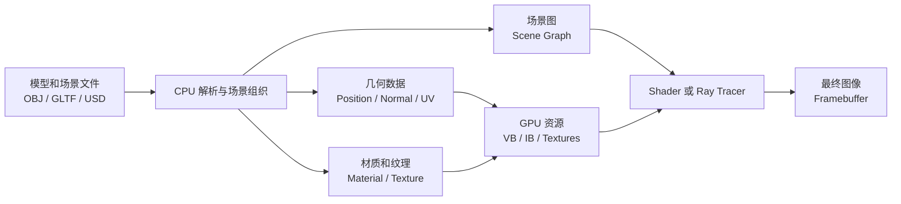
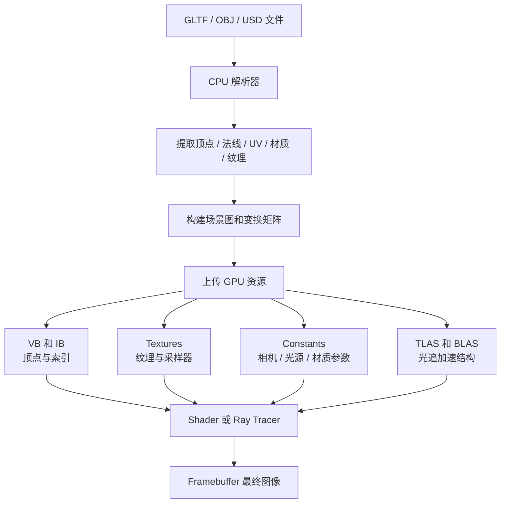
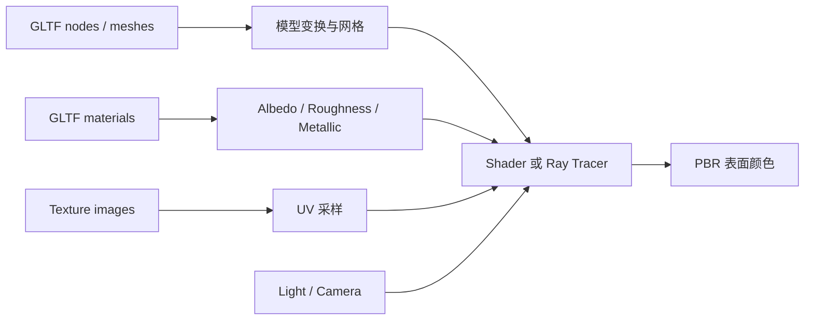
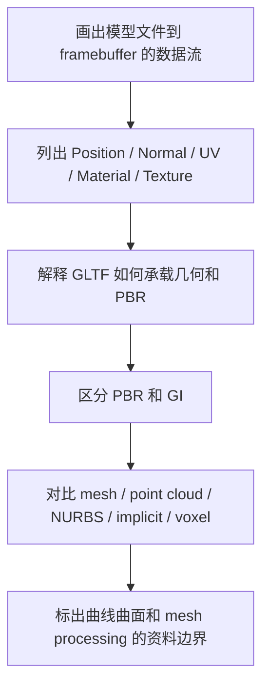

# CG Week 10-11 学习指南：模型加载、场景表示与 PBR 过渡

> **对应 Part**：P5 / `week10-11`
> **知识图谱**：`notebooklm-raw/week10-11/knowledge-graph.md`
> **状态**：Agent 内部 Review 后的用户 Review 版；当前 raw 更支持模型加载、场景标准、GLTF / PBR 过渡与几何表示概览，不把资料不足的曲线曲面和 mesh processing 推导硬写成主线。

## 0. 术语表

| 术语 | 本 Part 中的含义 | 先记住的直觉 |
|------|------------------|--------------|
| 模型加载(Model Loading) | 把 3D 文件解析成渲染器能使用的几何、材质、纹理和场景层级数据 | 文件不是图像，而是渲染所需数据包 |
| 场景表示(Scene Representation) | 用节点、网格、材质、纹理和变换描述一个可渲染场景 | 把物体、层级和外观组织起来 |
| OBJ(Wavefront OBJ，经典几何格式) | 以几何网格为主的常见模型格式 | 简单、通用，但场景和 PBR 能力有限 |
| GLTF(Graphics Language Transmission Format，图形语言传输格式) | 面向现代实时渲染和传输的 3D 场景格式 | 常被理解成 3D 内容的传输格式 |
| GLB(GLTF Binary，GLTF 二进制格式) | GLTF 的二进制打包形式 | 把 JSON、buffer、纹理等打进一个文件 |
| USD(Universal Scene Description，通用场景描述) | 工业级复杂场景描述标准 | 更适合大型制作管线和资产协作 |
| PBR(Physically Based Rendering，基于物理的渲染) | 用物理一致的材质参数描述表面反射 | 材质参数要接近真实光学行为 |
| BRDF(Bidirectional Reflectance Distribution Function，双向反射分布函数) | 描述入射光有多少反射到观察方向 | 材质反光规则 |
| UV(UV Coordinates，纹理坐标) | 2D 纹理空间坐标，通常在 $[0,1]$ | 在图片上取样的位置 |
| VB(Vertex Buffer，顶点缓冲区) | GPU 中保存顶点属性的缓冲区 | 顶点数据上 GPU 后住在这里 |
| IB(Index Buffer，索引缓冲区) | GPU 中保存顶点索引顺序的缓冲区 | 复用顶点并组成三角形 |
| BVH(Bounding Volume Hierarchy，层次包围盒) | 用包围盒树加速 ray tracing 求交 | 先排除大块不可能命中的几何 |
| TLAS(Top-Level Acceleration Structure，顶层加速结构) | 光追中组织场景实例的上层加速结构 | 管“哪些实例在场景里” |
| BLAS(Bottom-Level Acceleration Structure，底层加速结构) | 光追中组织单个 mesh 三角形的底层加速结构 | 管“一个 mesh 内部有哪些三角形” |

## 1. 知识地图

P4 已经讲完着色(Shading)、纹理映射(Texture Mapping)和片元阶段的材质表现。Week 10-11 解决的是更靠前的问题：**这些几何、材质、纹理和场景层级数据从哪里来，如何进入渲染管线？**

> **追问：为什么 P5 不直接变成曲线曲面推导？**
> 因为当前 raw 显示，这一 Part 的可复习主线更像“资产如何进入渲染器”：模型文件、GLTF、PBR 材质、场景层级和几何表示边界。曲线曲面与 mesh processing 的部分细节要按资料边界保守处理。

> **参考来源：** Week 11 课程记录；课件08-Lecture11-part1-2026；对应 Week 10 / 曲线曲面资料缺口（标题待校准）。  
> raw batch: `overview-skeleton`、`concept-breakdown-model-loading-standards`、`visual-explain-model-data-pipeline`；阶段摘要：`stage1-summary.md`

## 2. 核心知识

### 2.1 从模型文件到最终图像：渲染器到底读进了什么

> **本节叙事线**：模型文件保存资产数据 → CPU 解析并组织场景 → GPU 接收几何、纹理、材质和常量 → shader 或 ray tracer 计算最终图像。

> **本节要回答**：一个 3D 模型文件怎样变成渲染管线里的输入？

常见模型 / 场景格式包括 OBJ(Wavefront OBJ，经典几何格式)、FBX(Filmbox，动画和层级场景格式)、GLTF(Graphics Language Transmission Format，图形语言传输格式)、GLB(GLTF Binary，GLTF 二进制格式)，以及 USD(Universal Scene Description，通用场景描述)。它们不是“图片”，而是把几何、材质、纹理、层级和动画打包给渲染器。

关键数据可以按“几何、外观、组织、加速”四类记：

| 数据 | 英文术语 | 作用 |
|------|----------|------|
| 顶点位置 | Position | 定义几何形状在局部空间的位置 |
| 法线 | Normal | 告诉着色器表面朝向，用于光照计算 |
| UV 坐标 | UV Coordinates | 把二维纹理贴到三维表面 |
| 材质 | Material | 描述表面颜色、粗糙度、金属度等反射属性 |
| 纹理 | Texture | 用图像承载颜色、法线、粗糙度等空间变化 |
| 场景图 | Scene Graph | 用层级结构组织对象和变换 |
| 加速结构 | Acceleration Structure | 为 ray tracing 快速求交服务 |

**小结**：模型加载把“文件资产”转成“管线资源”。接下来最重要的工程格式是 GLTF，因为它把几何和现代材质放在同一套传输结构里。

> **参考来源：** Week 11 课程记录；课件08-Lecture11-part1-2026。  
> raw batch: `visual-explain-model-data-pipeline`、`examples-gltf-pbr-material-flow`

### 2.2 GLTF 与 PBR：P5 的实践核心

> **承接 2.1**：渲染器已经能读入模型数据，但现代场景还需要一致地表达材质和纹理。

> **本节要回答**：为什么 GLTF 常和 PBR 放在一起讲？

GLTF 常被称为“3D 界的 JPEG”，因为它面向高效传输和现代实时渲染。对 P5 来说，GLTF 的价值在于它能把**几何数据**和 **PBR 材质参数**一起带进渲染器。

PBR(Physically Based Rendering，基于物理的渲染)关注的是：光线打到某个表面后，这个表面应该怎样反射光。它通常使用如下参数：

| 参数 | 英文 | 控制什么 |
|------|------|----------|
| 反照率 | Albedo | 表面基础颜色，不包含阴影 |
| 粗糙度 | Roughness | 微平面分布越散，表面越哑光 |
| 金属度 | Metallic | 决定材质更像金属还是电介质 |
| 法线贴图 | Normal Map | 不增加几何复杂度，也能制造细微凹凸 |
| BRDF | Bidirectional Reflectance Distribution Function | 描述入射光如何被表面反射到观察方向 |

一个简化的 GLTF / PBR 数据流是：

PBR 和 GI(Global Illumination，全局光照)的分界要记清：PBR 解决“**表面如何反射**”，也就是给定一束入射光，材质如何把它反射出去；GI 解决“**光从哪里来**”，包括直接光和多次反弹后的间接光。因此，P5 让场景数据和材质变得“物理化”，P6 再用 ray tracing / path tracing 去模拟完整光能传递。

**小结**：GLTF 把资产结构带进渲染器，PBR 把表面反射规则带进材质系统。下一步要看这些资产背后的几何可以有哪些表示方式。

> **参考来源：** Week 11 课程记录；课件08-Lecture11-part1-2026。  
> raw batch: `concept-breakdown-gltf-pbr-bridge`、`examples-gltf-pbr-material-flow`

### 2.3 几何表示：知道每种表示适合什么

> **承接 2.2**：GLTF 常以 mesh 为主，但图形学并不只有三角网格一种几何表示。

> **本节要回答**：为什么不同几何表示不能混成一个“模型格式”概念？

当前 raw 支持的是几何表示(Object Representations)的概览，而不是完整算法推导。复习时重点是识别不同表示的适用场景。

| 表示方法 | 英文术语 | 适用场景 | 当前 raw 覆盖 |
|----------|----------|----------|---------------|
| 多边形网格 | Polygon Mesh | 游戏、实时渲染、通用模型输入 | 覆盖较多 |
| 点云 | Point Cloud | LiDAR、SLAM、逆向工程 | 部分覆盖 |
| 细分曲面 | Subdivision Surface | 影视角色、平滑模型 | 概念覆盖 |
| 参数曲面 / NURBS | NURBS(Non-Uniform Rational B-Splines，非均匀有理 B 样条) | CAD、汽车、航空工业设计 | 概念覆盖 |
| 隐式曲面 | Implicit Surface | 流体、水滴融合、代数求交 | 部分覆盖 |
| 体素 | Voxel | CT / MRI、科学可视化、体数据 | 概念覆盖 |
| 构造实体几何 | CSG(Constructive Solid Geometry，构造实体几何) | 机械零件、布尔建模 | 概念覆盖 |
| 过程建模 | Procedural Modeling | 地形、植物、大规模自然场景 | 概念覆盖 |

多边形网格最适合 GPU 光栅化，因为三角形容易插值、裁剪和并行处理。点云更接近传感器原始数据，通常需要重建成曲面。NURBS 适合工业精确曲面，但实时渲染常要先离散化。隐式曲面适合用方程描述融合或体积效果，ray tracing 中可通过方程求交。

> **直观理解：mesh 为什么在实时渲染里最常见？**
> 不是因为 mesh 能表达所有几何细节，而是因为三角形非常适合现代 GPU 管线：顶点处理、光栅化、插值、深度测试都围绕它高效实现。

**小结**：几何表示决定资产如何存储和处理。最后还要明确哪些内容当前 raw 不足，复习时不要硬背成主线。

> **参考来源：** Week 11 课程记录；对应几何表示 / 曲线曲面课件或记录（标题待校准）。  
> raw batch: `concept-breakdown-geometry-representations`、`compare-geometry-representations-boundaries`

### 2.4 资料边界：哪些不要硬背成主线

> **承接 2.3**：知道几何表示的版图后，要把可靠主线和资料缺口分开。

> **本节要回答**：曲线曲面和 mesh processing 该复习到什么程度？

当前 raw 明确显示，以下内容没有足够课程资料支撑，应该作为扩展或待补 source，而不是本指南的主线：

| 内容 | 当前处理方式 |
|------|--------------|
| Bézier 曲线、B-spline 曲线、de Casteljau 算法完整推导 | 只保留基本形式和概念位置 |
| Half-edge(半边结构)等拓扑数据结构 | 作为 mesh processing 扩展认识 |
| QEM(Quadric Error Metrics，二次误差度量)网格简化 | 不展开算法细节 |
| Catmull-Clark 细分顶点权重公式 | 不作为必背推导 |
| 网格参数化、ARAP、LSCM 等高级算法 | 标记为资料不足的高级主题 |

可以保守掌握的是：参数曲线的基本形式、曲线光栅化的中点细分思想、常见几何表示的用途，以及模型加载中 Position / Normal / UV / Material / Texture 的数据流。

**小结**：P5 当前最可靠的复习主线是“资产与场景如何进入渲染器”，而不是完整 geometry processing 课程。

> **参考来源：** Week 11 课程记录；当前 source list 中未见 Week 10 / 曲线曲面 / mesh processing 明确来源。  
> raw batch: `gap-audit-curves-mesh-processing`、`review-gap-boundary-curves-mesh`

## 3. 易混点

| 易混点 | 正确认法 |
|--------|----------|
| GLTF 等于 OBJ 的新版 | OBJ 偏几何和简单材质；GLTF 更适合现代场景、PBR 材质和 Web / 实时传输 |
| PBR 等于 GI | PBR 定义表面反射规律；GI 模拟光线在场景中的多次传递 |
| Mesh 等于所有几何表示 | Mesh 是离散三角形或多边形；NURBS、implicit surface、voxel 等服务不同建模需求 |
| Texture 等于 Material | Texture 是图像或数据；Material 是如何解释这些数据的表面模型 |
| Scene Graph 等于 Acceleration Structure | 场景图组织对象层级；BVH、TLAS、BLAS 服务 ray tracing 求交加速 |
| 资料缺口等于可以忽略 | 缺口不是不重要，而是当前指南不能把未充分支持的细节写成主线 |

## 4. 复习路线

复习时建议用三句话自测：

1. 一个 GLTF / OBJ / USD 文件进入渲染器后，CPU 和 GPU 分别做什么？
2. GLTF、PBR、Texture、Material、BRDF 之间是什么关系？
3. Mesh、Point Cloud、NURBS、Implicit Surface、Voxel、CSG 分别适合表达哪类几何？

## 5. 与前后 Part 的承接

P4 解释 fragment 如何根据光照、材质和纹理得到颜色；P5 解释这些几何、材质、纹理和场景层级数据如何进入渲染器。P6 会继续沿着 PBR 和场景数据往下问：如果不仅考虑直接光，而是让光线在场景中多次反弹，最终颜色应该如何计算？
