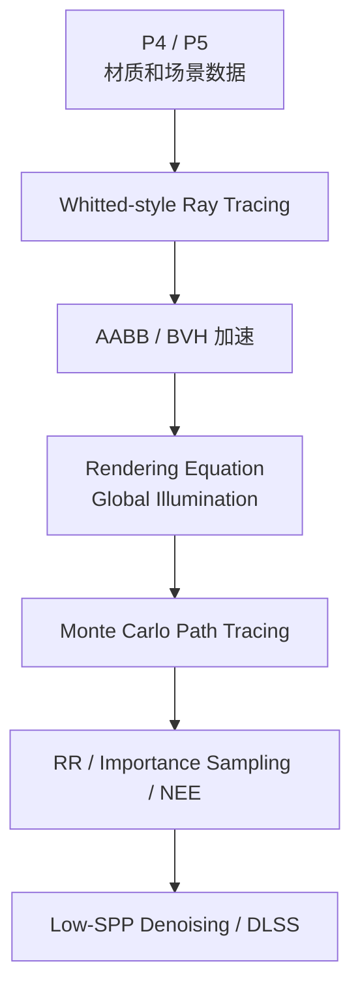
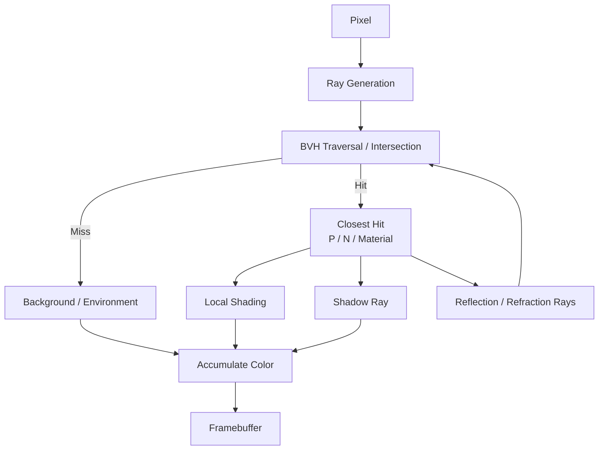
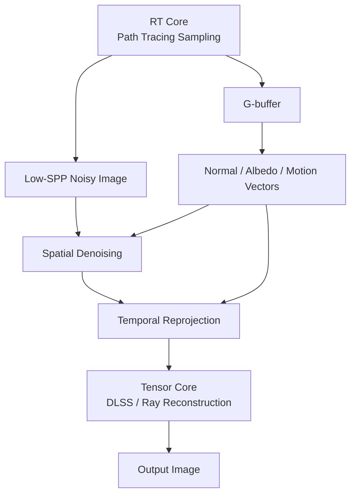
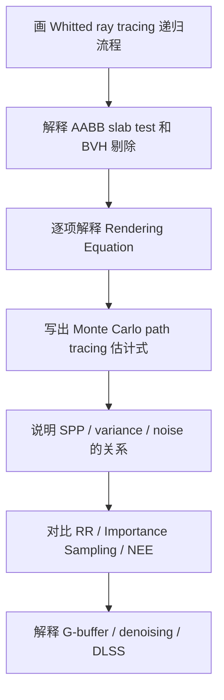

# CG Week 12-14 学习指南：光线追踪、路径追踪与全局光照

> **对应 Part**：P6 / `week12-14`
> **知识图谱**：`notebooklm-raw/week12-14/knowledge-graph.md`
> **状态**：Agent 内部 Review 后的用户 Review 版；主线为 Whitted-style ray tracing → BVH 加速 → rendering equation → Monte Carlo path tracing → sampling optimization → denoising / DLSS。

## 0. 术语表

| 术语 | 本 Part 中的含义 | 先记住的直觉 |
|------|------------------|--------------|
| 光线追踪(Ray Tracing) | 从相机或光源发射光线，与场景求交并计算颜色 | 用“看出去的光线”问场景里看见什么 |
| Whitted-style Ray Tracing(Whitted 风格光线追踪) | 通过主光线、阴影光线、反射 / 折射递归计算镜面效果 | 适合镜面反射、折射和硬阴影 |
| 主光线(Primary Ray) | 从相机穿过像素发出的第一条光线 | 每个像素先问“我打到了谁” |
| 阴影光线(Shadow Ray) | 从交点指向光源，用于判断可见性 | 判断光源有没有被挡住 |
| AABB(Axis-Aligned Bounding Box，轴对齐包围盒) | 边与坐标轴平行的包围盒 | 用简单盒子先包住复杂几何 |
| BVH(Bounding Volume Hierarchy，层次包围盒) | 用树形包围盒加速 ray tracing 求交 | 大量跳过不可能命中的三角形 |
| GI(Global Illumination，全局光照) | 同时考虑直接光和间接光的完整光能传递 | 光会在场景里反弹 |
| 渲染方程(Rendering Equation) | 描述出射光等于自发光加半球入射光反射积分 | 真实感渲染的统一目标 |
| BRDF(Bidirectional Reflectance Distribution Function，双向反射分布函数) | 描述入射光有多少反射到观察方向 | 材质反光规则 |
| 路径追踪(Path Tracing) | 用 Monte Carlo 方法求解渲染方程的全局光照算法 | 随机采很多光路取平均 |
| PDF(Probability Density Function，概率密度函数) | 描述采样方向出现概率的函数 | 采样方向不是白来的，要除以概率 |
| SPP(Samples Per Pixel，每像素采样数) | 每个像素发射的采样路径数量 | SPP 越高，噪声通常越低 |
| RR(Russian Roulette，俄罗斯轮盘赌) | 用概率终止路径并保持无偏的技术 | 随机杀路径，幸存者放大补偿 |
| NEE(Next Event Estimation，下次事件估计) | 显式采样光源以降低直接光噪声 | 小灯不用等随机路径撞上 |
| G-buffer(Geometry Buffer，几何缓冲区) | 保存法线、反照率、运动向量等辅助信息 | 给去噪和重投影提供结构线索 |
| DLSS(Deep Learning Super Sampling，深度学习超级采样) | 用 AI 超采样、去噪或重建画面的技术 | 用学习模型稳定低采样图像 |

## 1. 知识地图

P4 / P5 的光栅化管线很快，但很多真实光效很难自然表达：反射、折射、软阴影、焦散(Caustics)、颜色溢出(Color Bleeding)、间接光照(Indirect Illumination)。Week 12-14 的核心变化是：**从“把三角形投到屏幕”转向“从相机发出光线并模拟光能传递”。**

> **追问：为什么进入 P6 后要换思路？**
> 光栅化擅长快速确定三角形覆盖哪些像素；光线追踪更自然地表达“从相机看到的光来自哪里”。反射、折射和间接光本质上都在问光线如何与场景多次交互。

> **参考来源：** Week 12-14 课程记录；课件08-Lecture11-part1-2026；课件09-Lecture11-part2-路径追踪-2026。  
> raw batch: `overview-skeleton`、`notes-skeleton-week12-14`；图谱：`knowledge-graph.md`

## 2. 核心知识

### 2.1 Whitted-style Ray Tracing：从像素发射光线

> **本节叙事线**：像素生成主光线 → 场景求交 → 命中后做局部着色、阴影检测和反射 / 折射递归 → 累积颜色写入 framebuffer。

> **本节要回答**：ray tracing 是怎样为一个像素求颜色的？

光线追踪(Ray Tracing)的基本对象是一条参数化射线：

$$
P(t)=O+tD
$$

其中 $O$ 是光线起点，$D$ 是方向，$t$ 表示沿光线前进的距离。Whitted-style Ray Tracing(Whitted 风格光线追踪)从相机出发，为每个像素生成一条主光线(Primary Ray)，然后寻找它击中的最近物体。

一条 ray 的求色过程包括：

1. 光线生成(Ray Generation)：从相机穿过像素中心发射主光线。
2. 求交(Intersection)：找到最近交点和表面属性。
3. 阴影光线(Shadow Ray)：从交点朝光源发射，判断是否被遮挡。
4. 反射 / 折射递归(Reflection / Refraction Recursion)：根据材质生成次级光线。
5. 终止(Termination)：达到最大递归深度、贡献太小或未命中背景。

Whitted-style 的经典形式可以写成：

$$
I=I_{local}+k_r I_{reflection}+k_t I_{refraction}
$$

它已经能自然处理镜面反射和透明折射，但对漫反射表面之间的多次能量交换仍然不足。

**小结**：ray tracing 的表达能力来自递归光线，但直接逐三角形求交会非常慢，下一步需要加速结构。

> **参考来源：** Week 12 课程记录；课件08-Lecture11-part1-2026；论文-Ray Tracing in One Weekend。  
> raw batch: `concept-breakdown-ray-tracing-basics`、`visual-explain-ray-tracing-pipeline`

### 2.2 AABB / BVH：让光追跑得动

> **承接 2.1**：光线求色需要不断求交；如果每条光线都遍历所有三角形，成本会失控。

> **本节要回答**：BVH 为什么能显著降低 ray tracing 的求交成本？

如果一条光线要和场景中所有三角形逐个求交，复杂度近似是 $O(N)$。场景一大，计算量会爆炸。BVH(Bounding Volume Hierarchy，层次包围盒)用树形包围盒组织几何体，让大量“不可能命中”的物体被快速剔除。

AABB(Axis-Aligned Bounding Box，轴对齐包围盒)的 slab test 直觉是：分别计算光线进入和离开 $x/y/z$ 三组平行平面的时间区间，只有三个区间有重叠，光线才进入盒子。核心判断可理解为：

$$
t_{enter}<t_{exit}
$$

小例子：场景里有 10 万三角形的兔子和 2 个三角形的地板。没有 BVH 时，一条射向天空的光线可能要测试 100002 个三角形；有 BVH 时，只需先测试兔子盒和地板盒，不相交就整棵子树跳过。

现代 API 还会区分：

| 结构或硬件 | 英文 | 作用 |
|------------|------|------|
| BLAS | Bottom-Level Acceleration Structure | 包裹单个 mesh 的三角形 |
| TLAS | Top-Level Acceleration Structure | 组织场景实例和变换 |
| RT Core | Ray Tracing Core | 硬件加速 BVH 遍历和光线-三角形求交 |
| OptiX | OptiX Ray Tracing Engine | 提供可编程 ray tracing 管线和 JIT 优化 |

**小结**：BVH 解决“怎么快速找到命中点”。找到命中点后，P6 还要回答更大的问题：真实光照到底应该算什么。

> **参考来源：** Week 12-13 课程记录；课件08-Lecture11-part1-2026；论文-OptiX Ray Tracing Engine-SIGGRAPH2010。  
> raw batch: `concept-breakdown-acceleration-structures`、`deep-dive-bvh-aabb-example`

### 2.3 渲染方程：真实感渲染的统一目标

> **承接 2.2**：加速结构让求交可行，但求交只是找到表面点；真正要算的是这个点沿观察方向的出射光。

> **本节要回答**：渲染方程的每一项在视觉上代表什么？

渲染方程(Rendering Equation)描述一个表面点沿某个方向看到的光，来自自发光和半球上所有入射光的反射贡献：

$$
L_o(p,\omega_o)=L_e(p,\omega_o)+\int_{\Omega} f_r(p,\omega_i,\omega_o)L_i(p,\omega_i)\cos\theta_i\,d\omega_i
$$

各项含义：

| 符号 | 含义 | 视觉直觉 |
|------|------|----------|
| $L_o$ | 出射辐射率(Outgoing Radiance) | 相机最终看到的颜色和亮度 |
| $L_e$ | 自发光(Emitted Radiance) | 灯泡、屏幕等自己发光 |
| $L_i$ | 入射辐射率(Incident Radiance) | 从其他方向来到该点的光 |
| $f_r$ | BRDF(Bidirectional Reflectance Distribution Function，双向反射分布函数) | 材质如何反射光 |
| $\cos\theta_i$ | 余弦项(Cosine Term) | 光斜着照时能量摊得更开 |
| $V$ | 可见性(Visibility) | 被遮挡则贡献为 0 |
| $G$ | 几何项(Geometry Term) | 距离衰减和两表面朝向关系 |

局部光照(Local Illumination)只看直接光；全局光照(Global Illumination)还考虑其他物体反射来的间接光。比如白墙旁边有红墙时，光打到红墙再反射到白墙，白墙会染上淡红色，这就是颜色溢出(Color Bleeding)。

> **直观理解：为什么积分在半球上？**
> 一个表面点能接收来自上方半球所有方向的光。真实颜色不是某一条光线单独决定的，而是所有入射方向贡献的总和。

**小结**：渲染方程给出了目标，但半球积分很难解析求解。Path tracing 用随机采样逼近这个积分。

> **参考来源：** Week 13 课程记录；课件08-Lecture11-part1-2026；论文-The Rendering Equation-SIGGRAPH1986。  
> raw batch: `concept-breakdown-rendering-equation-gi`、`deep-dive-rendering-equation-terms`

### 2.4 Path Tracing：用 Monte Carlo 求解积分

> **承接 2.3**：渲染方程是积分问题，实际渲染需要数值估计。

> **本节要回答**：为什么 path tracing 会有噪声，又为什么增加 SPP 会收敛？

路径追踪(Path Tracing)用 Monte Carlo Integration(蒙特卡洛积分)数值求解渲染方程。核心估计式可写成：

$$
L_o(p,\omega_o)\approx\frac{1}{N}\sum_{i=1}^{N}
\frac{L_i(p,\omega_i)f_r(p,\omega_i,\omega_o)(n\cdot\omega_i)}{p(\omega_i)}
$$

这里 $p(\omega_i)$ 是 PDF(Probability Density Function，概率密度函数)，表示采样方向 $\omega_i$ 的概率。除以 PDF 的原因是：如果某些方向被更高概率采到，就要按概率修正贡献，避免估计偏向这些方向。

如果每次命中表面都采 $N$ 个方向，弹射深度为 $d$ 时光线数量会变成 $N^d$。Path tracing 的关键是每次弹射只随机选一个方向，也就是 $N=1$，让单条路径成本保持线性。但单条路径随机性很强，所以每个像素要发很多条路径取平均。

| SPP 水平 | 视觉特征 | 原因 |
|----------|----------|------|
| 1-4 | 噪声强，亮点和黑点随机 | 单样本代表不了积分平均 |
| 32-64 | 结构清晰但阴影仍有颗粒 | 方差下降但未充分收敛 |
| 1024+ | 光影平滑，接近照片级 | 大量样本平均逼近真实积分 |

> **追问：Path tracing 为什么常说“无偏但有噪声”？**
> 单次随机路径可能离真实积分很远，所以画面有噪声；但只要采样策略和权重正确，样本平均的期望仍指向真实结果。

**小结**：Path tracing 用随机路径换取可计算性。接下来要让这些随机样本更聪明，减少无效路径和噪声。

> **参考来源：** Week 13-14 课程记录；课件09-Lecture11-part2-路径追踪-2026。  
> raw batch: `concept-breakdown-monte-carlo-path-tracing`、`examples-monte-carlo-path-tracing-noise`

### 2.5 RR / Importance Sampling / NEE：让采样更聪明

> **承接 2.4**：Monte Carlo 会收敛，但朴素随机采样可能太慢。

> **本节要回答**：RR、importance sampling 和 NEE 分别降低了哪类成本或噪声？

| 技术 | 英文 | 解决什么 | 直觉 |
|------|------|----------|------|
| 俄罗斯轮盘赌 | RR(Russian Roulette，俄罗斯轮盘赌) | 路径无限递归 | 以概率 $P$ 继续，存活路径除以 $P$ 保持无偏 |
| 重要性采样 | Importance Sampling | 方差高、收敛慢 | 在贡献大的方向多采样 |
| 直接光源采样 / 下次事件估计 | NEE(Next Event Estimation，下次事件估计) | 小光源难随机命中 | 不等随机路径撞灯，直接在光源面积上采样 |

RR 的无偏性可以用期望解释：

$$
E=P\cdot\frac{L_o}{P}+(1-P)\cdot 0=L_o
$$

也就是说，虽然很多路径被提前杀掉，但活下来的路径被放大补偿，长期平均仍然不偏。

NEE 的直觉是：如果场景中只有一个很小的灯泡，随机朝半球发射方向很难撞到它。直接光源采样会显式在灯泡表面取点，再发 shadow ray 判断可见性，直接光照会稳定很多。

**小结**：采样优化提高的是收敛效率。实时渲染还要面对另一个限制：每帧能采的 SPP 很低。

> **参考来源：** Week 13-14 课程记录；课件09-Lecture11-part2-路径追踪-2026；论文-Particle Transport and Image Synthesis-CG1990。  
> raw batch: `concept-breakdown-sampling-optimization`、`compare-rr-importance-nee`

### 2.6 实时路径追踪：低 SPP + 去噪 + AI

> **承接 2.5**：即使采样策略更好，实时渲染也无法每帧堆到很高 SPP。

> **本节要回答**：为什么实时路径追踪离不开 G-buffer、denoising 和 DLSS？

实时渲染无法用 1024 SPP 逐帧渲染，常见做法是低 SPP path tracing，再用去噪(Denoising)和 AI 重建画面。

G-buffer(Geometry Buffer，几何缓冲区)提供辅助信息：

- Normal(法线)：帮助保留几何边界，避免滤波跨物体糊开。
- Albedo(反照率)：帮助区分纹理颜色和光照噪声。
- Motion Vectors(运动向量)：把上一帧信息重投影到当前帧，提升有效采样数。

DLSS(Deep Learning Super Sampling，深度学习超级采样)在 Tensor Core(张量核心)上运行，用 AI 做超采样、去噪或光线重建。RT Core 负责物理求交，Tensor Core 负责 AI 矩阵推理，两者共同让低 SPP 的路径追踪变成稳定画面。

**小结**：P6 从离线路径追踪走到实时光追时，核心矛盾变成“低采样输入如何重建稳定图像”。

> **参考来源：** Week 14 课程记录；课件09-Lecture11-part2-路径追踪-2026；论文-OptiX Ray Tracing Engine-SIGGRAPH2010。  
> raw batch: `concept-breakdown-denoising-realtime-rt`、`visual-explain-realtime-denoising`

## 3. 易混点

| 易混点 | 正确认法 |
|--------|----------|
| Ray Tracing 等于 Path Tracing | Ray tracing 常指 Whitted 镜面递归；path tracing 用 Monte Carlo 求渲染方程 |
| BVH 等于 G-buffer | BVH 加速求交；G-buffer 帮助屏幕空间 / 时空去噪 |
| RR 等于固定最大深度 | 固定截断可能有偏；RR 通过概率补偿保持无偏 |
| Importance Sampling 等于 NEE | Importance 按 BRDF 或分布采样；NEE 显式采样光源 |
| RT Core 等于 Tensor Core | RT Core 加速光追求交；Tensor Core 加速 AI / DLSS |
| SPP 高就一定实时 | SPP 高会降低噪声，但实时预算通常要求低 SPP 加去噪 |

## 4. 复习路线

复习时建议用三句话自测：

1. Whitted-style ray tracing 如何从 primary ray、shadow ray、reflection / refraction rays 累积颜色？
2. 渲染方程中 $L_o$、$L_i$、$f_r$、$\cos\theta_i$ 和 PDF 分别代表什么？
3. Path tracing、RR、importance sampling、NEE、denoising、DLSS 分别在解决“真实感、成本、噪声”中的哪一个问题？

## 5. 与前后 Part 的承接

P5 提供场景、几何和 PBR 材质数据；P6 用 ray tracing / path tracing 追问这些数据在全局光照下如何形成最终图像。后续复习时，可以把 P6 看成对 P4 / P5 的延伸：PBR 定义表面如何反射，path tracing 负责估计光如何在整个场景中传播。
