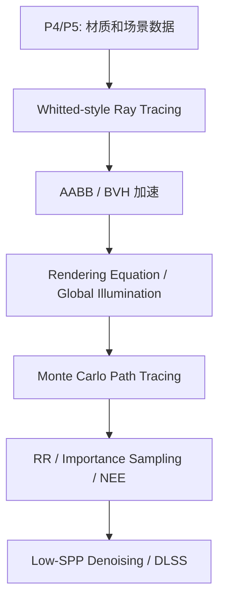
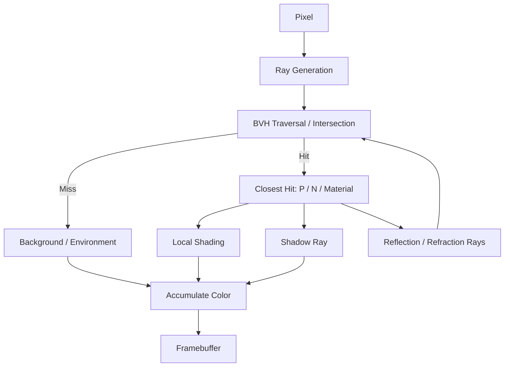
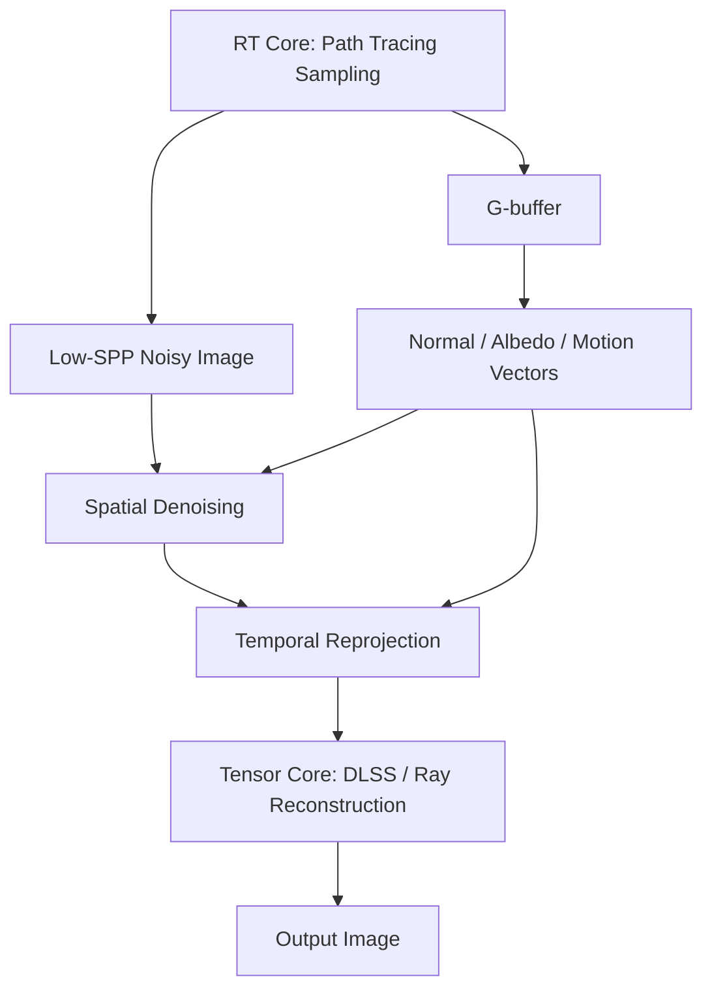

# CG Week 12-14 学习指南：光线追踪、路径追踪与全局光照

> **Part 6 / Week 12-14**  
> **定位**：从实时光栅化走向高级真实感渲染。P6 的主线是 Whitted-style ray tracing → BVH 加速 → rendering equation → Monte Carlo path tracing → sampling optimization → denoising / DLSS。  
> **学习目标**：理解 ray tracing 如何求颜色，为什么需要 BVH，渲染方程各项代表什么，path tracing 如何用 Monte Carlo 求解全局光照，以及实时光追为什么离不开去噪。

---

## 1. 全景：为什么 P6 要换渲染思路

P4/P5 的光栅化管线很快，但很多真实光效很难自然表达：反射、折射、软阴影、焦散(Caustics)、颜色溢出(Color Bleeding)、间接光照(Indirect Illumination)。P6 的核心变化是：从“把三角形投到屏幕”转向“从相机发出光线并模拟光能传递”。

> **参考 raw**：`overview-skeleton`、`notes-skeleton-week12-14`、`knowledge-graph.md`

---

## 2. Whitted-style Ray Tracing：从像素发射光线

光线追踪(Ray Tracing)的基本对象是一条参数化射线：

$$
P(t) = O + tD
$$

其中 $O$ 是光线起点，$D$ 是方向，$t$ 表示沿光线前进的距离。Whitted-style Ray Tracing(Whitted 风格光线追踪)从相机出发，为每个像素生成一条主光线(Primary Ray)，然后寻找它击中的最近物体。

一条 ray 的求色过程包括：

1. 光线生成(Ray Generation)：从相机穿过像素中心发射主光线。
2. 求交(Intersection)：找到最近交点和表面属性。
3. 阴影光线(Shadow Ray)：从交点朝光源发射，判断是否被遮挡。
4. 反射 / 折射递归(Reflection / Refraction Recursion)：根据材质生成次级光线。
5. 终止(Termination)：达到最大递归深度、贡献太小或未命中背景。

Whitted-style 的经典形式可以写成：

$$
I = I_{local} + k_r I_{reflection} + k_t I_{refraction}
$$

它已经能自然处理镜面反射和透明折射，但对漫反射表面之间的多次能量交换仍然不足。

> **参考 raw**：`concept-breakdown-ray-tracing-basics`、`visual-explain-ray-tracing-pipeline`

---

## 3. AABB / BVH：让光追跑得动

如果一条光线要和场景中所有三角形逐个求交，复杂度近似是 $O(N)$。场景一大，计算量会爆炸。BVH(Bounding Volume Hierarchy，层次包围盒)用树形包围盒组织几何体，让大量“不可能命中”的物体被快速剔除。

AABB(Axis-Aligned Bounding Box，轴对齐包围盒)的 slab test 直觉是：分别计算光线进入和离开 $x/y/z$ 三组平行平面的时间区间，只有三个区间有重叠，光线才进入盒子。

$$
t_{enter} < t_{exit}
$$

小例子：场景里有 10 万三角形的兔子和 2 个三角形的地板。没有 BVH 时，一条射向天空的光线可能要测试 100002 个三角形；有 BVH 时，只需先测试兔子盒和地板盒，不相交就整棵子树跳过。

现代 API 还会区分：

- BLAS(Bottom-Level Acceleration Structure，底层加速结构)：包裹单个 mesh 的三角形。
- TLAS(Top-Level Acceleration Structure，顶层加速结构)：组织场景实例和变换。
- RT Core(Ray Tracing Core，光线追踪核心)：硬件加速 BVH 遍历和光线-三角形求交。
- OptiX(OptiX Ray Tracing Engine，OptiX 光线追踪引擎)：提供可编程 ray tracing 管线和 JIT(Just-In-Time，即时编译)优化。

> **参考 raw**：`concept-breakdown-acceleration-structures`、`deep-dive-bvh-aabb-example`

---

## 4. 渲染方程：真实感渲染的统一目标

渲染方程(Rendering Equation)描述一个表面点沿某个方向看到的光，来自自发光和半球上所有入射光的反射贡献：

$$
L_o(p,\omega_o)=L_e(p,\omega_o)+\int_{\Omega} f_r(p,\omega_i,\omega_o)L_i(p,\omega_i)\cos\theta_i\,d\omega_i
$$

各项含义：

| 符号 | 含义 | 视觉直觉 |
|------|------|----------|
| $L_o$ | 出射辐射率(Outgoing Radiance) | 相机最终看到的颜色和亮度 |
| $L_e$ | 自发光(Emitted Radiance) | 灯泡、屏幕等自己发光 |
| $L_i$ | 入射辐射率(Incident Radiance) | 从其他方向来到该点的光 |
| $f_r$ | BRDF(Bidirectional Reflectance Distribution Function，双向反射分布函数) | 材质如何反射光 |
| $\cos\theta_i$ | 余弦项(Cosine Term) | 光斜着照时能量摊得更开 |
| $V$ | 可见性(Visibility) | 被遮挡则贡献为 0 |
| $G$ | 几何项(Geometry Term) | 距离衰减和两表面朝向关系 |

局部光照(Local Illumination)只看直接光；全局光照(Global Illumination)还考虑其他物体反射来的间接光。比如白墙旁边有红墙时，光打到红墙再反射到白墙，白墙会染上淡红色，这就是颜色溢出(Color Bleeding)。

> **参考 raw**：`concept-breakdown-rendering-equation-gi`、`deep-dive-rendering-equation-terms`

---

## 5. Path Tracing：用 Monte Carlo 求解积分

路径追踪(Path Tracing)用 Monte Carlo Integration(蒙特卡洛积分)数值求解渲染方程。核心估计式可写成：

$$
L_o(p,\omega_o)\approx\frac{1}{N}\sum_{i=1}^{N}
\frac{L_i(p,\omega_i)f_r(p,\omega_i,\omega_o)(n\cdot\omega_i)}{p(\omega_i)}
$$

这里 $p(\omega_i)$ 是 PDF(Probability Density Function，概率密度函数)，表示采样方向 $\omega_i$ 的概率。

### 为什么每次弹射只采一条？

如果每次命中表面都采 $N$ 个方向，弹射深度为 $d$ 时光线数量会变成 $N^d$。Path tracing 的关键是每次弹射只随机选一个方向，也就是 $N=1$，让单条路径成本保持线性。

但单条路径随机性很强，所以每个像素要发很多条路径取平均：

- SPP(Samples Per Pixel，每像素采样数)低：噪声大，画面颗粒明显。
- SPP 高：方差(Variance)下降，结果逐渐收敛(Convergence)。

| SPP 水平 | 视觉特征 | 原因 |
|----------|----------|------|
| 1-4 | 噪声强，亮点和黑点随机 | 单样本代表不了积分平均 |
| 32-64 | 结构清晰但阴影仍有颗粒 | 方差下降但未充分收敛 |
| 1024+ | 光影平滑，接近照片级 | 大量样本平均逼近真实积分 |

> **参考 raw**：`concept-breakdown-monte-carlo-path-tracing`、`examples-monte-carlo-path-tracing-noise`

---

## 6. RR / Importance Sampling / NEE：让采样更聪明

| 技术 | 英文 | 解决什么 | 直觉 |
|------|------|----------|------|
| 俄罗斯轮盘赌 | RR(Russian Roulette，俄罗斯轮盘赌) | 路径无限递归 | 以概率 $P$ 继续，存活路径除以 $P$ 保持无偏 |
| 重要性采样 | Importance Sampling | 方差高、收敛慢 | 在贡献大的方向多采样 |
| 直接光源采样 / 下次事件估计 | NEE(Next Event Estimation，下次事件估计) | 小光源难随机命中 | 不等随机路径撞灯，直接在光源面积上采样 |

RR 的无偏性可以用期望解释：

$$
E = P\cdot\frac{L_o}{P} + (1-P)\cdot 0 = L_o
$$

也就是说，虽然很多路径被提前杀掉，但活下来的路径被放大补偿，长期平均仍然不偏。

NEE 的直觉是：如果场景中只有一个很小的灯泡，随机朝半球发射方向很难撞到它。直接光源采样会显式在灯泡表面取点，再发 shadow ray 判断可见性，直接光照会稳定很多。

> **参考 raw**：`concept-breakdown-sampling-optimization`、`compare-rr-importance-nee`

---

## 7. 实时路径追踪：低 SPP + 去噪 + AI

实时渲染无法用 1024 SPP 逐帧渲染，常见做法是低 SPP path tracing，再用去噪(Denoising)和 AI 重建画面。

G-buffer(Geometry Buffer，几何缓冲区)提供辅助信息：

- Normal(法线)：帮助保留几何边界，避免滤波跨物体糊开。
- Albedo(反照率)：帮助区分纹理颜色和光照噪声。
- Motion Vectors(运动向量)：把上一帧信息重投影到当前帧，提升有效采样数。

DLSS(Deep Learning Super Sampling，深度学习超级采样)在 Tensor Core(张量核心)上运行，用 AI 做超采样、去噪或光线重建。RT Core 负责物理求交，Tensor Core 负责 AI 矩阵推理，两者共同让低 SPP 的路径追踪变成稳定画面。

> **参考 raw**：`concept-breakdown-denoising-realtime-rt`、`visual-explain-realtime-denoising`

---

## 8. 易混对比

| 概念 | 容易混的点 | 正确区分 |
|------|------------|----------|
| Ray Tracing vs Path Tracing | 都从相机发射光线 | Ray tracing 常指 Whitted 镜面递归；path tracing 用 Monte Carlo 求渲染方程 |
| BVH vs G-buffer | 都是辅助数据 | BVH 加速求交；G-buffer 帮助屏幕空间/时空去噪 |
| RR vs 固定最大深度 | 都能终止递归 | 固定截断可能有偏；RR 通过概率补偿保持无偏 |
| Importance Sampling vs NEE | 都降低噪声 | Importance 按 BRDF/分布采样；NEE 显式采样光源 |
| RT Core vs Tensor Core | 都是硬件加速 | RT Core 加速光追求交；Tensor Core 加速 AI / DLSS |

---

## 9. 术语表

| 术语 | 解释 |
|------|------|
| Ray Tracing(光线追踪) | 从相机发射光线，与场景求交并递归计算颜色 |
| Path Tracing(路径追踪) | 用 Monte Carlo 方法求解渲染方程的全局光照算法 |
| GI(Global Illumination，全局光照) | 考虑直接光和间接光的完整光能传递 |
| BRDF(Bidirectional Reflectance Distribution Function，双向反射分布函数) | 描述材质如何把入射光反射到出射方向 |
| AABB(Axis-Aligned Bounding Box，轴对齐包围盒) | 边与坐标轴平行的包围盒 |
| BVH(Bounding Volume Hierarchy，层次包围盒) | 用树形包围盒加速 ray tracing 求交 |
| PDF(Probability Density Function，概率密度函数) | 描述采样方向出现概率的函数 |
| SPP(Samples Per Pixel，每像素采样数) | 每个像素发射的采样路径数量 |
| RR(Russian Roulette，俄罗斯轮盘赌) | 用概率终止路径并保持无偏的技术 |
| NEE(Next Event Estimation，下次事件估计) | 直接采样光源以降低直接光噪声 |
| DLSS(Deep Learning Super Sampling，深度学习超级采样) | 用 AI 超采样 / 重建画面的技术 |
| G-buffer(Geometry Buffer，几何缓冲区) | 保存法线、反照率、运动向量等辅助去噪信息 |

---

## 10. 复习抓手

1. 能画出 Whitted ray tracing 的递归流程。
2. 能解释 AABB slab test 和 BVH 剔除为什么能降低求交成本。
3. 能逐项解释渲染方程，而不是只背公式。
4. 能说明 path tracing 中 $N=1$、SPP、variance 和 noise 的关系。
5. 能用一句话区分 RR、importance sampling 和 NEE。
6. 能解释实时路径追踪为什么需要 G-buffer、denoising 和 DLSS。
