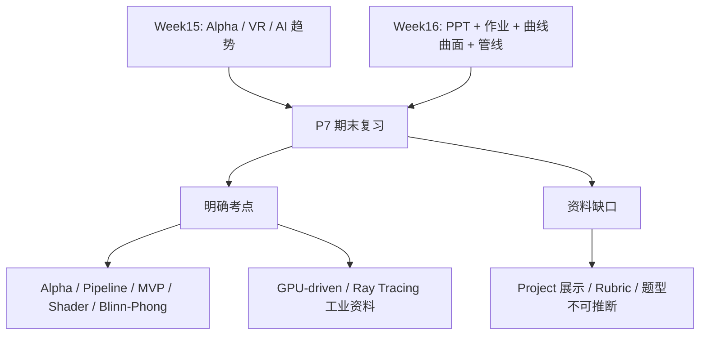
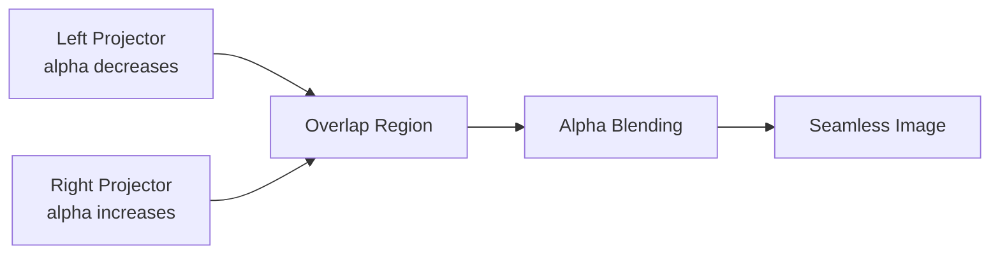
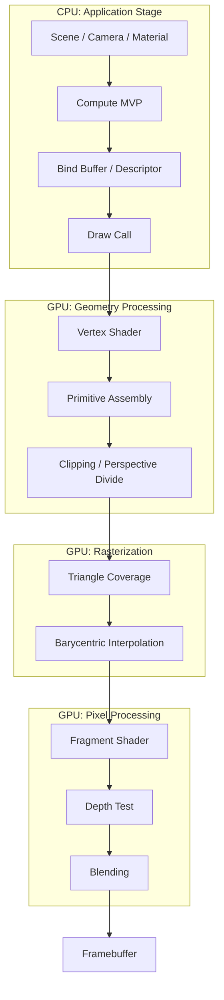
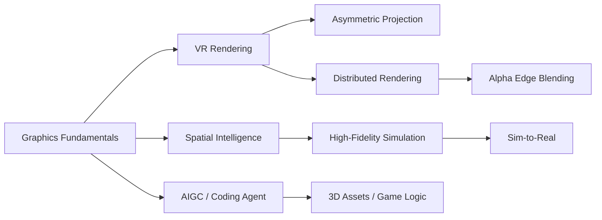

# CG Week 15-16 学习指南：期末总复习、曲线曲面与现代图形学收束

> **对应 Part**：P7 / `week15-16`  
> **范围定位**：Week 15-16 / Week15 课堂记录、Week16 邮件/课程总结、P1-P6 已完成指南与 NotebookLM 中可确认的工业资料；真实主线是期末复习边界、PPT/作业考点回收、曲线曲面补齐、渲染管线总复习与 VR/AI 趋势收束。
> **知识图谱**：`notebooklm-raw/week15-16/knowledge-graph.md`  
> **状态**：Agent 内部 Review 后的用户 Review 版；Week16 课程总结已由本地 FiCS/iCourse 导出、脱敏并加入 NotebookLM。

## 本指南要回答的问题 / 学习目标

读完本指南，你应该能回答：

- Week 15-16 能确认哪些期末复习边界，哪些题型、分值或 Project 展示规则不能从现有 source 推断。
- Alpha 混合(Alpha Blending)公式 $I=\alpha F+(1-\alpha)B$ 的符号、视觉意义和常见误读。
- 参数曲线(Parametric Curve)、B-spline Curve(B 样条曲线)与 NURBS(Non-Uniform Rational B-Spline，非均匀有理 B 样条)为什么补上 P5 几何建模缺口。
- 渲染管线(Rendering Pipeline)如何把 CPU 端场景、MVP(Model-View-Projection，模型-视图-投影)、Shader(着色器)、Buffer(缓冲区)和 Framebuffer(Frame Buffer，帧缓冲)串成一条复习主轴。
- GPU-driven Rendering(GPU 驱动渲染)、光线追踪(Ray Tracing)、路径追踪(Path Tracing)、VR(Virtual Reality，虚拟现实)和 AIGC(AI Generated Content，人工智能生成内容)在课程收束中各自承担什么角色。

## 0. 术语表

| 术语 | 本 Part 中的含义 | 先记住的直觉 |
|------|------------------|--------------|
| 图像合成(Image Compositing) | 把前景和背景按透明度合成最终像素 | 多层图像叠在一起 |
| Alpha 混合(Alpha Blending) | 用 $\alpha$ 控制前景对背景的遮挡程度 | $\alpha=1$ 只看前景，$\alpha=0$ 只看背景 |
| MVP(Model-View-Projection，模型-视图-投影) | Model、View、Projection 三个矩阵串联 | 把局部模型放进相机并投到屏幕 |
| Shader(着色器) | 运行在 GPU(Graphics Processing Unit，图形处理器)上的小程序 | 顶点和片元各做自己的计算 |
| Buffer(缓冲区) | CPU(Central Processing Unit，中央处理器)或 GPU 存放顶点、索引、常量等数据的内存区域 | 给 GPU 喂数据的容器 |
| Descriptor Set(描述符集) | Vulkan 等 API(Application Programming Interface，应用程序编程接口)中描述资源如何绑定给 shader 的对象 | 告诉 shader 到哪里拿矩阵、纹理和 buffer |
| 参数曲线(Parametric Curve) | 用参数 $u$ 生成曲线上点 | 一个旋钮扫出一条曲线 |
| 基函数(Basis Function) | 决定控制点在某个参数处贡献多少 | 每个控制点的影响力分布 |
| CV(Control Vertex，控制顶点) | 牵引曲线或曲面的控制点 | 曲线的“拉手” |
| B-spline Curve(B 样条曲线) | 由局部支撑基函数和节点向量控制的分段多项式曲线 | 移动一个控制点只影响附近曲线 |
| CAD(Computer-Aided Design，计算机辅助设计) | 工业设计中精确构造和编辑几何模型的系统 | 需要可控、光滑、精确的曲线曲面 |
| NURBS(Non-Uniform Rational B-Spline，非均匀有理B样条) | 带非均匀节点和权重的有理 B 样条 | CAD 里表达圆和复杂曲面的工业标准 |
| GPU-driven Rendering(GPU 驱动渲染) | 把剔除、LOD、绘制调度更多交给 GPU | 少让 CPU 一件件下命令 |
| Mesh Shader(网格着色器) | GPU 上直接处理 meshlet 的可编程阶段 | GPU 自己判断小网格簇要不要画 |
| Visibility Buffer(可见性缓冲) | 只记录可见物体 ID 和深度的轻量缓冲 | 先记“看见谁”，后面再查材质着色 |
| BVH(Bounding Volume Hierarchy，层次包围盒) | 用层级包围盒加速光线与场景求交 | 先排除一大块不可能命中的空间 |
| BRDF(Bidirectional Reflectance Distribution Function，双向反射分布函数) | 描述表面如何把入射光反射到观察方向 | 材质反光规律的函数 |
| VR(Virtual Reality，虚拟现实) | 通过头显和立体渲染产生沉浸式空间 | 画面要跟着头动保持世界稳定 |
| AIGC(AI Generated Content，人工智能生成内容) | 用 AI 生成图像、3D 资产或内容 | 把内容生产的一部分交给模型 |
| Sim-to-Real(Simulation to Reality，仿真到现实) | 先在仿真中训练，再迁移到真实世界 | 机器人先在虚拟沙盒练习 |

## 1. 知识地图

P7 的核心不是再开一门新专题，而是把前面 6 个 Part 拉回期末复习和工程应用。现在可确认的 source 是 Week15 与 Week16 两份课堂记录；Week16 由邮件课程总结脱敏导入 NotebookLM 后已可用。仍然没有独立的 Final Project 任务书、展示要求、详细评分标准(Rubric)或题型说明。

> **参考来源：** Week 15 课程记录；Week 16 邮件/课程总结；对应期末复习边界记录。
> raw batch: `overview-skeleton`、`notes-skeleton-week15`、`notes-skeleton-week16`、`source-boundary-week16-project-rubric`

> **追问：为什么不写 Project 展示 checklist？**
> 因为当前 source 没有展示流程、PPT 时长、Demo 要求或详细 rubric。可以写“作业与项目整合复习思路”，不能伪造最终展示规则。

## 2. 核心知识

### 2.1 期末怎么复习：PPT + 作业是主线

> **本节叙事线**：资料边界先定住 → 已确认考点回收 P1-P6 → 不能从 source 推断的题型和 Project 规则保持空白。

> **本节要回答**：哪些是已确认考点，哪些只是建议复习，哪些不能推断？

Week16 明确说：考试题目来自课堂讲授过的 PPT，作业内容一定会考。可确认的高价值复习点包括：渲染管线(Pipeline)、Blinn-Phong 光照模型、MVP 矩阵传递、Shader 编写、Buffer 绑定、Vulkan / OpenGL 渲染流程，以及 Week15 明确点名的 Alpha 混合公式。

| 类别 | 可以确认 | 不能推断 |
|------|----------|----------|
| 范围 | PPT 和作业相关内容 | 是否覆盖未讲自学内容 |
| 题型 | 未给出 | 选择、填空、计算、代码题比例 |
| 分值 | 未给出 | 各模块具体占比 |
| Project | 作业完成情况重要 | 是否有期末展示、展示流程、详细 rubric |

P1-P6 的复习地图可以这样看：

| Part | 回到期末时要抓住什么 | Week15/16 线索 |
|------|----------------------|------------------|
| P1 总览与数学 | 图形学应用、颜色、Alpha 合成 | Alpha 公式必考，颜色科学回顾 |
| P2 变换/相机/投影 | 齐次坐标、MVP、透视除法 | Week16 强调 MVP 传递和齐次坐标 |
| P3 光栅化/管线 | 应用、几何、光栅化、像素处理 | Pipeline 是判断是否学过图形学的核心 |
| P4 着色/纹理 | Shader、Blinn-Phong、纹理采样 | 作业会考 Shader 与 Blinn-Phong |
| P5 几何 | 曲线、曲面、NURBS、连续性 | Week16 补了参数曲线曲面 |
| P6 高级渲染 | Ray tracing、Path tracing、BVH、AI 降噪 | 工业资料与赛博朋克 2077 光追 |

**小结**：复习优先级不是“把所有概念平均背一遍”，而是先把作业中亲手碰过的管线、矩阵、shader、光照和光追逻辑讲清楚。

> **参考来源：** Week 16 邮件/课程总结；Week 15-16 课程记录；P1-P6 学习指南。
> raw batch: `concept-breakdown-exam-homework-boundary`、`review-map-final-exam-p1-p6`

### 2.2 Alpha 混合：明确必考的图像合成公式

> **本节叙事线**：图像合成问题 → Alpha 线性插值公式 → 数值例和投影融合场景 → 透明度/不透明度易混点。

> **本节要回答**：$I=\alpha F+(1-\alpha)B$ 到底在算什么？

Alpha 混合(Alpha Blending)是图像合成(Image Compositing)的线性插值：

$$
I=\alpha F+(1-\alpha)B,\qquad \alpha\in[0,1]
$$

其中 $I$ 是最终像素颜色，$F$ 是前景颜色，$B$ 是背景颜色，$\alpha$ 是前景不透明度(Opacity)。当 $\alpha=1$ 时只看前景；当 $\alpha=0$ 时只看背景；中间值表示半透明混合。

#### 数值例

如果 $F=0.8$，$B=0.2$，$\alpha=0.6$，则：

$$
I=0.6\times0.8+(1-0.6)\times0.2=0.56
$$

这类题的关键不是算术难，而是能解释“前景贡献 60%，背景贡献 40%”。

#### 投影融合直觉

在多投影或 VR 大屏拼接中，两台投影机的重叠区域容易变亮。边缘融合(Edge Blending)会让一侧的 $\alpha$ 从 1 渐变到 0，另一侧反向渐变，使重叠区总亮度保持平滑。

> **直观理解：Alpha 是透明度还是不透明度？**
> 本公式里 $\alpha$ 表示前景不透明度。日常说“透明度 40%”时，对应的不透明度可能是 60%，要先看定义再代公式。

| 易混点 | 正确理解 |
|--------|----------|
| $\alpha$ 当成透明度 | 本公式中 $\alpha$ 是前景不透明度，透明度口语说法要先换成公式定义 |
| RGB 单通道例和颜色向量例混淆 | 单通道例用于手算；真实颜色可对 R/G/B 三个分量分别套同一公式 |
| 投影融合以为只是调亮度 | 本质是在重叠区域用互补权重避免亮带和接缝 |

**小结**：Alpha 混合是 P7 中少数明确可手算的公式，复习时要同时会算数值、解释视觉意义和识别 $\alpha$ 的定义。

> **参考来源：** Week 15 课程记录；Week 16 邮件/课程总结。
> raw batch: `concept-breakdown-alpha-color-display`、`examples-alpha-blending-exam`

### 2.3 Week16 补齐的几何建模：曲线、曲面与 NURBS

> **本节叙事线**：三角网格适合渲染 → 连续设计需要参数曲线曲面 → 控制顶点和基函数控制形状 → NURBS 用权重和节点进入 CAD 场景。

> **本节要回答**：为什么图形学不只用三角形，还要学参数曲线曲面？

三角网格适合渲染，但工业设计、字体和 CAD 更需要可编辑、可缩放、光滑的连续几何。参数曲线(Parametric Curve)用参数 $u$ 生成曲线上点：

$$
Q(u)=\sum_{i=0}^{n} B_i(u)V_i
$$

$V_i$ 是控制顶点(Control Vertex)，$B_i(u)$ 是基函数(Basis Function)。直觉上，控制顶点像拉手，基函数决定每个拉手在当前位置有多大影响。

#### Bezier、B-spline、NURBS

| 表示 | 核心思想 | 优点 | 局限或定位 |
|------|----------|------|------------|
| Bezier Curve | Bernstein 基函数 + 控制多边形 | 端点插值、凸包性、直观 | 长复杂曲线会阶数过高 |
| B-spline Curve | 节点向量控制局部支撑 | 局部控制强 | 默认不一定经过端点 |
| NURBS | 非均匀节点 + 有理权重 | 可精确表示圆、椭圆，CAD 标准 | 实现和求交复杂 |

NURBS 的有理基函数常写为：

$$
R_i(u)=\frac{B_i(u)w_i}{\sum_{j=0}^{n}B_j(u)w_j}
$$

权重 $w_i$ 像控制顶点的“吸引力”。权重越大，曲线越靠近该控制顶点。

#### 曲面与连续性

张量积曲面(Tensor Product Surface)把曲线推广到二维参数域 $(u,v)$：

$$
S(u,v)=\sum_{i=0}^{m}\sum_{j=0}^{n}B_i(u)B_j(v)V_{i,j}
$$

连续性(Continuity)决定拼接处是否光滑：

| 连续性 | 意义 | 视觉效果 |
|--------|------|----------|
| $C^0$ | 位置相连 | 没断，但可能有角 |
| $C^1$ | 一阶导连续 | 切线方向连续，没有明显折痕 |
| $C^2$ | 二阶导连续 | 曲率也连续，反光更平滑 |

| 易混点 | 正确理解 |
|--------|----------|
| 控制顶点等于曲线上点 | 控制顶点主要牵引形状，Bezier 端点通常在曲线上，但 B-spline 不一定经过每个控制点 |
| $C^0$ 连续等于光滑 | $C^0$ 只保证位置接上，切线可能突变，反光会出现折痕 |
| 权重只是缩放坐标 | NURBS 的权重改变有理基函数贡献，会把曲线拉向或推离控制点 |

**小结**：Week16 的曲线曲面补上了 P5 中几何建模的连续表达部分。考试不一定要求完整 CAD 算法，但要能解释控制顶点、基函数、局部控制、权重和连续性的意义。

> **参考来源：** Week 16 邮件/课程总结；对应曲线曲面课程记录。
> raw batch: `concept-breakdown-curves-surfaces`、`deep-dive-curves-nurbs-continuity`

### 2.4 渲染管线总复习：从 CPU 到 Framebuffer

> **本节叙事线**：CPU 组织数据和状态 → GPU 顶点阶段应用 MVP → 光栅化生成 fragment → 片元阶段着色 → 深度、混合和 framebuffer 收束。

> **本节要回答**：一份模型数据如何变成屏幕像素？

这一图是期末复习主轴：

1. CPU 端应用阶段(Application Stage)：组织场景、相机、材质，计算 MVP，准备 Buffer 和 Descriptor Set。
2. 顶点着色器(Vertex Shader)：把顶点从模型空间经 MVP 变到裁剪空间。
3. 光栅化(Rasterization)：把三角形覆盖转换成片元(Fragment)，并插值属性。
4. 片元着色器(Fragment Shader)：做纹理采样、Blinn-Phong、颜色输出。
5. 深度测试(Depth Test)和混合(Blending)：决定可见性和透明合成。
6. 帧缓冲区(Framebuffer)：保存最终像素。

> **追问：MVP 为什么常和 Shader 一起考？**
> 因为作业里不是只写矩阵公式，而是要把矩阵作为 uniform 或 descriptor 传进 shader，再在顶点着色器中应用。考试很可能考“数学意义 + 管线位置 + 数据传递”这三件事的组合。

| 易混点 | 正确理解 |
|--------|----------|
| MVP 是 CPU 端还是 GPU 端概念 | CPU 常计算并上传矩阵；GPU 顶点着色器实际把矩阵作用到顶点 |
| Shader 负责整条管线 | Shader 只负责可编程阶段，光栅化、深度测试等很多阶段仍由固定功能硬件完成 |
| Buffer 和 Descriptor Set 混同 | Buffer 存数据；Descriptor Set 描述 shader 怎样访问这些资源 |

**小结**：这条管线是把 P2-P4 作业经验串起来的复习骨架；下一节看为什么现代工业渲染会继续重分配 CPU 与 GPU 的职责。

> **参考来源：** Week 16 邮件/课程总结；对应渲染管线和 Vulkan/OpenGL 作业复习记录。
> raw batch: `concept-breakdown-pipeline-programmable-api`、`visual-explain-pipeline-mvp-shader`

### 2.5 现代工业线索：GPU-driven Rendering

> **本节叙事线**：传统 CPU-driven 管线的 draw call 和状态切换成本升高 → GPU 并行处理 meshlet、LOD 和剔除 → Mesh Shader、MDI 与 Visibility Buffer 成为工业优化线索。

> **本节要回答**：为什么现代渲染越来越让 GPU 自己做决策？

传统 CPU-driven 管线由 CPU 做对象级剔除、LOD 选择和大量 Draw Call 提交。场景对象多时，瓶颈不一定是 GPU 算不过来，而是 CPU 一件件发命令、切状态、绑定资源太慢。

GPU-driven Rendering(GPU 驱动渲染)的思想是：把更多剔除、LOD、绘制参数生成放到 GPU 上，让 GPU 用并行能力直接处理大量 meshlet。

| 维度 | CPU-driven | GPU-driven |
|------|------------|------------|
| 调度核心 | CPU 决定每个物体怎么画 | GPU 根据场景数据生成绘制参数 |
| 绘制调用 | Draw Call 多，CPU 开销大 | MDI(Multi-Draw Indirect，间接多绘制)减少 CPU 干预 |
| 几何粒度 | Object 级 | Meshlet 级 |
| 几何阶段 | Vertex / Geometry Shader 为主 | Mesh Shader 直接处理网格簇 |
| 可见性缓冲 | 常用 G-buffer 存很多属性 | Visibility Buffer 先只存 ID 和深度 |

Visibility Buffer(可见性缓冲)的直觉是：先回答“这个像素看到哪个物体/三角形”，再按 ID 查询材质并着色。它比传统 G-buffer 少存许多材质属性，能降低带宽压力。

**小结**：Week16 推荐工业资料，不是要求背 Mesh Shader 代码，而是理解图形 API 和游戏引擎为什么演进到“GPU 更主动”的架构。

> **参考来源：** Week 16 邮件/课程总结；论文 GPU-Driven Rendering Pipelines；对应工业渲染资料。
> raw batch: `concept-breakdown-gpu-driven-rendering`、`compare-traditional-gpu-driven-pipeline`

### 2.6 P6 回看：光线追踪、路径追踪与 AI 降噪

> **本节叙事线**：P6 的光线、路径积分和加速结构回到期末复习 → 工业资料强调实时光追成本 → AI 降噪和光线重建承担低采样补偿。

> **本节要回答**：Week16 为什么又回到光追和路径追踪？

Week16 把 P6 高级渲染放进期末和工业资料语境：从渲染方程(Rendering Equation)、BRDF(Bidirectional Reflectance Distribution Function，双向反射分布函数)、BVH(Bounding Volume Hierarchy，层次包围盒)，到 Path Tracing(路径追踪)、Russian Roulette(俄罗斯轮盘赌)和 Ray Reconstruction(光线重建)。

复习时不要重写一遍 P6，而要抓三条线：

| 线索 | 要会解释 | 常见误区 |
|------|----------|----------|
| 物理目标 | 渲染方程统一直接光和间接光 | 只背公式不解释每项 |
| 计算方法 | Path tracing 用 Monte Carlo 求积分 | 以为随机采样就是随便乱射 |
| 工业落地 | BVH / RT Core / AI Denoising 降低成本 | 把 AI 降噪当作“凭空变清晰” |

**小结**：本节只做 P6 回看，不重写完整路径追踪；复习时应回到 P6 指南补公式和算法细节。

> **参考来源：** Week 16 邮件/课程总结；P6 指南 `guides/CG-Week12-14-学习指南.md`；论文 The Rendering Equation；论文 OptiX Ray Tracing Engine。
> raw batch: `concept-breakdown-raytracing-review`

### 2.7 VR、空间智能与 AI：课程收束

> **本节叙事线**：图形学基础支撑 VR 稳定显示 → 高保真仿真连接空间智能与 Sim-to-Real → AIGC 和 Coding Agent 改变内容生产但不替代底层判断。

> **本节要回答**：Week15-16 最后为什么讲 VR、空间智能和 AI 工具？

这些内容把前面学过的数学、管线、渲染和几何放进真实应用中：

考试核心更可能落在非对称投影矩阵(Asymmetric Projection Matrix)、Alpha 投影融合和渲染管线；空间智能(Spatial Intelligence)、World Labs、Sim-to-Real、Coding Agent、AIGC 则更像行业趋势和学习方法。

> **直观理解：为什么说图形学在 AI 时代更重要？**
> AI 需要理解和生成 3D 世界，机器人需要在安全、可控、可重复的仿真环境里训练。图形学提供的建模、渲染、物理和显示技术，正在从“画图”变成“构造可交互世界”。

**小结**：课程最后的趋势材料提醒你，图形学不只是期末公式集合，也是一整套构造、显示和理解三维世界的工程语言。

> **参考来源：** Week 15 课程记录；Week 16 邮件/课程总结；对应 VR、空间智能与 AIGC 趋势记录。
> raw batch: `concept-breakdown-vr-spatial-intelligence`、`visual-explain-vr-spatial-ai`

## 3. 易混点与常见错误

| 易混点 / 常见错误 | 正确理解 |
|-------------------|----------|
| 把“PPT 和作业会考”扩写成具体题型和分值 | 当前 source 没有题型、分值和 Project 展示 rubric，只能保守复习 |
| 把 Week16 的曲线曲面当成与三角网格无关的新课 | 它补的是连续几何建模表达，仍会回到渲染管线或 CAD / 工业建模 |
| 只背 Alpha 公式不解释 $\alpha$ | 需要能说清 $\alpha$ 是前景不透明度，并能解释前景/背景贡献 |
| 把 GPU-driven Rendering 当成某个单一 API | 它是一组把剔除、LOD、绘制调度推给 GPU 的管线思想 |
| 把 AI 降噪当成物理渲染替代品 | AI 降噪是低采样实时渲染的重建和补偿，不替代渲染方程、采样和可见性判断 |
| 复习 P7 时脱离 P1-P6 | P7 的价值在于把前面所有 Part 串回作业、PPT 和工业应用 |

> **参考来源：** Week 15-16 课程记录；Week 16 邮件/课程总结；P1-P6 学习指南。
> raw batch: `review-map-final-exam-p1-p6`、`source-boundary-week16-project-rubric`

## 4. 复习路线 / 自测题 / 前后 Part 承接

### 4.1 最后复习 Checklist

- 能写出并解释 $I=\alpha F+(1-\alpha)B$，且知道 $\alpha\in[0,1]$。
- 能画出从 CPU 应用阶段到 Framebuffer 的渲染管线数据流。
- 能解释 MVP 三个矩阵各自负责哪个空间变换。
- 能说清 Vertex Shader 和 Fragment Shader 的职责差别。
- 能把 Blinn-Phong 放回作业和片元着色语境。
- 能解释 Bezier、B-spline、NURBS 的关系，以及控制顶点 / 基函数 / 权重的直觉。
- 能对比传统 CPU-driven 管线和 GPU-driven rendering。
- 能说明光追 / 路径追踪 / BVH / AI 降噪的关系，但不必把 P6 全部重背。
- 能明确说出当前资料没有 Project 展示要求、详细 rubric 和题型说明。

### 4.2 建议复习路线

1. 先读资料边界，明确“已确认考点”和“不可推断内容”，避免把复习时间花在猜题型上。
2. 用 Alpha 混合(Alpha Blending)和渲染管线(Rendering Pipeline)做两条硬主线：一条练公式，一条画数据流。
3. 回到 P1-P6 指南，把 MVP、Shader、Buffer、Blinn-Phong、曲线曲面、路径追踪分别补到对应 Part。
4. 用本指南的易混点表做口头自测，尤其是 $\alpha$ 定义、MVP 数据传递、Shader 职责边界和 GPU-driven 管线思想。
5. 最后再看 VR、空间智能和 AIGC 趋势，把它们当作课程收束和应用地图，不当作未确认的题型清单。

### 4.3 自测题

1. Week 15-16 当前 source 能确认哪些考试范围？哪些信息不能推断？
2. 如果前景颜色 $F=0.7$、背景颜色 $B=0.1$、$\alpha=0.25$，最终单通道颜色 $I$ 是多少？它的视觉意义是什么？
3. 为什么 NURBS(Non-Uniform Rational B-Spline，非均匀有理 B 样条)比普通 Bezier Curve 更适合 CAD 场景？
4. 画出 CPU 端 Compute MVP → Bind Buffer / Descriptor → Vertex Shader → Rasterization → Fragment Shader → Depth Test / Blending → Framebuffer 的数据流，并说明每一步输入输出。
5. GPU-driven Rendering(GPU 驱动渲染)试图缓解 CPU-driven 管线的什么瓶颈？Mesh Shader(网格着色器)和 Visibility Buffer(可见性缓冲)各自提供什么直觉？
6. 为什么 P7 复习光线追踪(Ray Tracing)和路径追踪(Path Tracing)时，不应该脱离 P6 的渲染方程(Rendering Equation)、BVH 和采样优化？

### 4.4 前后 Part 承接

P7 是全课收束：它向前回收 P1 的图形学地图、P2 的 MVP 和投影、P3 的光栅化与可见性、P4 的 Shader / Blinn-Phong / 纹理、P5 的几何表示、P6 的光追和路径追踪；向后则连接期末复习、工程作品解释和继续学习现代实时渲染、VR/AR、空间智能与 AIGC 的路线。

> **总收束**：P7 的复习方式是“用 Week15-16 的口头重点把 P1-P6 串起来”。先抓作业和 PPT 中真正做过、讲过的管线与公式，再用 Week16 的曲线曲面、GPU-driven、VR/AI 趋势完成课程闭环。
