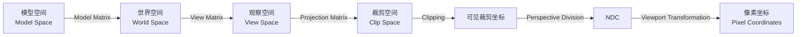
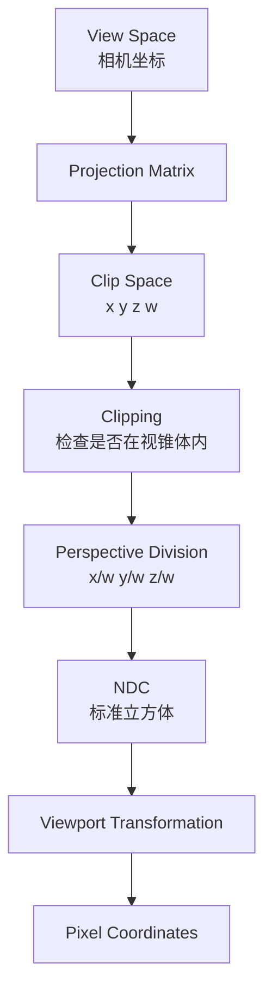
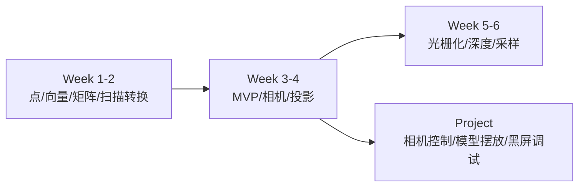

# CG Week 3-4 学习指南：变换、相机与投影

> **对应 Part**：P2 / `week3-4`  
> **知识图谱**：`notebooklm-raw/week3-4/knowledge-graph.md`  
> **状态**：Agent 内部 Review 后的用户 Review 版；遵循术语首现解释、英语考试对照、章节就近引用与 Markdown 表格安全标准。

## 0. 术语表

| 术语 | 本 Part 中的含义 | 先记住的直觉 |
|------|------------------|--------------|
| 几何变换(Geometric Transformation) | 把点或物体从一个配置映射到另一个配置 | 改变模型的位置、朝向、大小或形状 |
| 仿射变换(Affine Transformation) | 保持直线和平行关系的变换，如平移、旋转、缩放、错切 | 多数建模变换都属于这一类 |
| 齐次坐标(Homogeneous Coordinates) | 给坐标增加 $w$ 分量，用统一矩阵表达平移和投影 | $w$ 是“点、方向、透视”的开关 |
| 矩阵组合(Matrix Composition) | 将多个变换矩阵连乘成一个复合矩阵 | 顺序写错，物体就去错地方 |
| 局部坐标(Local Coordinates) / 模型空间(Model Space) | 模型自己内部的坐标系 | 物体还没放进世界前的坐标 |
| 世界空间(World Space) | 场景中所有物体共享的坐标系 | 所有模型最终在同一张地图上 |
| 层次结构(Transformation Hierarchy) | 父子节点通过矩阵链继承变换 | 机器人手臂中小臂跟着大臂动 |
| 相机模型(Camera Model) | 用位置、朝向、视场等参数描述虚拟相机 | 决定“从哪里看、往哪看” |
| 观察变换(Viewing Transformation) | 将世界空间转换到相机坐标系 | 固定相机，反向移动整个世界 |
| View Matrix(视图矩阵) | 执行观察变换的矩阵 | 把世界搬到相机眼前 |
| 投影变换(Projection Transformation) | 将观察空间中的 3D 点映射到可成像空间 | 决定正交或近大远小 |
| FOV(Field of View，视场角) | 相机能看到的角度范围 | FOV 越大，视野越宽 |
| Clip Space(裁剪空间) | 投影矩阵输出的齐次坐标空间 | 还没除以 $w$，先判断能不能看见 |
| NDC(Normalized Device Coordinates，规范化设备坐标) | 透视除法后的标准立方体坐标 | 与屏幕分辨率无关的中间坐标 |
| Viewport Transformation(视口变换) | 将 NDC 映射到屏幕像素范围 | 把标准小盒子拉伸到真实窗口 |
| MVP(Model-View-Projection，模型-观察-投影) | Model、View、Projection 三类矩阵组成的空间变换链 | 顶点从模型坐标走到裁剪空间的主路 |

## 1. 知识地图

Week 3-4 解决的是一个核心问题：**模型已经有了坐标，怎样把它摆进世界、放到相机眼前，再投到屏幕上？**



> **追问：为什么 Week 3-4 要紧跟 Week 1-2 的点、向量、矩阵？**  
> 因为渲染管线并不是直接“画模型”。它先把顶点在多个坐标空间之间搬运。点(Point)、向量(Vector)、齐次坐标(Homogeneous Coordinates) 和矩阵(Matrix) 是这条搬运链的语言。

> **参考 raw：** `overview-skeleton.answer.md`、`stage1-summary.md`、`visual-explain-mvp-pipeline.answer.md`。

## 2. 核心知识

### 2.1 几何变换：把模型摆进世界

> **本节叙事线**：模型先在自己的坐标系中定义 → 基本变换改变顶点 → 齐次坐标把平移也纳入矩阵乘法。

> **本节要回答**：为什么平移、旋转、缩放最后都要写成矩阵？

几何变换(Geometric Transformation) 的对象不是“整块模型”这个抽象名词，而是模型的顶点(Vertex)。如果一个三角形的三个顶点都被同一个矩阵变换，三角形整体就完成了移动、旋转或缩放。这样做非常适合 GPU 并行处理：每个顶点都执行类似的矩阵乘法。

常见基本变换包括：

| 变换 | 英文 | 几何意义 | 典型矩阵位置 |
|------|------|----------|--------------|
| 平移 | Translation | 沿向量整体移动 | 4x4 矩阵最后一列 |
| 旋转 | Rotation | 绕原点或某个轴转动 | 左上 3x3 线性部分 |
| 缩放 | Scale | 沿坐标轴拉伸或压缩 | 对角线比例项 |
| 错切 | Shear | 一个坐标受另一个坐标影响而偏移 | 非对角线线性项 |

平移(Translation) 不能用普通 $2 \times 2$ 或 $3 \times 3$ 线性矩阵表示，因为线性变换必须把原点映射到原点。齐次坐标(Homogeneous Coordinates) 的作用就是补一个 $w$ 分量，让平移也能进入统一的矩阵乘法。

```text
点(Point):    (x, y, z, 1)
向量(Vector): (x, y, z, 0)
```

一个 3D 仿射变换(Affine Transformation) 常写成：

$$
\begin{bmatrix}
a & b & c & t_x \\
d & e & f & t_y \\
g & h & i & t_z \\
0 & 0 & 0 & 1
\end{bmatrix}
\begin{bmatrix}
x \\ y \\ z \\ 1
\end{bmatrix}
=
\begin{bmatrix}
x' \\ y' \\ z' \\ 1
\end{bmatrix}
$$

左上角 $3 \times 3$ 负责旋转、缩放、错切；最后一列 $\begin{bmatrix} t_x & t_y & t_z \end{bmatrix}^T$ 负责平移。若输入是方向向量，$w=0$ 会让平移项消失，这正符合“方向不应被平移改变”的几何意义。

> **直观理解：$w$ 不只是多写一个数字。**  
> 在建模变换中，$w$ 区分点和向量；在投影变换中，$w$ 又会保存深度信息，供透视除法(Perspective Division) 使用。它贯穿了 Part 2 的前后半段。

**小结**：几何变换先解决“物体如何改变位置和形态”。但真实场景会连续做多个变换，下一步必须处理顺序。

> **参考 raw：** `concept-breakdown-geometric-transforms.answer.md`、`slide-skeleton-lecture03.answer.md`。

### 2.2 矩阵顺序与层次结构：为什么不能乱乘

> **承接 2.1**：基本矩阵已经有了，但模型通常不是只变换一次。

> **本节要回答**：为什么先旋转再平移，和先平移再旋转不是同一件事？

本课程使用的典型表达是列向量(Column Vector) 约定。若点 $\mathbf{p}$ 先经过 $M_1$，再经过 $M_2$，写法是：

$$
\mathbf{p}' = M_2(M_1\mathbf{p}) = (M_2M_1)\mathbf{p}
$$

所以**最右边的矩阵最先执行**。这和复合函数 $f(g(x))$ 中 $g$ 先作用于 $x$ 是同一逻辑。

看一个最小例子。设二维点 $\mathbf{p}=(1,0,1)^T$，绕原点旋转 $90^\circ$：

$$
R =
\begin{bmatrix}
0 & -1 & 0 \\
1 & 0 & 0 \\
0 & 0 & 1
\end{bmatrix},
\quad
T =
\begin{bmatrix}
1 & 0 & 2 \\
0 & 1 & 1 \\
0 & 0 & 1
\end{bmatrix}
$$

先旋转再平移：

$$
T R \mathbf{p} = T(0,1,1)^T = (2,2,1)^T
$$

先平移再旋转：

$$
R T \mathbf{p} = R(3,1,1)^T = (-1,3,1)^T
$$

结果不同，因为矩阵乘法不满足交换律。视觉上，前者像“物体先原地转，再搬走”；后者像“先搬远，再绕原点转一大圈”。

层次结构(Transformation Hierarchy) 是矩阵组合的工程版本。机器人手臂可以写成：

$$
\mathbf{p}_{world}
=
M_{base} M_{upper} M_{lower}\mathbf{p}_{local}
$$

下臂的顶点先受自己的局部矩阵影响，再继承上臂和底座的变换。底座一转，整条手臂跟着转，因为 $M_{base}$ 影响后面所有子节点。

| 易混概念 | 正确理解 |
|----------|----------|
| 矩阵写在左边 | 不代表先执行；列向量约定下，靠近点的右侧矩阵先执行 |
| 局部坐标(Local Coordinates) | 模型自己的内部坐标，适合定义几何形状 |
| 世界空间(World Space) | 所有模型放到同一场景后的统一坐标 |
| Scene Graph(场景图) | 用父子节点组织矩阵继承，不是简单文件目录 |

**小结**：Model Matrix 把物体从局部空间放进世界空间。接下来要问：这个世界从哪只“眼睛”看？

> **参考 raw：** `concept-breakdown-composition-hierarchy.answer.md`、`examples-transform-order-matrix-chain.answer.md`；Stage 3 原始数值例有排版异常，本节使用校正后的 LaTeX 例子。

### 2.3 相机与 View Matrix：反向移动世界

> **承接 2.2**：物体已经在世界空间中，但屏幕图像必须从某个相机视角生成。

> **本节要回答**：为什么 View Matrix 不是“移动相机”，而是“反向移动世界”？

相机模型(Camera Model) 用三个核心输入定义观察方式：

- 视点(Eye Position)：相机在世界空间的位置 $\mathbf{E}$。
- 注视点(Look-at Point)：相机看向的目标 $\mathbf{at}$。
- 上向量(Up Vector)：相机头顶大致朝向 $\mathbf{V}_{up}$。

图形学里常把相机规范化为：相机位于原点，看向 $-Z$ 轴。真实相机若在世界中移动，本质上等价于让整个世界做相机运动的反变换。于是观察变换(Viewing Transformation) 的目标是把世界空间(World Space) 转换到观察空间(View Space / Camera Space)。

相机基向量可按右手坐标系(Right-handed Coordinate System) 构造：

$$
\mathbf{B} =
\frac{\mathbf{E} - \mathbf{at}}
{\lVert \mathbf{E} - \mathbf{at} \rVert}
$$

$$
\mathbf{R} =
\frac{\mathbf{V}_{up} \times \mathbf{B}}
{\lVert \mathbf{V}_{up} \times \mathbf{B} \rVert},
\quad
\mathbf{U} = \mathbf{B} \times \mathbf{R}
$$

这里 $\mathbf{B}$ 是 Back 向量，因为相机默认看向 $-Z$，所以相机局部的 $+Z$ 指向“身后”。$\mathbf{R}$ 是 Right 向量，$\mathbf{U}$ 是修正后的 True Up 向量。

为什么先构造 Camera-to-World(C2W，相机到世界变换) 再求逆？因为 C2W 很直观：它把标准相机放到世界里的 $\mathbf{E}$ 位置，并让它的三个轴对齐到 $\mathbf{R}, \mathbf{U}, \mathbf{B}$。

$$
M_{view}^{-1} =
\begin{bmatrix}
R_x & U_x & B_x & E_x \\
R_y & U_y & B_y & E_y \\
R_z & U_z & B_z & E_z \\
0 & 0 & 0 & 1
\end{bmatrix}
$$

真正需要的 View Matrix(视图矩阵) 是世界到相机，所以：

$$
M_{view} = (M_{view}^{-1})^{-1}
$$

> **追问：为什么相机在 $(0,0,5)$ 看原点时，View Matrix 会把世界沿 $Z$ 方向平移 $-5$？**  
> 因为我们不是把相机真的搬回原点，而是把整个世界做相反运动。相机在世界里向 $+Z$ 走了 5，世界在相机眼中就整体向 $-Z$ 走 5。

**小结**：View Matrix 把世界放到相机坐标系里。现在所有点仍是 3D，下一步要把它们投到 2D 成像平面。

> **参考 raw：** `concept-breakdown-camera-view.answer.md`、`deep-dive-view-matrix-lookat.answer.md`、`slide-module-detail-lecture04-part2.answer.md`。

### 2.4 投影：从 3D 观察空间到可成像空间

> **承接 2.3**：View Space 已经以相机为中心，但屏幕是二维的。

> **本节要回答**：正交投影和透视投影到底差在哪里？

投影变换(Projection Transformation) 定义相机如何把 3D 点压到可成像空间。课程中主要区分：

| 类型 | 英文 | 视觉效果 | 常见用途 |
|------|------|----------|----------|
| 正交投影 | Orthographic Projection | 物体大小不随深度变化 | 工程制图、CAD、精确测量 |
| 斜投影 | Oblique Projection | 投影线不垂直观察平面 | 了解即可 |
| 透视投影 | Perspective Projection | 近大远小，平行线可汇聚 | 游戏、电影、真实感渲染 |

透视投影(Perspective Projection) 的直觉来自相似三角形(Similar Triangles)。若相机在原点，投影平面距离为 $n$，观察空间点为 $P(x,y,z)$，则有：

$$
\frac{x'}{n} = \frac{x}{z},
\quad
\frac{y'}{n} = \frac{y}{z}
$$

因此：

$$
x' = \frac{nx}{z},
\quad
y' = \frac{ny}{z}
$$

当 $z$ 变大时，$x'$ 和 $y'$ 变小，于是远处物体看起来更小。

视锥体(View Frustum) 由 FOV(Field of View，视场角)、Aspect Ratio(宽高比)、Near Plane(近裁剪面) 和 Far Plane(远裁剪面) 定义：

- FOV 越大，能看到的范围越宽，但物体显得更小。
- Aspect Ratio 决定横纵比例，错了会把圆拉成椭圆。
- Near/Far 决定深度范围，也影响深度精度。

投影矩阵(Projection Matrix) 的输出不是最终像素，而是裁剪空间(Clip Space) 中的齐次坐标 $(x,y,z,w)$。透视投影会把深度信息编码到 $w$，为后面的透视除法做准备。

**小结**：投影不是一步到屏幕，而是先进入 Clip Space。这个中间状态是理解裁剪和 NDC 的关键。

> **参考 raw：** `concept-breakdown-projection.answer.md`、`deep-dive-projection-clip-ndc.answer.md`、`slide-module-detail-lecture04-part2.answer.md`。

### 2.5 Clip Space、NDC 与 Viewport：最后怎么到像素

> **承接 2.4**：投影矩阵已经输出齐次裁剪坐标，但还没有真正变成屏幕坐标。

> **本节要回答**：为什么要先裁剪，再做透视除法和视口映射？

从投影到像素的链路如下：



裁剪(Clipping) 放在透视除法之前，原因有两个：

1. 在齐次坐标下线段和多边形仍保持适合裁剪的结构，判断条件统一。
2. 若先除以 $w$，相机后方或 $w$ 接近 0 的点可能造成异常。

透视除法(Perspective Division) 将 Clip Space 坐标变为 NDC(Normalized Device Coordinates，规范化设备坐标)：

$$
\begin{bmatrix}
x_{ndc} \\
y_{ndc} \\
z_{ndc}
\end{bmatrix}
=
\begin{bmatrix}
x / w \\
y / w \\
z / w
\end{bmatrix}
$$

NDC 与具体屏幕分辨率无关，通常可理解为范围在 $[-1,1]^3$ 的标准立方体。最后 Viewport Transformation(视口变换) 把它映射到真实窗口。若视口左下角是 $(v_{x1}, v_{y1})$，宽高为 $W,H$，则：

$$
v_x = v_{x1} + (x_{ndc}+1)\frac{W}{2}
$$

$$
v_y = v_{y1} + (y_{ndc}+1)\frac{H}{2}
$$

例如 $x_{ndc}=0, y_{ndc}=0$，在 $1024 \times 1024$ 视口中会映射到屏幕中心 $(512,512)$。

> **直观理解：Clip Space 不是 NDC。**  
> Clip Space 还保留 $w$，适合判断“该不该看”；NDC 是除以 $w$ 后的标准坐标，适合映射到任意分辨率。

**小结**：到这里，Part 2 完成了从模型空间到像素坐标前的全部几何变换。下一周的光栅化会接手“哪些像素被图元覆盖”。

> **参考 raw：** `concept-breakdown-clip-ndc-viewport.answer.md`、`deep-dive-projection-clip-ndc.answer.md`、`visual-explain-mvp-pipeline.answer.md`。

## 3. 重难点与易错点

### 3.1 把 Model、View、Projection 混成一个“万能矩阵”

MVP(Model-View-Projection，模型-观察-投影) 常被写成一个矩阵：

$$
\mathbf{p}_{clip}
=
P \cdot V \cdot M \cdot \mathbf{p}_{model}
$$

但学习时不要把它压扁成一个黑盒：

- $M$ 负责 Model Space 到 World Space。
- $V$ 负责 World Space 到 View Space。
- $P$ 负责 View Space 到 Clip Space。

调试时也要按空间查：模型位置错先查 $M$，相机看不到先查 $V$，透视畸变或裁剪异常再查 $P$。

### 3.2 混淆点(Point) 和向量(Vector)

点的 $w=1$，方向向量的 $w=0$。如果把法线、光线方向或相机朝向当成点，它们会错误地吃到平移项，后续光照和观察方向都会错。

### 3.3 误以为投影后直接是屏幕坐标

Projection Matrix 输出的是 Clip Space，不是像素。中间还有 Clipping、Perspective Division、NDC 和 Viewport Transformation。少想一步，就容易把 NDC、Screen Space、Pixel Coordinates 混在一起。

### 3.4 叉积顺序写反

构造相机基向量时，$\mathbf{V}_{up} \times \mathbf{B}$ 和 $\mathbf{B} \times \mathbf{V}_{up}$ 方向相反。叉积顺序错了，相机右方向会翻转，画面可能左右颠倒或直接看不到目标。

## 4. 知识串联



Week 3-4 是从数学到渲染工程的转折点。你不只是在背矩阵，而是在建立一套调试语言：

- 物体绕错中心转：先查矩阵组合顺序。
- 画面黑屏：查物体是否在 View Space 的相机前方、是否被 near/far 裁剪。
- 图像被拉伸：查 Aspect Ratio 或 Viewport。
- 透视效果不对：查 Projection Matrix 的 $w$ 分量和透视除法。

## 5. 复习路线与自检

1. 画出 Model Space → World Space → View Space → Clip Space → NDC → Pixel Coordinates 的链路，并说明每一步输入输出。
2. 手推一个点先旋转再平移、先平移再旋转的结果，确认自己理解矩阵从右到左应用。
3. 用 Eye、Look-at、Up 构造 $\mathbf{B}, \mathbf{R}, \mathbf{U}$，解释为什么 View Matrix 是 C2W 的逆。
4. 用相似三角形解释透视投影的近大远小，再说明 $w$ 如何进入透视除法。
5. 区分 Clip Space、NDC、Viewport 和 Pixel Coordinates，不把它们混成“屏幕坐标”。
