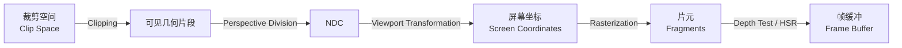
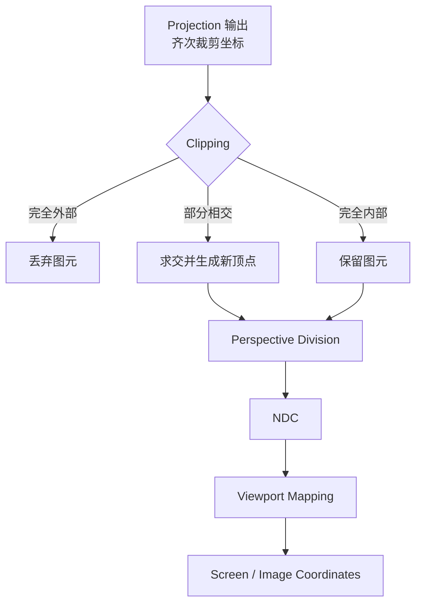
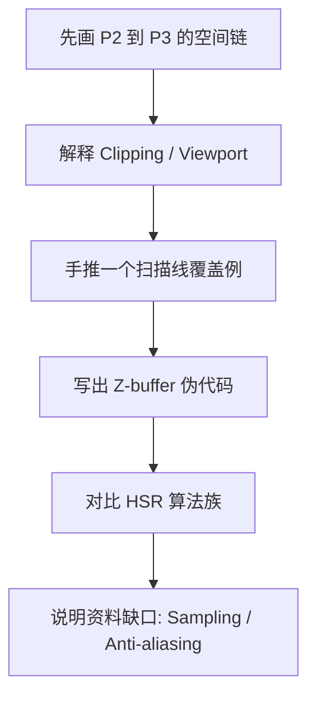

# CG Week 5-6 学习指南：光栅化、可见性与深度缓冲

> **对应 Part**：P3 / `week5-6`  
> **知识图谱**：`notebooklm-raw/week5-6/knowledge-graph.md`  
> **状态**：Agent 内部 Review 后的用户 Review 版；遵循术语首现解释、英语考试对照、章节就近引用与 Markdown 表格安全标准。

## 0. 术语表

| 术语 | 本 Part 中的含义 | 先记住的直觉 |
|------|------------------|--------------|
| 裁剪(Clipping) | 删除或截断视锥体 / 窗口外的几何图元 | 不在镜头里的部分先别送去画 |
| NDC(Normalized Device Coordinates，规范化设备坐标) | 透视除法后的标准坐标范围，通常是 $[-1,1]^3$ | 与屏幕分辨率无关的中转盒子 |
| 视口变换(Viewport Transformation) | 将 NDC 或窗口坐标映射到屏幕像素范围 | 把标准盒子拉伸到真实窗口 |
| 扫描转换(Scan Conversion) | 把连续几何图元转换为离散像素 / 片元 | 数学三角形变成屏幕网格上的覆盖点 |
| 光栅化(Rasterization) | 现代管线中生成片元的离散化阶段 | 判断哪些像素被三角形覆盖 |
| 像素(Pixel) | 图像上的离散采样单元 | 屏幕格子 |
| 片元(Fragment) | 候选像素样本，携带深度、颜色、纹理坐标等属性 | 还没通过测试的“准像素” |
| HSR(Hidden Surface Removal，隐藏面消除 / 消隐) | 判定哪些表面可见、哪些被遮挡 | 多个面抢同一像素时选谁 |
| 深度测试(Depth Test) | 比较当前片元和深度缓冲中的深度 | 更近的片元留下 |
| Z-buffer(Depth Buffer，深度缓冲) | 每个像素存一个当前最近深度值的缓冲区 | 屏幕每格记住“最近的 z” |
| 帧缓冲(Frame Buffer) | 存放最终像素颜色的缓冲区 | 显示器最终读取的颜色表 |
| 背面剔除(Back-face Culling) | 根据法线和视线方向丢弃背向相机的面 | 先把看不见的背面扔掉 |
| 画家算法(Painter's Algorithm) | 从远到近绘制多边形 | 像画画一样近处盖远处 |
| A-buffer(Accumulation Buffer，累积缓冲) | 每像素保存多个片元列表的缓冲思想 | 为透明和抗锯齿保留更多候选 |
| BSP Tree(Binary Space Partitioning Tree，二叉空间剖分树) | 用平面递归切分空间以获得绘制顺序 | 静态场景的空间排序树 |

## 1. 知识地图

Week 5-6 解决的是 Part 2 之后的问题：**顶点已经被投影到可成像空间，接下来怎样把连续几何变成屏幕像素，并保证前后遮挡正确？**



> **追问：为什么 P3 不直接从“画三角形”开始？**  
> 因为三角形进入屏幕前还处在一串坐标空间中。裁剪(Clipping)、NDC 和视口变换(Viewport Transformation) 决定它能不能进入屏幕、进入屏幕后落在哪些像素附近；光栅化(Rasterization) 才负责生成片元(Fragment)。

> **参考 raw：** `visual-explain-post-projection-pipeline.answer.md`、`concept-breakdown-pipeline-after-projection.answer.md`、`knowledge-graph.md`。

## 2. 核心知识

### 2.1 从投影后到像素前：这段管线到底做什么

> **本节叙事线**：Projection 产生裁剪空间 → Clipping 保留可见几何 → Perspective Division 得到 NDC → Viewport 映射到像素坐标 → Rasterization 生成 fragment → Depth Test 决定最终可见像素。

> **本节要回答**：为什么投影完还不能直接写入屏幕？

投影变换(Projection Transformation) 之后，几何还不是屏幕像素。它首先需要经过裁剪(Clipping)：如果线段、多边形或三角形的一部分在视锥体之外，就要被删除或截断。这样做既避免绘制看不见的部分，也防止后续光栅化处理无效图元。

裁剪后，系统执行透视除法(Perspective Division)，把齐次坐标除以 $w$，进入 NDC(Normalized Device Coordinates，规范化设备坐标)。NDC 仍然不等于像素坐标，它只是一个标准化空间。视口变换(Viewport Transformation) 再把这个标准空间映射到具体窗口分辨率：

$$
v_x = v_{x1} + (w_x - w_{x1})\frac{v_{x2}-v_{x1}}{w_{x2}-w_{x1}}
$$

$$
v_y = v_{y1} + (w_y - w_{y1})\frac{v_{y2}-v_{y1}}{w_{y2}-w_{y1}}
$$

这里 $(w_x,w_y)$ 是窗口 / NDC 侧坐标，$(v_x,v_y)$ 是视口 / 像素侧坐标。Stage 2 raw 中 Liang-Barsky 的参数区间出现了引用排版噪声；正确直觉是线段参数 $t \in [0,1]$，裁剪算法通过求有效 $t$ 区间保留窗口内线段。



> **参考 raw：** `concept-breakdown-clipping-viewport.answer.md`、`slide-skeleton-lecture04-05-part3.answer.md`。

### 2.2 扫描转换 / 光栅化：连续几何怎样变成 fragment

> **本节叙事线**：屏幕坐标中的三角形仍是连续形状 → 光栅化检查像素覆盖 → 对覆盖点生成 fragment → 插值得到深度、颜色、纹理坐标和法线。

> **本节要回答**：一个数学三角形怎样落到整数像素网格上？

扫描转换(Scan Conversion) / 光栅化(Rasterization) 的核心是离散化：输入是屏幕空间(Screen Coordinates)中的 2D 图元，输出是被图元覆盖的一批片元(Fragment)。每个片元不仅有像素位置，还携带深度(Depth)、颜色(Color)、纹理坐标(Texture Coordinates)、法线(Normal) 等属性。

对三角形来说，最直观的规则是像素中心(Pixel Center)：把每个像素看作一个小方格，用中心点 $(x+0.5,y+0.5)$ 代表这个像素。如果中心点落在三角形内部，就生成一个 fragment。扫描线算法(Scan-line Algorithm) 则把多边形按水平行处理，找到当前扫描线与边的交点，两个交点之间的像素区间就是跨度(Span)。

一个小例子：三角形顶点为 $P_1(2,1)$、$P_2(8,1)$、$P_3(5,5)$。当扫描线到 $y=3$ 时，左边交点约为 $x_L=3.5$，右边交点约为 $x_R=6.5$。检查像素中心后，$x=4,5,6$ 对应的中心点落在跨度内，于是这一行生成 3 个片元。

| 光栅化材料 | 解决的问题 | 输出给谁 |
|------------|------------|----------|
| 像素中心(Pixel Center) | 用一个采样点代表像素 | 覆盖测试 |
| 三角形覆盖(Triangle Coverage) | 判断像素是否被图元覆盖 | fragment 生成 |
| 扫描线跨度(Scan-line Span) | 按行批量填充多边形 | 软件 / 概念光栅化 |
| Bresenham 算法 | 用整数增量画直线 | 直线 rasterization |
| 插值(Interpolation) | 给 fragment 计算深度、颜色、纹理坐标、法线 | Depth Test 与后续 Shading |

> **直观理解：fragment 为什么还不是最终 pixel？**  
> 因为多个三角形可能覆盖同一个像素。光栅化只说“这个三角形想在这里画一个候选点”，深度测试(Depth Test)、模板测试和混合等后段操作才决定它是否真正写入帧缓冲(Frame Buffer)。

> **参考 raw：** `examples-rasterization-scanline-interpolation.answer.md`、`concept-breakdown-scan-conversion-rasterization.answer.md`。

### 2.3 可编程管线：shader 和固定功能阶段的边界

> **本节叙事线**：现代 GPU 不是纯固定黑盒 → 顶点 / 片元等阶段可编程 → 裁剪、光栅化、深度测试等仍主要由硬件固定功能高效执行。

> **本节要回答**：为什么写 shader 不等于自己实现整条管线？

固定功能管线(Fixed-function Pipeline) 时代，开发者主要配置硬件开关。可编程管线(Programmable Pipeline) 让开发者用着色器(Shader) 自定义部分计算，例如在顶点着色器(Vertex Shader) 中写 MVP(Model-View-Projection，模型-观察-投影) 矩阵乘法，在片元着色器(Fragment Shader) 中计算颜色、纹理和光照。

但并不是所有阶段都由 shader 写。裁剪、光栅化、深度测试等通常仍属于硬件固定功能或半固定功能阶段，因为这些操作要对大量图元 / fragment 高效并行执行。


| 管线责任 | 主要控制者 | 本 Part 里的理解 |
|----------|------------|------------------|
| MVP 变换 | Vertex Shader / 开发者 | P2 的矩阵链在现代管线中常由 shader 实现 |
| Clipping | 硬件固定功能 | 丢弃或截断视野外几何 |
| Rasterization | 硬件固定功能 | 把屏幕空间图元变成 fragments |
| Fragment Shading | Fragment Shader / 开发者 | 颜色、纹理、光照计算，承接 P4 |
| Depth Test | 固定功能 / 输出合并阶段 | 用 Z-buffer 判断可见性 |

> **参考 raw：** `concept-breakdown-programmable-pipeline.answer.md`、`overview-skeleton.answer.md`。

### 2.4 Hidden Surface Removal：为什么需要消隐

> **本节叙事线**：多个面可能投影到同一像素 → 有些面背向相机，有些被遮挡，有些相交 → 消隐算法决定最终可见表面。

> **本节要回答**：为什么光栅化后还要做可见性判断？

消隐(Hidden Surface Removal, HSR) 也叫可见面判定(Visible Surface Determination)。它处理的不是“物体有没有被投影到屏幕”，而是“投影到同一屏幕区域时，谁应该被看见”。

常见不可见原因有四类：

| 情况 | 英文 | 直觉 |
|------|------|------|
| 背面 | Back-facing | 面的法线背向观察者 |
| 遮挡 | Occluded | 前面的物体挡住后面的物体 |
| 图像平面重叠 | Image-plane Overlap | 多个面抢同一批像素 |
| 相交 | Intersection | 两个面在空间中穿插，局部前后关系变化 |

消隐算法可先分成两大类。对象空间算法(Object-space Algorithms) 在几何空间里比较多边形关系，例如背面剔除(Back-face Culling) 和画家算法(Painter's Algorithm)。图像空间算法(Image-space Algorithms) 在投影后的像素 / 扫描线 / 区域上比较可见性，例如 Z-buffer、A-buffer、扫描线算法和区域细分算法。

> **追问：背面剔除是不是已经解决了遮挡？**  
> 不是。背面剔除只删掉背向相机的面，不能判断“前面的物体挡住后面的物体”。一个面正对相机，也可能被另一个更近的面挡住，所以仍需要 Z-buffer 等算法。

> **参考 raw：** `concept-breakdown-hidden-surface-overview.answer.md`、`slide-skeleton-lecture06.answer.md`。

### 2.5 Z-buffer：现代 GPU 的可见性基石

> **本节叙事线**：每个像素维护一个最近深度 → fragment 到来时比较深度 → 更近则更新颜色和深度 → 更远则丢弃。

> **本节要回答**：为什么 Z-buffer 允许多边形乱序绘制？

Z-buffer(Depth Buffer，深度缓冲) 是图像空间(Image-space)消隐算法。它为每个像素保存一个当前最近的深度值。颜色写入帧缓冲(Frame Buffer)之前，fragment 会进行深度测试(Depth Test)。

流程可以写成：

```text
for each pixel p:
    Z[p] = Z_FAR
    Color[p] = background

for each fragment f at pixel p:
    if f.z < Z[p]:
        Z[p] = f.z
        Color[p] = f.color
    else:
        discard f
```

小例子：像素 $(100,100)$ 初始深度为 $1.0$，背景为黑色。片元 A 深度 $0.5$、颜色红色，先到达并通过测试；片元 B 深度 $0.8$、颜色蓝色，后到达但更远，因此被丢弃。最后像素保持红色。

| 顺序 | 片元 | 深度 $z$ | 比较 | 结果 |
|------|------|----------|------|------|
| 1 | A / 红色 | $0.5$ | $0.5 < 1.0$ | 更新 Z 与颜色 |
| 2 | B / 蓝色 | $0.8$ | $0.8 < 0.5$ 为假 | 丢弃 |

这就是 Z-buffer 允许多边形以任意顺序光栅化的原因：最终保留下来的不是“最后画到的”，而是“深度测试中最近的”。

Z-buffer 也有局限：

| 局限 | 表现 | 常见处理 |
|------|------|----------|
| 透明度(Transparency) | 只保留最近片元，不适合透明混合 | 透明物体排序、A-buffer 或其他 OIT 思路 |
| 走样(Aliasing) | 边缘锯齿或覆盖不足 | 多重采样、A-buffer 等更高质量方法 |
| 深度精度(Depth Precision) | 近距离表面闪烁，Z-fighting | 调整 near / far、提高深度精度、polygon offset |
| 过度绘制(Overdraw) | 被遮挡片元仍可能消耗计算 | 早期深度测试、前向后绘制、剔除优化 |

> **直观理解：Z-fighting 为什么像闪烁？**  
> 深度缓冲的数值精度有限。如果两个表面深度非常接近，某些像素会判断 A 更近，另一些像素或下一帧又判断 B 更近，于是遮挡关系来回跳。

> **参考 raw：** `deep-dive-zbuffer-depth-test.answer.md`、`concept-breakdown-depth-buffer-algorithms.answer.md`。

### 2.6 消隐算法族对比

> **本节叙事线**：Z-buffer 是现代实时渲染主力，但不是唯一方法；不同算法服务于不同场景、历史阶段和质量需求。

| 算法 | 分类 | 核心思想 | 优势 | 局限 |
|------|------|----------|------|------|
| Back-face Culling | Object-space | 用法线和视线方向判断背面 | 快，常作为预处理 | 不能处理物体间遮挡 |
| Painter's Algorithm | Object-space | 从远到近排序绘制 | 直观 | 循环遮挡和相交多边形困难 |
| Z-buffer | Image-space | 每像素保留最近深度 | 硬件友好、顺序无关 | 透明、精度和 overdraw 问题 |
| A-buffer | Image-space | 每像素保存多个有序片元 | 支持透明和高质量抗锯齿 | 内存开销大 |
| Ray Casting | Image-space | 每像素发射射线找最近交点 | 与光线追踪自然衔接 | 计算量大，需要加速结构 |
| Scan-line | Image-space | 按扫描线处理 span 和深度 | 早期软件渲染内存友好 | 不适合现代 GPU 并行主线 |
| Area Subdivision | Image-space | 递归细分复杂区域 | 利用区域连贯性 | 实现复杂，复杂边缘递归深 |
| BSP Tree | Mixed / Object-order | 预处理空间分割得到绘制顺序 | 静态场景排序好 | 动态场景更新困难 |

> **参考 raw：** `compare-hidden-surface-algorithms.answer.md`。

## 3. 本 Part 的资料缺口与学习边界

Stage 1-3 raw 显示，当前 NotebookLM source list 没有 Week 6 课堂笔记，也没有 Project / Assignment 文档。`semester-parts.md` 预期的“采样 / 抗锯齿”在本轮 raw 中只通过 A-buffer 的 aliasing 动机间接出现，因此本指南不把采样与抗锯齿扩展成完整大章。

这一点对复习很重要：P3 当前可可靠复习的主线是**投影后管线、光栅化、消隐、Z-buffer 与算法族对比**。若后续补齐 Week 6 或 Project 资料，再把 MSAA、采样频率、抗锯齿方法和项目调试细节作为补充。

## 4. 易混点

| 易混点 | 正确认法 |
|--------|----------|
| NDC 等于屏幕坐标 | NDC 仍是标准化坐标，视口变换后才进入像素范围 |
| Rasterization 直接产生最终颜色 | Rasterization 产生 fragment，最终颜色还要经过 shading、depth test、blend 等 |
| Fragment 等于 Pixel | Fragment 是候选样本；通过测试并写入 frame buffer 后才成为最终像素颜色 |
| Back-face Culling 等于 HSR 全部 | 它只处理背向面，不处理物体间遮挡 |
| Z-buffer 按绘制顺序决定可见性 | Z-buffer 按每像素深度比较决定可见性，因此顺序基本无关 |
| A-buffer 只是更大的 Z-buffer | A-buffer 保存多个片元列表，目标是透明和抗锯齿等更复杂情况 |

## 5. 复习路线



复习时建议按三句话自测：

1. 从 Clip Space 到 Frame Buffer，每一步的输入输出是什么？
2. Rasterization 生成 fragment 后，Z-buffer 如何决定谁能留下？
3. Back-face Culling、Painter、Z-buffer、A-buffer、BSP Tree 分别解决哪类可见性问题？

## 6. 与前后 Part 的承接

P2 把顶点从模型空间一路送到 Clip Space / NDC；P3 把这些几何转成 fragment，并通过消隐决定哪些 fragment 能写入 Frame Buffer。P4 会继续回答另一个问题：**留下来的 fragment 应该是什么颜色？** 这就进入着色(Shading)、光照(Lighting)、纹理映射(Texture Mapping) 和 GLSL / shader 数据流。
