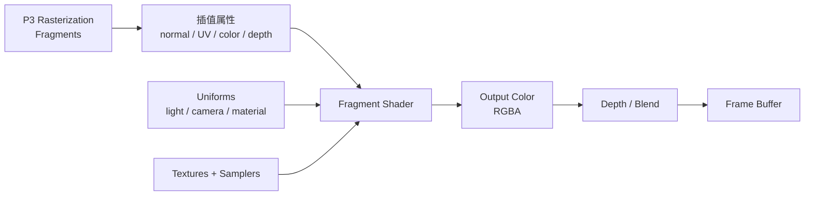
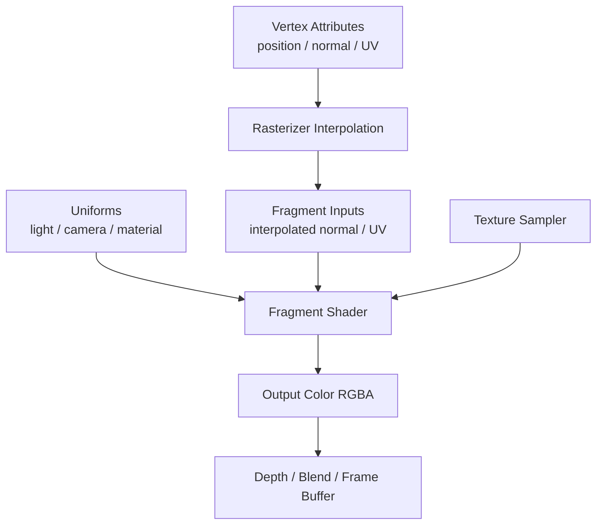
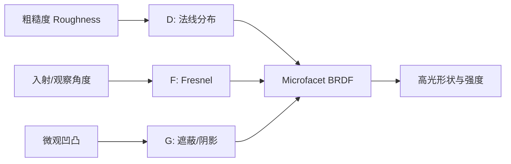
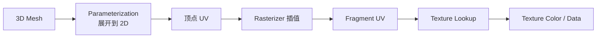
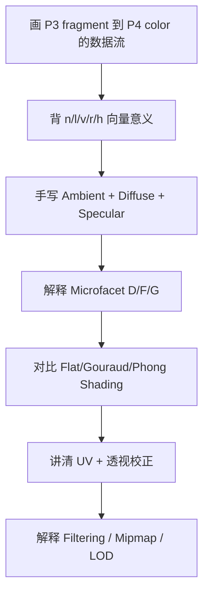

# CG Week 7-9 学习指南：着色、光照与纹理映射

> **对应 Part**：P4 / `week7-9`  
> **知识图谱**：`notebooklm-raw/week7-9/knowledge-graph.md`  
> **状态**：Agent 内部 Review 后的用户 Review 版；遵循术语首现解释、英语考试对照、章节就近引用与 Markdown 表格安全标准。

## 0. 术语表

| 术语 | 本 Part 中的含义 | 先记住的直觉 |
|------|------------------|--------------|
| 着色(Shading) | 根据光照、材质、法线、纹理等计算 fragment 颜色 | 决定像素“长什么样” |
| 局部光照(Local Illumination) | 只用当前着色点、光源、相机和材质估计颜色 | 不追踪整个场景的多次反弹 |
| Fragment Shader(片元着色器) | 对每个 fragment 运行的可编程阶段 | 把候选像素算成 RGBA |
| Uniform(Uniform Variables，统一变量) | 对一批 fragment 保持不变的外部参数 | 光源、相机、材质常量 |
| BRDF(Bidirectional Reflectance Distribution Function，双向反射分布函数) | 描述入射光有多少反射到观察方向 | 材质反光规则 |
| 环境光(Ambient) | 用常量近似间接光照 | 防止背光面纯黑 |
| 漫反射(Diffuse) | 粗糙表面对光的均匀散射 | 粉笔、黏土的基础明暗 |
| 镜面高光(Specular) | 光滑表面的亮斑 | 塑料、金属、玻璃的亮点 |
| 半程向量(Halfway Vector) | 光源方向和视线方向的归一化中间方向 | Blinn-Phong 和 microfacet 的关键方向 |
| 微平面(Microfacet) | 把粗糙表面看成无数微小镜面 | 粗糙度来自微小法线分布 |
| Fresnel(菲涅尔效应) | 反射率随观察 / 入射角变化 | 越斜着看越容易反光 |
| Flat Shading(平面着色) | 每个面算一次光照 | 块状感明显 |
| Gouraud Shading(高洛德着色) | 顶点算颜色，面内插值颜色 | 平滑但可能丢高光 |
| Phong Shading(冯氏着色) | 插值法线，每个 fragment 算光照 | 高光更准但更贵 |
| UV(UV Coordinates，纹理坐标) | 2D 纹理空间坐标，通常在 $[0,1]$ | 在图片上取样的位置 |
| Texture Mapping(纹理映射) | 将 2D 图像或数据映射到 3D 表面 | 给模型“贴皮肤” |
| Mipmap(Mipmap，多级纹理映射) | 预生成多层降采样纹理 | 远处用小图防摩尔纹 |
| LOD(Level of Detail，细节层次) | 根据像素足迹选择合适精度 | 离远了别用过细细节 |

## 1. 知识地图

P3 回答“哪个 fragment 能留下”，P4 回答：**留下来的 fragment 应该是什么颜色？** 颜色来自三个输入族：几何属性、光照 / 材质参数、纹理采样。

> **追问：为什么 P4 不再重点讲 Z-buffer？**  
> 因为 Z-buffer(Depth Buffer，深度缓冲) 已在 P3 负责可见性。P4 只需要记住：片元着色器(Fragment Shader)算出颜色后，仍要经过深度测试和混合，才能真正写入帧缓冲(Frame Buffer)。

> **参考 raw：** `visual-explain-fragment-shading-pipeline.answer.md`、`concept-breakdown-shader-data-flow.answer.md`、`knowledge-graph.md`。

## 2. 核心知识

### 2.1 Fragment Shader 数据流：颜色从哪里来

> **本节叙事线**：顶点携带属性 → 光栅化插值成 fragment inputs → fragment shader 读取 uniform、材质和纹理 → 输出 RGBA → 后段测试和混合。

> **本节要回答**：fragment shader 不是凭空算颜色，它到底吃哪些数据？

一个 fragment 通常会收到插值后的法线(Normal)、纹理坐标(UV)、顶点颜色、深度等。插值发生在 P3 的 rasterizer 中，常用重心坐标(Barycentric Coordinates)完成；纹理坐标和法线还需要透视校正(Perspective-correct Interpolation)，否则倾斜表面上的纹理和光照会扭曲。

除了随 fragment 变化的输入，shader 还会读取 Uniform(Uniform Variables，统一变量)：光源位置 / 方向、相机位置、材质参数、环境光强度等。纹理采样器(Texture Sampler) 则用 UV 在贴图中查颜色、法线或高度等数据。

> **参考 raw：** `visual-explain-fragment-shading-pipeline.answer.md`。

### 2.2 局部光照：Ambient、Diffuse、Specular

> **本节叙事线**：一个表面点的颜色可以近似拆成环境光底色、漫反射明暗和镜面高光。

> **本节要回答**：为什么同一个材质会有明暗、阴影和亮斑？

局部光照(Local Illumination) 把每个着色点当作独立点，只考虑当前点的法线 $\mathbf n$、光源方向 $\mathbf l$、视线方向 $\mathbf v$、材质参数和光源强度。经典模型把结果拆为三部分：

| 分量 | 公式直觉 | 视觉效果 |
|------|----------|----------|
| Ambient | $k_a L_a$ | 均匀底色，避免阴影纯黑 |
| Diffuse | $k_d I \max(0,\mathbf n\cdot\mathbf l)$ | 粗糙表面的明暗，和观察方向无关 |
| Specular | $k_s I \max(0,\mathbf r\cdot\mathbf v)^p$ 或 $k_s I \max(0,\mathbf n\cdot\mathbf h)^p$ | 光滑表面的亮斑 |

Lambert 漫反射(Lambertian Diffuse) 的核心是 $\max(0,\mathbf n\cdot\mathbf l)$。点积越大，光越接近垂直照射，单位面积收到的能量越多；如果光从背面来，取 0。

Phong 模型用反射方向 $\mathbf r$ 与视线方向 $\mathbf v$ 的接近程度控制高光：

$$
I_{specular}=k_s I \max(0,\mathbf r\cdot\mathbf v)^p
$$

Blinn-Phong 用半程向量 $\mathbf h$ 替代理想反射方向：

$$
\mathbf h=\frac{\mathbf l+\mathbf v}{\|\mathbf l+\mathbf v\|}
$$

$$
I_{specular}=k_s I \max(0,\mathbf n\cdot\mathbf h)^p
$$

高光指数(Specular Exponent) $p$ 控制亮斑集中程度。若点积为 $0.9$，则 $0.9^1=0.9$、$0.9^{10}\approx0.35$、$0.9^{100}\approx0.000026$。指数越大，只有非常接近镜面方向的区域才亮，视觉上越光滑。

> **直观理解：Diffuse 和 Specular 的区别**  
> Diffuse 问“光有没有照到这个面”，所以看 $\mathbf n$ 和 $\mathbf l$；Specular 问“反射方向有没有正好进相机”，所以还要看 $\mathbf v$ 或 $\mathbf h$。

> **参考 raw：** `deep-dive-phong-blinn-lighting-example.answer.md`、`concept-breakdown-local-shading-phong.answer.md`、`source-skeleton-improved-illumination.answer.md`。

### 2.3 Microfacet BRDF：从经验高光到物理材质

> **本节叙事线**：Phong / Blinn-Phong 给出高光技巧，Microfacet BRDF 给出更物理的解释：表面由很多微小镜面组成。

> **本节要回答**：为什么粗糙度、掠射角和微遮挡会改变高光？

BRDF(Bidirectional Reflectance Distribution Function，双向反射分布函数) 描述的是：给定入射光方向和观察方向，表面把多少比例的光反射到观察者。Microfacet Theory(微平面理论) 把宏观表面看成无数微小镜面(Microfacets) 的集合。低粗糙度时，微平面法线集中，高光小而锐；高粗糙度时，微平面法线分散，高光大而模糊。

课件中的 Microfacet BRDF 由三项控制：

| 项 | 英文 | 控制什么 | 视觉直觉 |
|----|------|----------|----------|
| $D$ | Normal Distribution Function | 微平面法线分布 | 高光形状和锐利度 |
| $F$ | Fresnel Term | 反射率随角度变化 | 掠射角更亮、更反光 |
| $G$ | Geometry / Shadowing-masking Term | 微平面互相遮挡 | 粗糙边缘别亮得不自然 |

Blinn-Phong 中的半程向量 $\mathbf h$ 与 microfacet 有天然联系：只有微平面法线接近 $\mathbf h$ 的小镜面，才会把光反射到观察者。可以把 Blinn-Phong 的高光指数看作对 $D$ 项的经验近似，而 Microfacet BRDF 用 $D/F/G$ 把这种经验拆成更可解释的物理因素。

> **参考 raw：** `deep-dive-microfacet-brdf-visual.answer.md`、`concept-breakdown-microfacet-brdf.answer.md`、`slide-skeleton-lecture07.answer.md`。

### 2.4 Flat、Gouraud、Phong Shading：光照在哪个频率算

> **本节叙事线**：同一个光照模型，可以在面、顶点或 fragment 级别计算；计算越细，质量越高，代价也越高。

| 方法 | 计算频率 | 插值对象 | 视觉质量 | 主要缺陷 |
|------|----------|----------|----------|----------|
| Flat Shading | 每个面一次 | 无，使用面法线 | 块状，棱角明显 | 马赫带、低多边形感 |
| Gouraud Shading | 每个顶点一次 | 顶点颜色 | 较平滑 | 三角形内部高光可能丢失 |
| Phong Shading | 每个 fragment 一次 | 顶点法线 | 高光细腻、最常用 | 每像素算光照，开销更大 |

Gouraud Shading 的问题来自“先算颜色再插值”。高光是非线性的，如果亮斑中心落在三角形内部而不是顶点上，顶点颜色里没有这个高光，插值也插不出来。Phong Shading 则先插值法线，再在每个 fragment 运行光照公式，因此能找回内部高光。

> **追问：Phong Shading 会让模型轮廓变圆吗？**  
> 不会。它只改变多边形内部的明暗，不能改变几何边界。模型外轮廓仍由三角形边构成，轮廓平滑需要更多几何、细分或位移等技术。

> **参考 raw：** `compare-shading-interpolation-methods.answer.md`、`concept-breakdown-shading-interpolation.answer.md`。

### 2.5 Texture Mapping：把图像映射到表面

> **本节叙事线**：复杂表面不一定靠增加三角形，可以把二维图像或数据映射到三维表面。

> **本节要回答**：UV 是什么，为什么纹理插值需要透视校正？

纹理映射(Texture Mapping) 的核心是参数化(Parameterization)：给 3D 表面上的点分配 2D 纹理坐标。UV(UV Coordinates，纹理坐标) 通常取值在 $[0,1]$，$u$ 是水平轴，$v$ 是垂直轴。Stage 2/3 raw 中 UV 范围出现引用排版噪声，本指南按图形学常规定义修正为 $[0,1]$。

三角形三个顶点都有 UV，光栅化时会为内部 fragment 插值 UV，然后 fragment shader 用 UV 查纹理(Texture Lookup)。如果只在屏幕空间线性插值 UV，会忽略透视投影的非线性，斜着看的棋盘格会扭曲。透视校正插值(Perspective-correct Interpolation) 用深度信息修正权重，让纹理跟 3D 几何保持一致。

> **参考 raw：** `concept-breakdown-texture-mapping-basics.answer.md`、`examples-texture-uv-filtering-applications.answer.md`、`slide-skeleton-lecture08.answer.md`。

### 2.6 Filtering、Mipmap 与纹理应用

> **本节叙事线**：纹理采样不是简单取一个 texel；屏幕像素和纹理像素大小不匹配时，需要过滤和 LOD。

当远处物体的一个屏幕像素覆盖很多纹理像素(Texels) 时，如果只取一个点，就会发生走样(Aliasing)、摩尔纹或闪烁。过滤(Filtering) 试图用更合理的平均值代表这个覆盖区域。

| 方法 | 做法 | 适合解决 |
|------|------|----------|
| Nearest Neighbor | 取最近 texel | 快，但放大块状、缩小走样 |
| Bilinear Filtering | 取周围 4 个 texel 加权平均 | 放大更平滑 |
| Mipmap | 预生成分辨率逐级减半的图像金字塔 | 远处 minification 走样 |
| Trilinear Filtering | 在两个 mipmap 层级之间再插值 | 减少层级切换突变 |
| LOD(Level of Detail) | 按 footprint 选细节层级 | 平衡性能与质量 |

如果像素在纹理空间覆盖的足迹(Footprint) 边长约为 $L$，常用直觉是选择：

$$
D=\log_2 L
$$

其中 $D$ 是 Mipmap 层级。$L$ 越大，表示一个屏幕像素覆盖越多 texel，就应该用更低分辨率的层级平均高频细节。

纹理也不只存颜色：

| 应用 | 纹理存什么 | 改变什么 | 轮廓会变吗 |
|------|------------|----------|------------|
| Modulation Texture | 颜色或缩放因子 | 最终颜色 / 材质系数 | 不会 |
| Illumination Mapping | 预计算光照或材质参数 | 局部亮度 / 反射率 | 不会 |
| Bump Mapping | 高度或法线扰动线索 | 光照用的法线 | 不会 |
| Normal Mapping | 预计算扰动法线 | 光照用的法线 | 不会 |
| Displacement Mapping | 高度 / 位移 | 顶点位置 | 会 |
| Environment Mapping | 环境图 / cube map | 反射颜色 | 不改变真实环境 |

> **直观理解：Normal Mapping 和 Displacement Mapping 的本质区别**  
> Normal Mapping 只骗光照，让表面“看起来”有凹凸；Displacement Mapping 真的移动几何，因此能改变轮廓和自遮挡，但代价更高。

> **参考 raw：** `concept-breakdown-texture-filtering-applications.answer.md`、`examples-texture-uv-filtering-applications.answer.md`。

## 3. 易混点

| 易混点 | 正确认法 |
|--------|----------|
| Fragment Shader 负责可见性 | 它主要算颜色；可见性主要由 depth test / blending 等后段决定 |
| Ambient 是真实全局光照 | Ambient 是廉价近似，不等于真正间接光照 |
| Gouraud 和 Phong 都是 Phong 光照模型 | Gouraud / Phong Shading 是计算频率和插值方式；Phong 光照模型是 specular 公式 |
| Blinn-Phong 就是物理 BRDF | 它是经验近似；Microfacet BRDF 更物理地拆出 D/F/G |
| UV 是 3D 坐标 | UV 是 2D 纹理空间地址，通常在 $[0,1]$ |
| Bilinear 能解决所有纹理走样 | Bilinear 主要改善放大；远处 minification 还需要 mipmap / LOD |
| Normal Mapping 改变模型形状 | 它只改变法线和光照，不改变真实几何轮廓 |

## 4. 复习路线

复习时建议用三句话自测：

1. Fragment shader 的输入来自哪些地方，哪些是插值属性，哪些是 uniform 或 sampler？
2. Lambert、Phong、Blinn-Phong、Microfacet BRDF 分别解决什么层次的光照问题？
3. Texture Mapping、Filtering、Normal Mapping、Displacement Mapping 分别改变了颜色、采样还是几何？

## 5. 与前后 Part 的承接

P3 决定 fragment 是否可见，P4 决定可见 fragment 的颜色和表面细节。后续 P5 会把注意力从“如何渲染已有三角形”转向“如何构造更复杂的几何”，例如曲线、曲面和 mesh 表示。
