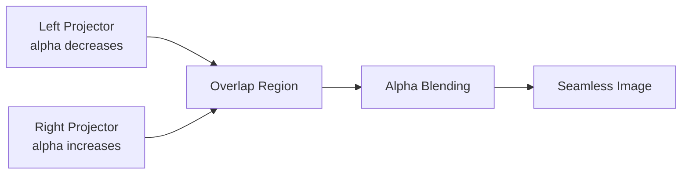
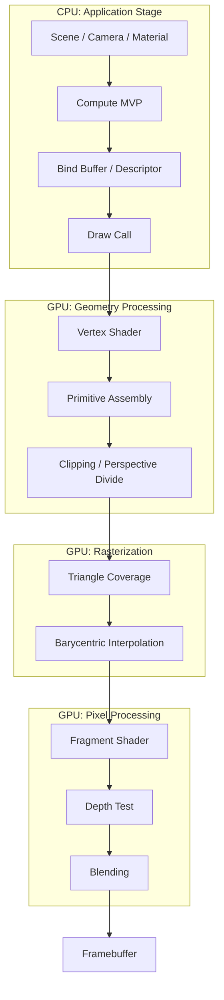
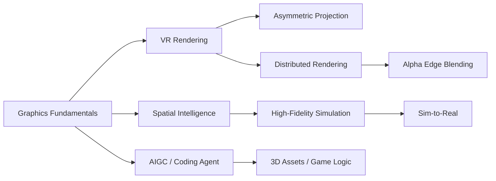

# CG Week 15-16 打印版：期末总复习、曲线曲面与现代图形学收束

## 0. 术语表

| 术语 | 本 Part 中的含义 | 先记住的直觉 |
|------|------------------|--------------|
| 图像合成(Image Compositing) | 把前景和背景按透明度合成最终像素 | 多层图像叠在一起 |
| Alpha 混合(Alpha Blending) | 用 $\alpha$ 控制前景对背景的遮挡程度 | $\alpha=1$ 只看前景，$\alpha=0$ 只看背景 |
| MVP(Model-View-Projection，模型-视图-投影) | Model、View、Projection 三个矩阵串联 | 把局部模型放进相机并投到屏幕 |
| Shader(着色器) | 运行在 GPU 上的小程序 | 顶点和片元各做自己的计算 |
| Buffer(缓冲区) | CPU/GPU 存放顶点、索引、常量等数据的内存区域 | 给 GPU 喂数据的容器 |
| Descriptor Set(描述符集) | Vulkan 等 API 中描述资源如何绑定给 shader 的对象 | 告诉 shader 到哪里拿矩阵、纹理和 buffer |
| 参数曲线(Parametric Curve) | 用参数 $u$ 生成曲线上点 | 一个旋钮扫出一条曲线 |
| 基函数(Basis Function) | 决定控制点在某个参数处贡献多少 | 每个控制点的影响力分布 |
| CV(Control Vertex，控制顶点) | 牵引曲线或曲面的控制点 | 曲线的“拉手” |
| NURBS(Non-Uniform Rational B-Spline，非均匀有理B样条) | 带非均匀节点和权重的有理 B 样条 | CAD 里表达圆和复杂曲面的工业标准 |
| GPU-driven Rendering(GPU 驱动渲染) | 把剔除、LOD、绘制调度更多交给 GPU | 少让 CPU 一件件下命令 |
| Mesh Shader(网格着色器) | GPU 上直接处理 meshlet 的可编程阶段 | GPU 自己判断小网格簇要不要画 |
| Visibility Buffer(可见性缓冲) | 只记录可见物体 ID 和深度的轻量缓冲 | 先记“看见谁”，后面再查材质着色 |
| VR(Virtual Reality，虚拟现实) | 通过头显和立体渲染产生沉浸式空间 | 画面要跟着头动保持世界稳定 |
| AIGC(AI Generated Content，人工智能生成内容) | 用 AI 生成图像、3D 资产或内容 | 把内容生产的一部分交给模型 |
| Sim-to-Real(Simulation to Reality，仿真到现实) | 先在仿真中训练，再迁移到真实世界 | 机器人先在虚拟沙盒练习 |

## 3. Alpha 混合：明确必考的图像合成公式

Alpha 混合(Alpha Blending)是图像合成(Image Compositing)的线性插值：

$$
I=\alpha F+(1-\alpha)B,\qquad \alpha\in[0,1]
$$

其中 $I$ 是最终像素颜色，$F$ 是前景颜色，$B$ 是背景颜色，$\alpha$ 是前景不透明度(Opacity)。当 $\alpha=1$ 时只看前景；当 $\alpha=0$ 时只看背景；中间值表示半透明混合。

### 3.1 数值例

如果 $F=0.8$，$B=0.2$，$\alpha=0.6$，则：

$$
I=0.6\times0.8+(1-0.6)\times0.2=0.56
$$

这类题的关键不是算术难，而是能解释“前景贡献 60%，背景贡献 40%”。

### 3.2 投影融合直觉

在多投影或 VR 大屏拼接中，两台投影机的重叠区域容易变亮。边缘融合(Edge Blending)会让一侧的 $\alpha$ 从 1 渐变到 0，另一侧反向渐变，使重叠区总亮度保持平滑。

> **直观理解：Alpha 是透明度还是不透明度？**
> 本公式里 $\alpha$ 表示前景不透明度。日常说“透明度 40%”时，对应的不透明度可能是 60%，要先看定义再代公式。

## 4. Week16 补齐的几何建模：曲线、曲面与 NURBS

三角网格适合渲染，但工业设计、字体和 CAD 更需要可编辑、可缩放、光滑的连续几何。参数曲线(Parametric Curve)用参数 $u$ 生成曲线上点：

$$
Q(u)=\sum_{i=0}^{n} B_i(u)V_i
$$

$V_i$ 是控制顶点(Control Vertex)，$B_i(u)$ 是基函数(Basis Function)。直觉上，控制顶点像拉手，基函数决定每个拉手在当前位置有多大影响。

### 4.1 Bezier、B-spline、NURBS

| 表示 | 核心思想 | 优点 | 局限或定位 |
|------|----------|------|------------|
| Bezier Curve | Bernstein 基函数 + 控制多边形 | 端点插值、凸包性、直观 | 长复杂曲线会阶数过高 |
| B-spline Curve | 节点向量控制局部支撑 | 局部控制强 | 默认不一定经过端点 |
| NURBS | 非均匀节点 + 有理权重 | 可精确表示圆、椭圆，CAD 标准 | 实现和求交复杂 |

NURBS 的有理基函数常写为：

$$
R_i(u)=\frac{B_i(u)w_i}{\sum_{j=0}^{n}B_j(u)w_j}
$$

权重 $w_i$ 像控制顶点的“吸引力”。权重越大，曲线越靠近该控制顶点。

### 4.2 曲面与连续性

张量积曲面(Tensor Product Surface)把曲线推广到二维参数域 $(u,v)$：

$$
S(u,v)=\sum_{i=0}^{m}\sum_{j=0}^{n}B_i(u)B_j(v)V_{i,j}
$$

连续性(Continuity)决定拼接处是否光滑：

| 连续性 | 意义 | 视觉效果 |
|--------|------|----------|
| $C^0$ | 位置相连 | 没断，但可能有角 |
| $C^1$ | 一阶导连续 | 切线方向连续，没有明显折痕 |
| $C^2$ | 二阶导连续 | 曲率也连续，反光更平滑 |

**小结**：Week16 的曲线曲面补上了 P5 中几何建模的连续表达部分。考试不一定要求完整 CAD 算法，但要能解释控制顶点、基函数、局部控制、权重和连续性的意义。

## 5. 渲染管线总复习：从 CPU 到 Framebuffer

这一图是期末复习主轴：

1. CPU 端应用阶段(Application Stage)：组织场景、相机、材质，计算 MVP，准备 Buffer 和 Descriptor Set。
2. 顶点着色器(Vertex Shader)：把顶点从模型空间经 MVP 变到裁剪空间。
3. 光栅化(Rasterization)：把三角形覆盖转换成片元(Fragment)，并插值属性。
4. 片元着色器(Fragment Shader)：做纹理采样、Blinn-Phong、颜色输出。
5. 深度测试(Depth Test)和混合(Blending)：决定可见性和透明合成。
6. 帧缓冲区(Framebuffer)：保存最终像素。

> **追问：MVP 为什么常和 Shader 一起考？**
> 因为作业里不是只写矩阵公式，而是要把矩阵作为 uniform 或 descriptor 传进 shader，再在顶点着色器中应用。考试很可能考“数学意义 + 管线位置 + 数据传递”这三件事的组合。

## 6. 现代工业线索：GPU-driven Rendering

GPU-driven Rendering(GPU 驱动渲染)的思想是：把更多剔除、LOD、绘制参数生成放到 GPU 上，让 GPU 用并行能力直接处理大量 meshlet。

| 维度 | CPU-driven | GPU-driven |
|------|------------|------------|
| 调度核心 | CPU 决定每个物体怎么画 | GPU 根据场景数据生成绘制参数 |
| 绘制调用 | Draw Call 多，CPU 开销大 | MDI(Multi-Draw Indirect，间接多绘制)减少 CPU 干预 |
| 几何粒度 | Object 级 | Meshlet 级 |
| 几何阶段 | Vertex / Geometry Shader 为主 | Mesh Shader 直接处理网格簇 |
| 可见性缓冲 | 常用 G-buffer 存很多属性 | Visibility Buffer 先只存 ID 和深度 |

Visibility Buffer(可见性缓冲)的直觉是：先回答“这个像素看到哪个物体/三角形”，再按 ID 查询材质并着色。它比传统 G-buffer 少存许多材质属性，能降低带宽压力。

**小结**：Week16 推荐工业资料，不是要求背 Mesh Shader 代码，而是理解图形 API 和游戏引擎为什么演进到“GPU 更主动”的架构。

## 7. P6 回看：光线追踪、路径追踪与 AI 降噪

Week16 把 P6 高级渲染放进期末和工业资料语境：从渲染方程(Rendering Equation)、BRDF(Bidirectional Reflectance Distribution Function，双向反射分布函数)、BVH(Bounding Volume Hierarchy，层次包围盒)，到 Path Tracing(路径追踪)、Russian Roulette(俄罗斯轮盘赌)和 Ray Reconstruction(光线重建)。

复习时不要重写一遍 P6，而要抓三条线：

| 线索 | 要会解释 | 常见误区 |
|------|----------|----------|
| 物理目标 | 渲染方程统一直接光和间接光 | 只背公式不解释每项 |
| 计算方法 | Path tracing 用 Monte Carlo 求积分 | 以为随机采样就是随便乱射 |
| 工业落地 | BVH / RT Core / AI Denoising 降低成本 | 把 AI 降噪当作“凭空变清晰” |

## 8. VR、空间智能与 AI：课程收束

这些内容把前面学过的数学、管线、渲染和几何放进真实应用中：

考试核心更可能落在非对称投影矩阵(Asymmetric Projection Matrix)、Alpha 投影融合和渲染管线；空间智能(Spatial Intelligence)、World Labs、Sim-to-Real、Coding Agent、AIGC 则更像行业趋势和学习方法。

> **直观理解：为什么说图形学在 AI 时代更重要？**
> AI 需要理解和生成 3D 世界，机器人需要在安全、可控、可重复的仿真环境里训练。图形学提供的建模、渲染、物理和显示技术，正在从“画图”变成“构造可交互世界”。
