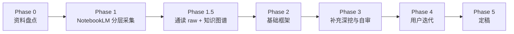

# 学习指南整合规范

> **用途**：统一维护 CG 课程学习指南的整合流程、质量下限与监修标准。适用于 `CG-Week*-学习指南.md`、按课件拆分的学习指南以及后续补充指南。  
> **工作流入口**：`.cursor/skills/cg-course-notebooklm/SKILL.md`  
> **Skill 详细规范**：`.cursor/skills/cg-course-notebooklm/docs/integration-guide.md`  
> **本文件定位**：面向实际写作/监修时的质量准则，避免规则散落在单个指南正文中。

---

## 1. 工作流底线

### 1.1 六阶段流程



| 阶段 | 必须产出 | 质量要求 |
|------|----------|----------|
| Phase 1.5 | `knowledge-graph.md` | 必须通读全部 raw，标出节点、叙事线、章节映射 |
| Phase 2 | 基础框架 | 不能只粘贴 raw；必须按知识图谱搭清晰层次 |
| Phase 3 | 迭代增强版 | 补全基础解释、重难点、示例、承接、追问、对比表、必要图示，并完成内部 Review |
| Phase 4 | Review 回写 | 用户指出的理解断点要沉淀为规范，而不只修当前句子 |

**禁止**：未通读 raw 就写指南；只把 raw 摘要拼接成正文；把通用监修经验写进单个学习指南正文。

### 1.2 raw / manifest 责任检查

raw 收集阶段覆盖优先于精炼。每个 Part 应先有 `overview-skeleton`，再基于骨架拆 `concept-breakdown-*`；核心/难点补 `deep-dive-*`、`examples-*`、`misconceptions-*` 和 `project-bridge`。课件采集必须用 `slide-skeleton-*` 与 `slide-module-detail-*`，并在 prompt 中明确“仅限指定课件”。

当指南质量差时，先判断问题来源：

| 现象 | 更可能的问题 | 处理 |
|------|--------------|------|
| raw 没覆盖关键公式、图形管线、项目要求 | manifest / 采集问题 | 补采或重新设计 batch |
| raw 有公式和例子，但指南只写摘要 | 整合问题 | 回到 raw/周指南/课件指南补全 |
| 指南有术语表，但正文仍读不懂 | 正文解释不足 | 在首次使用处就地解释 |
| 代码示例有，但不知道每行体现什么 | 教学化不足 | 加逐行解释和渲染流程位置 |

---

### 1.3 内部迭代责任

用户 Review 前，Agent 至少完成一轮内部「整合 → Review → 迭代整合 → Review」：

1. 基础框架：根据知识图谱形成章节层次、术语表和资料索引。
2. 基础补充：回到 raw 补齐基础解释、来源、公式/坐标含义和管线位置。
3. 重难点深挖：补示例、例题、直观解释、形象比喻、易混对比和常见错误。
4. 可视化与串联：加入合适的 Mermaid/ASCII 图，补前后周、课件模块和 Project 桥接。
5. 自审迭代：按 checklist 修一轮，再进入用户 Review。

---

## 2. 认知编排原则

### 2.1 先「图形问题 / 为什么」，再「数学与代码」

每个大模块开始前必须回答：

| 问题 | 要求 |
|------|------|
| 这节解决什么图形问题？ | 一句话说明动机 |
| 学完能做什么？ | 3–5 条可检验能力 |
| 内部路线是什么？ | 问题链、坐标链、渲染管线或小结 |
| 哪些是考试/Project 重点？ | 必考 / 高优先 / 了解 分层 |

不要直接进入矩阵、公式、着色器代码或术语表。

### 2.2 认知阶梯

```text
L0 定位与动机
  → L1 几何/视觉直觉
  → L2 符号、坐标系与对象
  → L3 公式 / 矩阵 / 算法 / 代码
  → L4 数值或图形例子
  → L5 工程流程 / Project 模板
  → L6 跨周串联
```

整合顺序按读者理解顺序，不按 manifest 采集顺序。

### 2.3 三层叙事

- **章级叙事线**：大节开始写「本节要从 A 走到 B」。
- **节级问题**：每小节开头用 `> **本节要回答**：...`。
- **节间承接**：每节结尾说明「为什么下一节必要」。

---

## 3. 语言与解释标准

1. **名词不裸奔**：算法名、英文术语、代码符号首次出现时，要交代场景、解决的问题，以及它在图形管线中的作用。
2. **专业词首次白话解释**：齐次坐标、视锥、法向量、插值、采样、着色器等术语，第一次出现要翻成普通话。
3. **坐标系必须落位**：说明对象处在模型、世界、观察、裁剪、NDC 还是屏幕空间。
4. **公式必须有几何意义**：不能只给矩阵；要说明每一项对应平移、旋转、缩放、投影、归一化还是插值。
5. **例子必须服务理解**：例子要明确解释哪个公式、机制或代码结构；没有来源的数值不硬编。
6. **重点推导不可被摘要吃掉**：变换矩阵、投影、光照、光栅化、纹理采样等核心内容必须保留符号表、适用条件、步骤和例题。
7. **备考/Project 权重明确**：区分必考手算、概念理解、代码实现、作业易错点和了解即可。
8. **正文解释不能依赖术语表兜底**：术语表可以预告概念，但正文首次真正使用核心词时仍要就地解释。

---

## 4. 系统 / 代码类指南最低结构

遇到 OpenGL/GLSL、光栅化器、路径追踪、曲线曲面、纹理采样、相机/投影、Project 框架等系统或代码案例时，至少按下面顺序组织：

1. **系统全景**：它是什么、解决什么图形问题、输入/输出是什么。
2. **管线位置**：它发生在建模、顶点处理、光栅化、片元处理、后处理还是离线渲染中。
3. **核心对象**：有哪些主要数据结构、状态或变量，例如 vertex、normal、MVP、fragment、texture coordinate。
4. **符号入口**：解释最小公式、矩阵、API 或 shader 变量。
5. **运行流程**：按时间顺序说明数据如何从几何变成像素。
6. **贴题示例**：示例必须逐行说明“这一行体现了哪个机制”。
7. **备考/Project 定位**：指出需要会推导、会读代码、会实现，还是了解即可。

---

## 5. 格式与渲染检查

定稿前检查：

- Markdown 表格列数是否一致。
- 表格内绝对值是否使用 `\lvert...\rvert` 或 `\lVert...\rVert`。
- LaTeX 是否有粘连，如 `\lambdaw`。
- Mermaid 标签是否含易坏字符；必要时改成纯文本。
- 代码块语言是否正确，如 `cpp`、`glsl`、`python`、`mermaid`。
- 标题层级是否连续。
- 资料索引、raw 路径是否存在。

---

## 6. 监修检查清单

- 每个大板块是否先回答「本节要解决什么图形问题」。
- 首次出现的核心术语是否有中文、英文和白话解释。
- 公式、矩阵、代码是否解释了坐标系位置和几何意义。
- 例子是否紧贴概念、公式或管线位置，且没有无来源数值。
- 重点公式、符号表、适用条件和手算/实现模板是否完整。
- 复习优先级是否与课堂、考试和 Project 定位一致。
- 易混概念是否通过对比表或提醒块区分。
- 系统类内容是否先说明系统全貌、管线位置、输入输出和典型交互，再解释内部结构。
- 动态流程是否说明了数据如何从几何、顶点、片元最终变成屏幕像素。
- 术语表中的关键名词是否也在正文首次使用处得到足够解释。
- Markdown 表格、公式、Mermaid、路径引用是否能正常渲染。
