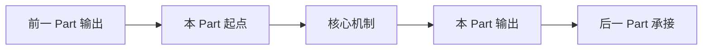

# 学习指南统一框架模板

> **用途**：新建或重写 `guides/CG-Week*-学习指南.md` 时使用。最终指南面向学习和复习，不写采集执行计划。

## 标题与定位

```markdown
# CG Week X-Y 学习指南：[本 Part 主题]

> **对应 Part**：P? / `weekX-Y`
> **范围定位**：Week X-Y / 课件与课堂记录覆盖的真实主题
> **知识图谱**：`notebooklm-raw/weekX-Y/knowledge-graph.md`
> **状态**：Agent 内部 Review 后的用户 Review 版
```

开头必须说明本指南覆盖哪个 Part、哪些 Week、真实课程主线是什么；若规划主题和 raw source 不一致，要在正文中用“资料边界”说明，不要把缺口硬写成课程主线。

## 本指南要回答的问题 / 学习目标

在术语表前或知识地图前，用 3-6 条写清读完后应该能回答的问题，例如：

- 这个 Part 解决什么图形学问题？
- 它接在前一个 Part 的哪一步后面？
- 本 Part 学完能画出哪条管线、推导哪个公式、区分哪些易混概念？
- 哪些内容是考试 / Project / 后续 Part 的前置能力？

## 0. 术语表

术语表必须覆盖本 Part 首次出现的专业术语、算法名、缩写、坐标空间和矩阵名。

| 术语 | 本 Part 中的含义 | 先记住的直觉 |
|------|------------------|--------------|
| 中文(English) | 用一句话解释场景和作用 | 白话直觉 |
| Abbr(Full English Name，中文对照) | 缩写完整英文和中文对照 | 一句话说明它解决什么 |

正文首次出现专业术语时仍要就地解释，不能只依赖术语表。

## 1. 知识地图

先用 1-2 段定位本 Part 在全课程中的位置，再放 Mermaid 或 ASCII 图。图应表达认知链、空间链、渲染管线或算法流程，而不是装饰性目录。



## 2. 核心知识

每个核心章节采用固定小结构：

```markdown
### 2.N [章节标题]

> **本节叙事线**：[A] → [B] → [C]

> **本节要回答**：[一个具体、可检验的问题]

[概念解释：先说图形问题和管线位置，再说术语、对象、输入输出。]

[公式 / 图示 / 例子：公式用 LaTeX；说明符号、坐标系、几何意义和适用条件。]

> **直观理解 / 追问：** [读者自然会卡住的问题]
> [用图形直觉、数值例或工程现象解释。]

| 易混点 | 正确理解 |
|--------|----------|
| ... | ... |

**小结**：[≤3 条总结] → [为什么下一节必要]

> **参考来源：** Week X 课程记录；课件XX-...；论文-...
> raw batch: `batch-a`、`batch-b`
```

核心章节必须包含概念解释、必要公式 / 图示 / 例子、易混点或常见错误、小结与承接。引用块要就近放在被支撑的核心章节后。

## 3. 易混点与常见错误

集中整理跨章节易混概念，例如空间名混淆、算法职责混淆、公式符号误读、Project 调试误区。优先用对比表或短条目，避免重复正文。

## 4. 复习路线 / 自测题 / 前后 Part 承接

用 3-6 步复习路线串起本 Part：

1. 先画出核心管线或认知地图。
2. 再解释关键术语和输入输出。
3. 手推或口述 1-2 个核心公式 / 算法。
4. 对比本 Part 的易混概念。
5. 说明它承接前一 Part、如何引出后一 Part。

自测题必须能从正文找到答案，避免泛泛问答。

## 参考来源写法

最终指南的就近引用以可读来源为主，不以 `*.answer.md` 文件名为主：

```markdown
> **参考来源：** Week 3 课程记录；课件03-Lecture03-2026；课件04-Lecture04-05-2025。
> raw batch: `concept-breakdown-geometric-transforms`、`slide-skeleton-lecture03`
```

无法从 raw metadata、manifest、prompt、stage summary 或 source list 还原标题时，写：

```markdown
> **参考来源：** 对应 Week 记录/课件（标题待校准）。
> raw batch: `batch-id`
```

## 禁止内容

最终学习指南不得包含采集计划、补采说明、manifest 操作、NotebookLM 执行命令、补采 TODO 或长篇 raw 索引。这些内容应放在 `knowledge-graph.md`、`focus-map.md`、`stage1-summary.md` 或 `review-iteration.md`。
