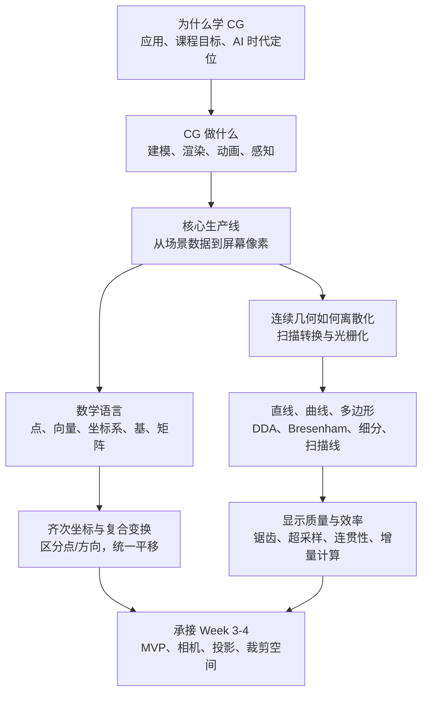

# CG Week 1-2 / Part 1 知识图谱

> **模块**：`week1-2`  
> **raw run**：`notebooklm-raw/week1-2/runs/latest` -> `20260625-213138`  
> **采集状态**：12/12 batch completed，0 failed，0 retry  
> **范围**：笔记-week01、笔记-week02、课件01、课件02

## 1. 认知阶梯

## 2. 节点清单

| 节点 | 深度 | 认知目标 | 关键 raw | Agent 须补充 |
|------|------|----------|----------|--------------|
| 学科动机与课程定位 | 重要 | 说明 AI 辅助编程时代为什么还要懂底层图形学 | `overview-skeleton`、`concept-breakdown-graphics-overview`、`slide-skeleton-lecture01`、`project-bridge` | 避免写成宣传，落到“能审查黑屏、闪烁、性能问题” |
| CG 四大范畴与应用 | 了解 | 建立建模、渲染、动画、感知的地图 | `concept-breakdown-graphics-overview`、`slide-skeleton-lecture01` | 应用只保留代表例，压缩前沿材料 |
| 渲染管线总览 | 核心 | 说清顶点、图元、片元、framebuffer 的数据流 | `concept-breakdown-rendering-pipeline`、`deep-dive-pipeline-dataflow` | 用一个三角形贯穿输入、处理、输出 |
| 2D 扫描转换 | 核心 | 解释连续线/面如何变成像素 | `overview-skeleton`、`slide-skeleton-lecture02`、`examples-pipeline-and-math` | 把 Week 2 内容放回管线后端，而不是孤立算法 |
| Bresenham 与 DDA | 核心 | 掌握增量计算、整数决策、硬件友好 | `slide-skeleton-lecture02`、`examples-pipeline-and-math`、`misconceptions-part1` | 给一个可跟算的决策参数例子 |
| 曲线与多边形填充 | 重要 | 理解中点细分、扫描线、区域填充的角色 | `overview-skeleton`、`slide-skeleton-lecture02`、`misconceptions-part1` | 标注 raw 对多边形细节有缺口，指南保守展开 |
| 抗锯齿与采样 | 重要 | 认识离散采样产生走样，超采样用成本换质量 | `overview-skeleton`、`project-bridge`、`misconceptions-part1` | 不深入 MSAA/mipmap，作为后续引子 |
| 点、向量、坐标系、基 | 核心 | 区分位置与方向，理解坐标依赖参考系 | `concept-breakdown-math-foundations`、`deep-dive-coordinates-homogeneous` | raw 混入后续变换内容，需标注 Week 3-4 承接 |
| 矩阵、齐次坐标、复合 | 核心 | 解释为什么平移需要齐次坐标，为什么顺序重要 | `concept-breakdown-math-foundations`、`deep-dive-coordinates-homogeneous` | Lecture02 未直接讲矩阵，来源主要来自笔记/承接信息 |
| Project/复习落点 | 重要 | 环境搭建、AI 互动记录、算法和管线复习重点 | `project-bridge`、`overview-skeleton` | Project 细则不足，明确“来源中未见完整 Project 文档” |

## 3. 叙事承接表

| 指南章节 | 要回答的问题 | 承接 | 引出 | raw |
|----------|--------------|------|------|-----|
| 0. 术语表 | 读者先要认哪些词？ | 把 raw 中分散术语收拢 | 后文每次出现术语可回查 | 全部 batch |
| 1. 知识地图 | Week 1-2 在全课里放在哪里？ | 从课程动机进入技术主线 | 进入渲染管线 | `overview-skeleton`、`project-bridge` |
| 2.1 CG 的任务 | CG 到底生成什么、显示什么？ | 应用背景不是终点 | 需要一条从数据到图像的生产线 | `concept-breakdown-graphics-overview` |
| 2.2 渲染管线 | 一个三角形怎样变成像素？ | 从“要生成图像”转到“如何生成” | 需要理解离散化 | `deep-dive-pipeline-dataflow` |
| 2.3 扫描转换 | 连续几何如何选像素？ | 管线中的光栅化阶段 | DDA/Bresenham 和多边形填充 | `slide-skeleton-lecture02`、`examples-pipeline-and-math` |
| 2.4 数学语言 | 为什么要点、向量、矩阵？ | 扫描转换处理输出前，还要先表达几何 | Week 3-4 的变换、相机、投影 | `concept-breakdown-math-foundations`、`deep-dive-coordinates-homogeneous` |
| 3. 重难点 | 哪些误解会导致后续代码错？ | 汇总算法、管线、坐标易错点 | Project 和复习检查 | `misconceptions-part1` |
| 4. 串联 | 这些内容后面怎么用？ | 回到全学期路线 | 下一 Part MVP | `project-bridge` |

## 4. batch 到章节映射

| batch | 采集层 | 指南用途 | 整合深度 |
|-------|--------|----------|----------|
| `overview-skeleton` | L0 | 全局地图、章节边界、课程评价/Project 信息 | 中：压缩成框架，不直接粘贴 |
| `concept-breakdown-graphics-overview` | L2 | CG 定义、应用、课程目标、AI 时代定位 | 中：应用材料压缩 |
| `concept-breakdown-rendering-pipeline` | L2 | 管线阶段、术语位置、GPU/API/GLSL 角色 | 高：核心主线 |
| `concept-breakdown-math-foundations` | L2 | 点、向量、坐标系、矩阵、齐次坐标 | 高：核心主线 |
| `deep-dive-pipeline-dataflow` | L3 | 三角形数据流、片元/framebuffer 区分、常见误解 | 高：用于重难点 |
| `deep-dive-coordinates-homogeneous` | L3 | 位置/方向、齐次坐标、变换顺序 | 高：用于重难点 |
| `slide-skeleton-lecture01` | L1 | 课件01原序索引、课程资源和前沿趋势 | 低-中：资料索引为主 |
| `slide-skeleton-lecture02` | L1 | 课件02原序、DDA/Bresenham、曲线、多边形、优化思想 | 高：Week 2 技术主线 |
| `slide-module-detail-lecture02-math` | L2 | 说明 Lecture02 未直接讲齐次坐标，重点是像素坐标与增量计算 | 中：用于课纲审计 |
| `examples-pipeline-and-math` | L3 | Bresenham 例题、参数化线段例题 | 高：改写成可跟算例子 |
| `misconceptions-part1` | L3 | 易混对比表、Project 调试风险 | 高：直接支撑重难点 |
| `project-bridge` | L4 | 后续周、Project/作业、复习落点 | 中：Project 细节保守表述 |

## 5. 课纲审计与偏差

- `课件02-Lecture02-2026` 的主题是扫描转换，不是完整的矩阵/齐次坐标课。raw 中关于齐次坐标和 MVP 的内容多来自 Week 2 笔记或对后续 Week 3-4 的承接，应在指南中标注为“承接理解”，不要误写成课件02已完整推导。
- `overview-skeleton` 提到“2D 扫描转换、曲线、多边形填充、抗锯齿”是 Part 1 的核心内容；这与原先只把 P1 视为“总览 + 数学基础”的规划略有偏差，指南需要把扫描转换放到核心章节。
- Project/作业 raw 只明确了 Week 1 的算力补贴/AI 助手确认、Week 2 的 VS 与 Unity 环境搭建、作业注重 AI 互动过程记录；没有完整 Project 需求、评分细则或代码框架。
- source 中未见独立课程大纲文件；课程评价信息主要来自课件01和课堂笔记。

## 6. 补采建议

当前 P1 已足够写用户 Review 前的学习指南，不需要立即补采。若用户后续要定稿，可补：

- `supplement-bresenham-numeric-example`：让 NotebookLM 基于课件02给一个完整 Bresenham 决策参数表。
- `supplement-project-rubric-part1`：若 Project/作业文档上传后，补采环境搭建、AI 互动记录和评分要求。
