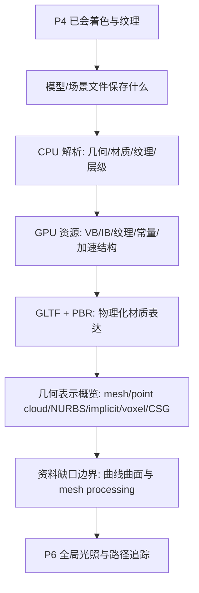

# Week 10-11 / Part 5 Knowledge Graph

> **输入 raw**：stage-1 `20260626-000200`，stage-2 `20260626-001017`，stage-3 `20260626-001714`  
> **主题校准**：当前 source 不足以支撑完整“曲线曲面 / mesh processing”理论课；P5 应聚焦模型加载、场景表示、GLTF/PBR 过渡与几何表示概览。

## 认知阶梯

## 节点清单

| 节点 | 认知目标 | batch | 关键素材 | Agent 须补充 |
|------|----------|-------|----------|--------------|
| 模型加载与场景标准 | 知道 OBJ / FBX / GLTF / USD 保存什么 | `concept-breakdown-model-loading-standards` | 几何、层级、材质、纹理、动画、场景图 | 术语中英对照和数据流叙事 |
| GLTF / PBR 过渡 | 理解 GLTF 如何携带 PBR 材质参数 | `concept-breakdown-gltf-pbr-bridge`、`examples-gltf-pbr-material-flow` | Albedo、Roughness、Metallic、Normal Map、BRDF | 区分 PBR 与 P6 GI |
| 模型数据流 | 将文件、CPU、GPU、shader / ray tracer 串起来 | `visual-explain-model-data-pipeline` | VB/IB、Texture、Constant Buffer、TLAS/BLAS | Mermaid 管线图 |
| 几何表示概览 | 能对比常见 object representations | `concept-breakdown-geometry-representations`、`compare-geometry-representations-boundaries` | mesh、point cloud、subdivision、NURBS、implicit、voxel、CSG | 表格安全，明确覆盖深度 |
| 缺口边界 | 不把未覆盖算法写成课程主线 | `gap-audit-curves-mesh-processing`、`review-gap-boundary-curves-mesh` | Bezier、B-spline、half-edge、QEM、Catmull-Clark 缺失 | 在指南中作为扩展 / 待补 source |

## 叙事承接表

| 章节 | 要回答 | 承接 | 引出 | raw |
|------|--------|------|------|-----|
| P5 真实范围 | 本 Part 到底学什么？ | P4 已有纹理与着色 | 文件与场景数据 | `overview-skeleton`、`stage1-summary.md` |
| 模型文件到 GPU | 模型如何变成渲染输入？ | 顶点/纹理概念 | GLTF/PBR | `visual-explain-model-data-pipeline` |
| GLTF 与 PBR | 物理化材质如何落地？ | P4 材质/纹理 | P6 GI | `examples-gltf-pbr-material-flow` |
| 几何表示概览 | 不同表示适合什么？ | 模型数据 | 缺口审计 | `compare-geometry-representations-boundaries` |
| 缺口与复习边界 | 哪些不能当考试主线？ | 表示概览 | 后续补 source | `review-gap-boundary-curves-mesh` |

## batch → 章节映射

| batch | 整合深度 |
|-------|----------|
| `overview-skeleton` | 高：用于范围校准 |
| `note-skeleton-week11` | 中：P5 作业与 ray tracing 混入判断 |
| `slide-skeleton-lecture11-part1` | 低：主要归入 P6，只在 P5 作承接 |
| `source-gap-check-part5` | 高：缺口审计 |
| `concept-breakdown-model-loading-standards` | 高：主体章节 |
| `concept-breakdown-gltf-pbr-bridge` | 高：主体章节 |
| `visual-explain-model-data-pipeline` | 高：Mermaid 图与数据流 |
| `compare-geometry-representations-boundaries` | 中：概览表 |
| `review-gap-boundary-curves-mesh` | 高：review 与边界 |

## 课纲审计

- 原规划 P5 写作“几何建模 / 曲线曲面 / 网格”，但现有 NotebookLM source 对传统曲线曲面和 mesh processing 只支持概览，不支持公式推导或数据结构。
- Week 10 笔记缺失；Week 11 和 Lecture11 part1 明显偏 ray tracing / global illumination，应与 P6 分界。
- 最终指南必须采用“资料校准版”写法：以 GLTF / PBR / 场景数据流为主，曲线曲面与 mesh 处理作为缺口说明。
