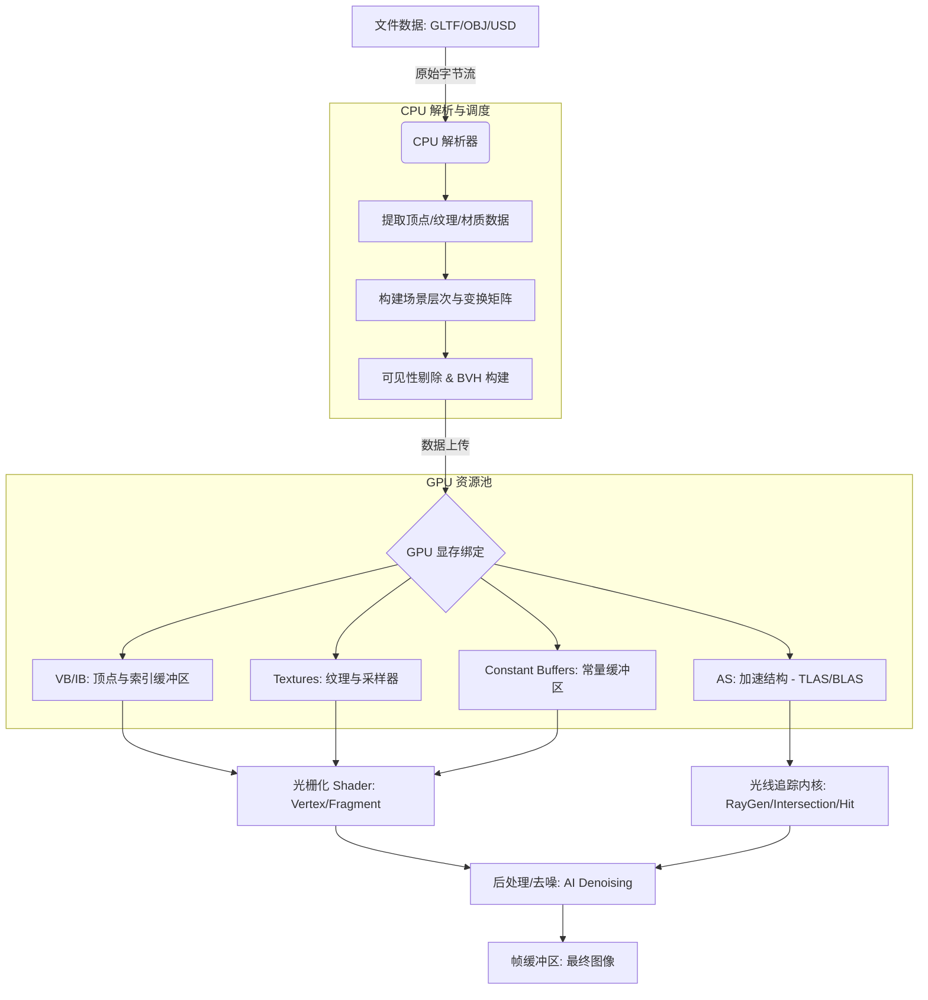

这里是基于 source 整理的从模型文件到渲染管线的数据流可视化解释素材。

### 1. 数据流阶段解析

按数据流顺序，模型与场景数据进入渲染管线的路径如下：

#### A. 文件数据输入 (File Data Input)
*   **输入**：存储在磁盘或网络上的 **OBJ** (源自 80 年代的旧格式)、**GLTF/GLB** (Graphics Language Transmission Format，图形语言传输格式，现代通用标准) 或 **USD** (Universal Scene Description，通用场景描述，工业界标准格式) 文件 [1, 2]。
*   **内容**：包含 **几何原语** (Geometric Primitives，如点、线、多边形/三角形网格)、**材质属性** (Material Properties)、**纹理引用** (Texture References) 以及 **场景图** (Scene Graph) 的层次结构信息 [3-5]。
*   **输出**：待解析的原始二进制或文本数据流。

#### B. CPU 解析与场景构建 (CPU Parsing & Scene Organization)
*   **输入**：原始文件数据。
*   **处理**：
    *   **解析 (Parsing)**：由主机 (Host, 通常指 CPU) 解析文件格式，提取顶点位置、**UV 坐标** (纹理映射坐标) 和法线 [6, 7]。
    *   **层次变换 (Hierarchical Transformation)**：构建场景树，每个节点存储相对于父节点的 **变换矩阵** (Transformation Matrix) [4]。
    *   **可见性预处理 (Visibility Pre-processing)**：在提交 GPU 前进行 **视锥体剔除** (Frustum Culling) 和 **遮挡剔除** (Occlusion Culling)，减少 **绘制调用** (Drawcalls) [8]。
    *   **加速结构构建**：若用于光线追踪，CPU 需组织 **BVH** (Bounding Volume Hierarchy，层次包围盒) 的 **TLAS** (Top-Level Acceleration Structure，顶层加速结构) [9, 10]。
*   **输出**：组织好的顶点/索引数组、常量数据和加速结构描述。

#### C. GPU 资源绑定与传输 (GPU Resource Binding & Transfer)
*   **输入**：CPU 准备好的数据数组。
*   **处理**：
    *   **缓冲上传 (Buffer Upload)**：将顶点数据存入 **VB** (Vertex Buffer，顶点缓冲区)，绘制顺序存入 **IB** (Index Buffer，索引缓冲区) [11]。
    *   **纹理映射 (Texture Mapping)**：将图像数据加载到 **GPU 纹理内存** (Texture Memory) 中，并通过 **纹理采样器** (Texture Sampler) 访问 [7, 12]。
    *   **常量更新**：将光照参数、变换矩阵等存入 **常量缓冲区** (Constant Buffer) [13, 14]。
*   **输出**：驻留在显存 (Device Memory) 中、Shader 可直接访问的资源 [15, 16]。

#### D. 渲染执行阶段 (Rendering Execution)
此阶段根据算法分为两条路径：

*   **路径 1：光栅化管线 (Rasterization Pipeline)**
    *   **顶点着色器 (Vertex Shader)**：执行 **MVP 变换** (Model-View-Projection，模型-视图-投影变换)，将 3D 坐标映射到 2D 屏幕 [11, 17]。
    *   **光栅化 (Rasterization)**：将几何图元转换为 **片元** (Fragment) [5]。
    *   **片元着色器 (Fragment Shader)**：进行光照计算 (如 **Blinn-Phong** 模型) 和纹理采样 [6, 11]。
*   **路径 2：光线/路径追踪管线 (Ray/Path Tracing Pipeline)**
    *   **光线生成 (Ray Generation)**：从相机发射光线 [9, 18]。
    *   **遍历与相交 (Traversal & Intersection)**：利用 **RT Core** 硬件加速，在 BVH 中寻找光线与几何体的交点 [19, 20]。
    *   **命中/未命中处理 (Hit/Miss Shading)**：计算交点处的颜色或递归追踪次级光线 [18, 20]。
*   **输出**：**帧缓冲区** (Framebuffer) 中的图像数据，通常还需经过 **去噪** (Denoising) 处理 [2, 21]。

---

### 2. Mermaid Flowchart 节点与箭头素材

以下是适合改写为流程图的逻辑节点定义：

### 3. 视觉解释关键术语 (符合要求格式)

*   **场景图 (Scene Graph)**：一种用树形结构组织 3D 场景中物体及其变换层次的方法 [4]。
*   **VB (Vertex Buffer，顶点缓冲区)**：显存中专门用于存储顶点坐标、法线和纹理坐标的连续空间 [11]。
*   **纹理采样器 (Texture Sampler)**：GPU 中负责根据 UV 坐标从图像数据中提取颜色的硬件或指令单元 [12]。
*   **AS (Acceleration Structure，加速结构)**：光线追踪中用于快速剔除不相交几何体的数据结构，通常指 **BVH** (Bounding Volume Hierarchy，层次包围盒) [9, 22]。
*   **绘制调用 (Drawcalls)**：CPU 向 GPU 发出的单次渲染指令，是系统性能优化的关键点 [8, 23]。
*   **片元 (Fragment)**：光栅化后生成的潜在像素数据，包含深度、颜色等信息，待通过深度测试 [5, 24]。
*   **去噪 (Denoising)**：利用 **时空信息** (Spatiotemporal Information) 或 AI 算法消除路径追踪产生的蒙特卡洛噪声的技术 [2, 21]。