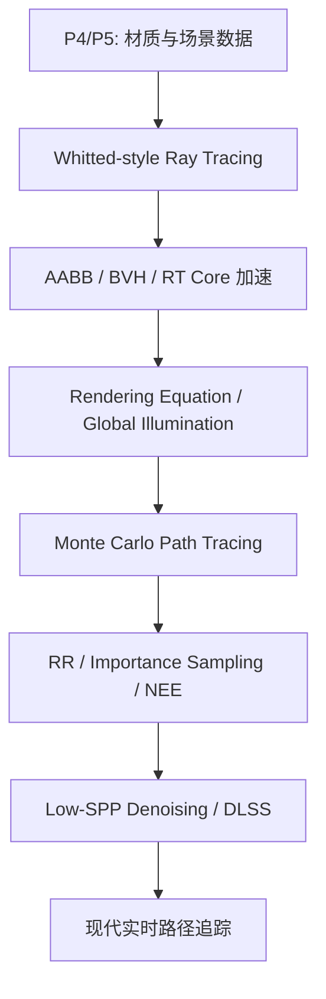

# Week 12-14 / Part 6 Knowledge Graph

> **输入 raw**：stage-1 `20260626-000323`，stage-2 `20260626-001017`，stage-3 `20260626-001714`  
> **主题校准**：P6 source 与规划高度吻合，主线是 ray tracing → acceleration → rendering equation → Monte Carlo path tracing → sampling optimization → real-time denoising。

## 认知阶梯

## 节点清单

| 节点 | 认知目标 | batch | 关键素材 | Agent 须补充 |
|------|----------|-------|----------|--------------|
| Whitted Ray Tracing | 理解主光线、求交、阴影、反射 / 折射递归 | `concept-breakdown-ray-tracing-basics`、`visual-explain-ray-tracing-pipeline` | $P(t)=O+tD$、shadow ray、递归边界 | 与 P4 rasterization 对比 |
| AABB / BVH | 理解 ray tracing 为什么需要加速 | `concept-breakdown-acceleration-structures`、`deep-dive-bvh-aabb-example` | slab test、TLAS / BLAS、RT Core、OptiX | 可视化例子 |
| 渲染方程 / GI | 理解局部光照到全局光照的数学统一 | `concept-breakdown-rendering-equation-gi`、`deep-dive-rendering-equation-terms` | $L_o$、$L_e$、$f_r$、$L_i$、visibility、geometry term | 公式逐项解释 |
| Monte Carlo / Path Tracing | 理解 PDF、estimator、SPP、variance 和 $N=1$ | `concept-breakdown-monte-carlo-path-tracing`、`examples-monte-carlo-path-tracing-noise` | MC 估算公式、低/高 SPP 对比 | 噪声直觉 |
| 采样优化 | 理解 RR、importance sampling、NEE 的区别 | `concept-breakdown-sampling-optimization`、`compare-rr-importance-nee` | 无偏概率补偿、光源面积采样 | 对比表 |
| 实时去噪 / DLSS | 理解低 spp 如何变成稳定画面 | `concept-breakdown-denoising-realtime-rt`、`visual-explain-realtime-denoising` | G-buffer、motion vectors、RT Core、Tensor Core | Mermaid 图 |

## 叙事承接表

| 章节 | 要回答 | 承接 | 引出 | raw |
|------|--------|------|------|-----|
| P6 全景 | 高级渲染为什么需要换算法？ | P5 PBR 和场景数据 | Ray tracing | `overview-skeleton` |
| Ray tracing | 如何从像素发射光线求颜色？ | P4 可见性/着色 | BVH 性能 | `visual-explain-ray-tracing-pipeline` |
| 加速结构 | 为什么 ray tracing 能跑起来？ | 大量求交 | GI 方程 | `deep-dive-bvh-aabb-example` |
| 渲染方程 | 真实感的统一目标是什么？ | 局部光照不足 | Monte Carlo | `deep-dive-rendering-equation-terms` |
| Path tracing | 如何数值求解渲染方程？ | 半球积分 | 采样优化 | `examples-monte-carlo-path-tracing-noise` |
| RR / NEE | 如何减少无效路径和噪声？ | MC 噪声 | 实时化 | `compare-rr-importance-nee` |
| 去噪 / DLSS | 如何实时落地？ | low spp | 课程收束 | `visual-explain-realtime-denoising` |

## batch → 章节映射

| batch | 整合深度 |
|-------|----------|
| `overview-skeleton` | 高：全局结构 |
| `notes-skeleton-week12-14` | 高：周次顺序 |
| `slide-skeleton-lecture11-part1` | 高：GI / path types |
| `slide-skeleton-lecture11-part2-path-tracing` | 高：MC / PT |
| `source-skeleton-rendering-equation` | 中：理论背景 |
| `concept-breakdown-ray-tracing-basics` | 高：ray tracing 起点 |
| `concept-breakdown-acceleration-structures` | 高：性能核心 |
| `concept-breakdown-rendering-equation-gi` | 高：公式核心 |
| `concept-breakdown-monte-carlo-path-tracing` | 高：path tracing 核心 |
| `concept-breakdown-sampling-optimization` | 高：优化核心 |
| `concept-breakdown-denoising-realtime-rt` | 中：工业落地 |

## 课纲审计

- P6 source 覆盖完整，未发现主要偏差。
- Shadow map 在原规划中出现，但当前 raw 主线不在 shadow map；指南中压缩为实时效果背景，不单独开大章。
- Week 14 含 AI 建模 / CAD 讨论，属于边角内容；P6 只保留与实时渲染、去噪、工业落地相关的部分。
