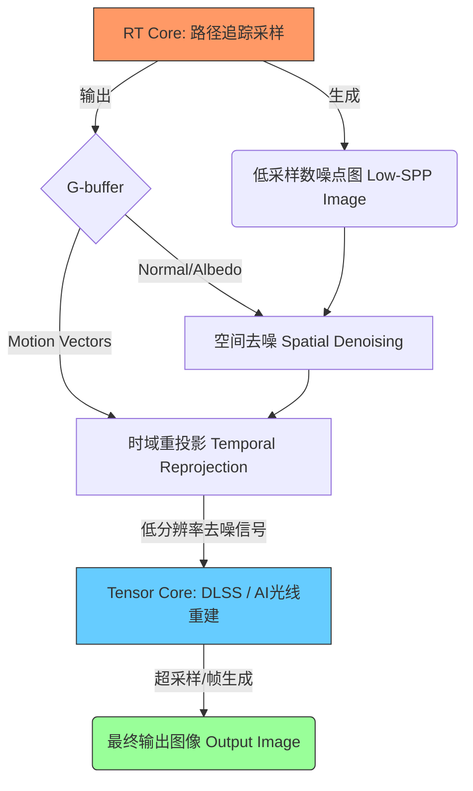

整理的实时路径追踪（Real-Time Path Tracing）去噪与深度学习超级采样（DLSS）的可视化解释素材如下：

### 1. 实时路径追踪去噪与 DLSS 全流程素材整理

实时渲染管线（Rendering Pipeline）中，实现高质量画面的核心在于如何将极低采样率的原始信号转化为高清晰度的最终图像 [1, 2]。

*   **低采样数噪点图 (Low-SPP noisy image)**：
    *   **现象**：由于实时渲染算力限制，路径追踪 (Path Tracing) 通常仅能承担每像素 1-4 个样本 (Samples Per Pixel, SPP) 的采样量，这会导致严重的蒙特卡洛方差，表现为画面布满颗粒状噪点 [3-5]。
    *   **成因**：随机采样过程中，大量光线未能击中光源，导致像素间的亮度贡献差异巨大 [4, 6]。
*   **几何缓冲区 G-buffer (Geometry Buffer, 几何缓冲区)**：
    *   **作用**：作为去噪的辅助信息（Auxiliary Features），提供场景的精确几何特征 [7, 8]。
    *   **法线 (Normal)**：记录表面朝向，帮助去噪器区分不同平面的边界 [7, 9]。
    *   **材质反照率 (Albedo)**：提供不含光影的纯净色彩，使去噪器能区分噪点是来自光照还是纹理本身 [7, 8, 10]。
    *   **运动向量 (Motion vectors)**：记录像素从前一帧到当前帧的移动轨迹，是时域处理的关键 [8]。
*   **时空去噪 (Spatial / Temporal denoising)**：
    *   **空间去噪 (Spatial denoising)**：利用当前帧相邻像素的信息进行滤波，利用法线和深度信息避免模糊几何边缘 [5, 8]。
    *   **时域去噪 (Temporal denoising)**：利用运动向量将前一帧的像素重投影（Reprojection）到当前帧，通过累加多帧信息来提升有效采样率，消除闪烁 [8, 11]。
*   **DLSS (Deep Learning Super Sampling, 深度学习超级采样) 与 Tensor Core**：
    *   **DLSS 技术**：利用 AI 模型在 Tensor Core 上运行，将低分辨率（如 1/4 分辨率）的去噪图像重构为高分辨率图像 [12, 13]。
    *   **光线重建 (Ray Reconstruction)**：在 DLSS 3.5+ 中，AI 取代了传统的手工去噪器，能更智能地处理时空信息，减少鬼影并提升全局光照质量 [8, 13]。

---

### 2. 硬件分工：RT Core 与 Tensor Core

在现代 GPU 架构中，实时光追的实现依赖于两种专用核心的协同工作 [2, 12]：

| 核心类型 | 英文全称 | 核心分工 (Division of Labor) |
| :--- | :--- | :--- |
| **RT Core** | Ray Tracing Core (光线追踪核心) | 专门负责加速**射线-三角形求交** (Ray-Triangle Intersection) 和 **层次包围盒** (BVH, Bounding Volume Hierarchy) 的遍历。它生成原始的 Low-SPP 噪点数据 [2, 12, 14]。 |
| **Tensor Core** | Tensor Core (张量核心) | 专门负责加速**深度学习矩阵运算**。它执行 DLSS 算法和 AI 去噪模型，将 RT Core 产生的“毛坯”信号加工成高质量图像 [12, 13]。 |

---

### 3. Mermaid 流程图节点与箭头设计

以下是适合改写为 Mermaid Flowchart 的逻辑结构：

**节点说明**：
*   **RT Core**：起点，负责物理光路计算 [2, 12]。
*   **Low-SPP Image**：中间产物，高方差噪点信号 [4, 5]。
*   **G-buffer**：辅助引擎，包含法线、反照率等几何特征 [7, 8]。
*   **Temporal Reprojection**：利用时域连续性提升信噪比 [8, 11]。
*   **Tensor Core / DLSS**：终点加速站，完成画质飞跃 [12, 13]。
*   **Output Image**：最终呈现的高清、稳定画面 [13]。