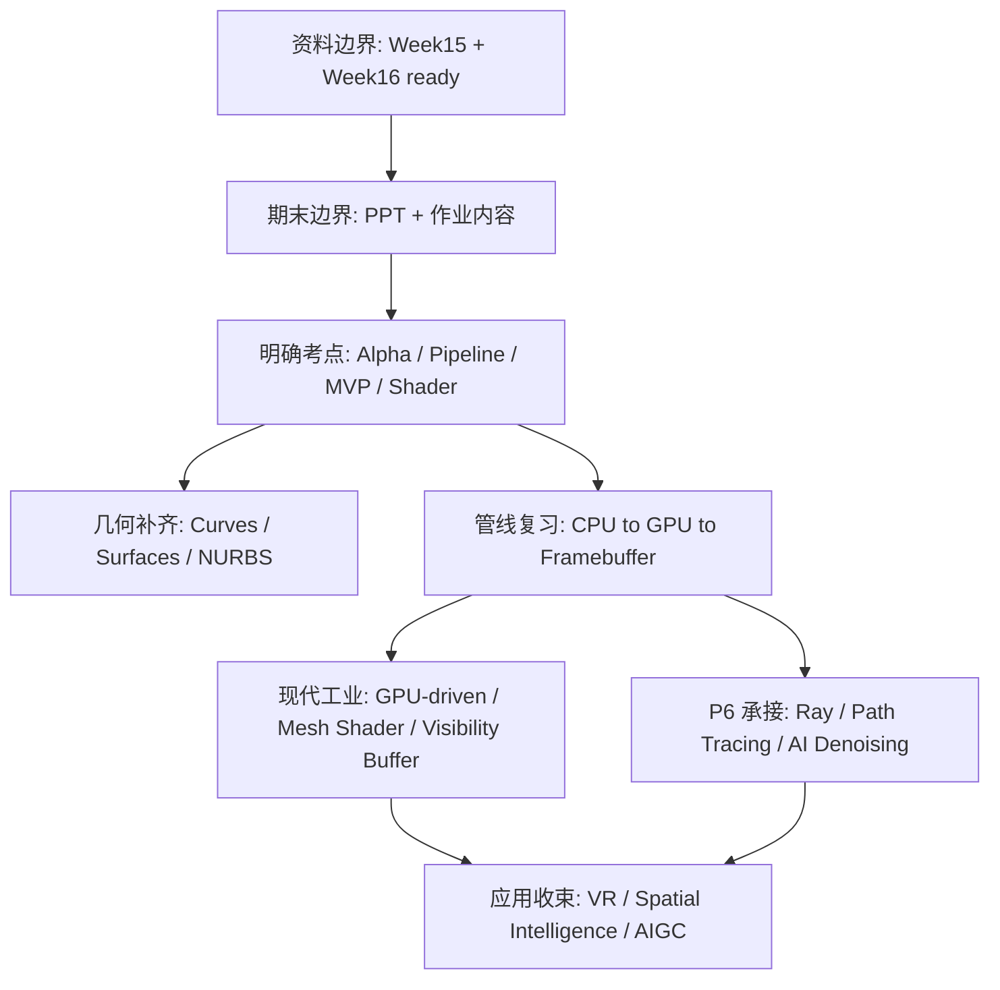

# Week 15-16 / Part 7 Knowledge Graph

> **输入 raw**：stage-1 `20260626-014343`，stage-2 `20260626-023329`，stage-3 `20260626-024213`  
> **Week16 source**：`笔记-week16-周一-图形学` 已由本地 FiCS/iCourse 课程总结脱敏导入 NotebookLM，状态 `ready`。  
> **主题校准**：P7 主线是期末复习边界 + 作业/PPT 考点 + Week16 曲线曲面补齐 + 管线/API 总复习 + GPU-driven / VR / AI 趋势收束。

## 认知阶梯

## 节点清单

| 节点 | 认知目标 | batch | 关键素材 | Agent 须补充 |
|------|----------|-------|----------|--------------|
| 资料边界 | 区分可确认信息与缺失信息 | `source-boundary-week16-project-rubric`、`concept-breakdown-exam-homework-boundary` | Week15/16 ready，Project/rubric/题型缺失 | 指南开头保守标注 |
| 期末复习地图 | 把 P1-P6 与 Week15/16 明确考点对应 | `review-map-final-exam-p1-p6` | Alpha、Pipeline、MVP、Blinn-Phong、Shader、Buffer、GPU-driven、Ray tracing | 避免虚构题型和分值 |
| Alpha / 颜色 / 显示 | 掌握必考公式与显示背景 | `concept-breakdown-alpha-color-display`、`examples-alpha-blending-exam` | $I=\alpha F+(1-\alpha)B$、颜色感知、HDR | 修正 raw 中 $\alpha$ 范围为 $[0,1]$ |
| 曲线曲面 | 补齐参数几何与工业建模 | `concept-breakdown-curves-surfaces`、`deep-dive-curves-nurbs-continuity` | Bezier、B-spline、NURBS、张量积曲面、连续性 | 用直觉解释控制顶点/基函数/权重 |
| 渲染管线 | 用数据流串起课程主线 | `concept-breakdown-pipeline-programmable-api`、`visual-explain-pipeline-mvp-shader` | CPU 应用阶段、MVP、Shader、光栅化、片元处理 | Mermaid 管线图 |
| GPU-driven | 理解前沿工业资料与传统管线差异 | `concept-breakdown-gpu-driven-rendering`、`compare-traditional-gpu-driven-pipeline` | Draw call、MDI、Meshlet、Mesh Shader、Visibility Buffer | 对比表 |
| VR / 空间智能 / AI 趋势 | 课程收束与行业方向 | `concept-breakdown-vr-spatial-intelligence`、`visual-explain-vr-spatial-ai` | 非对称投影、分布式渲染、World Labs、Sim-to-Real、AIGC | 区分考试核心与行业展望 |
| 光追复习承接 | 把 P6 高级渲染接回期末复习 | `concept-breakdown-raytracing-review` | 渲染方程、BRDF、BVH、Path Tracing、Ray Reconstruction | 不重复完整 P6 指南 |

## 叙事承接表

| 章节 | 要回答 | 承接 | 引出 | raw |
|------|--------|------|------|-----|
| 资料边界 | P7 到底能据哪些资料复习？ | Week16 邮件已导入 | 期末地图 | `source-boundary-week16-project-rubric` |
| 期末地图 | 哪些考点已确认，哪些不能推断？ | 资料边界 | Alpha 与管线 | `review-map-final-exam-p1-p6` |
| Alpha / 颜色 | 必考公式如何算、为什么用于融合？ | Week15 | 显示与 VR | `examples-alpha-blending-exam` |
| 曲线曲面 | Week16 补了哪些几何建模内容？ | P5 缺口 | CAD / AI 建模 | `deep-dive-curves-nurbs-continuity` |
| 管线 / API | 数据如何从 CPU 到屏幕？ | P2-P4 | GPU-driven | `visual-explain-pipeline-mvp-shader` |
| GPU-driven | 为什么现代管线把决策推给 GPU？ | 管线瓶颈 | 工业资料 | `compare-traditional-gpu-driven-pipeline` |
| 光追复习 | P6 如何进入期末与工业资料？ | P6 指南 | AI 降噪 | `concept-breakdown-raytracing-review` |
| VR / AI 趋势 | 课程最终落到哪些应用愿景？ | Alpha / 管线 / AI 降噪 | 学期收束 | `visual-explain-vr-spatial-ai` |

## batch → 章节映射

| batch | 整合深度 |
|-------|----------|
| `overview-skeleton` | 高：P7 全局范围 |
| `notes-skeleton-week15` | 高：Week15 Alpha、VR、AI 趋势 |
| `notes-skeleton-week16` | 高：Week16 曲线曲面、管线、工业复习 |
| `source-boundary-week16-project-rubric` | 高：边界审计，局部着色偏差需纠偏 |
| `concept-breakdown-exam-homework-boundary` | 高：期末边界 |
| `concept-breakdown-alpha-color-display` | 高：Alpha 与显示 |
| `concept-breakdown-curves-surfaces` | 高：曲线曲面 |
| `concept-breakdown-pipeline-programmable-api` | 高：管线/API |
| `concept-breakdown-gpu-driven-rendering` | 中高：工业前沿 |
| `concept-breakdown-vr-spatial-intelligence` | 中：应用趋势 |
| `concept-breakdown-raytracing-review` | 中：P6 承接 |
| `examples-alpha-blending-exam` | 高：考试例题 |
| `visual-explain-pipeline-mvp-shader` | 高：管线图 |
| `deep-dive-curves-nurbs-continuity` | 高：几何深挖 |
| `compare-traditional-gpu-driven-pipeline` | 中高：对比表 |
| `review-map-final-exam-p1-p6` | 高：总复习地图 |
| `visual-explain-vr-spatial-ai` | 中：收束图 |

## 课纲审计

- Week16 课程总结已从本地邮件导出并进入 NotebookLM；P7 不再标注 Week16 缺失。
- 未发现独立 Project / Final Project 任务书、展示要求、详细 rubric、官方题型说明；所有指南内容必须保守表达。
- NotebookLM 在边界审计中把 “Part 7” 误解为 Lecture 7 Local Shading；指南只把 Blinn-Phong 作为 Week16 明确提到的作业 / P4 复习点，不作为 P7 新授主线。
- Alpha raw 中 $\alpha$ 取值范围被引用编号污染，最终指南按数学定义修正为 $\alpha \in [0,1]$。
