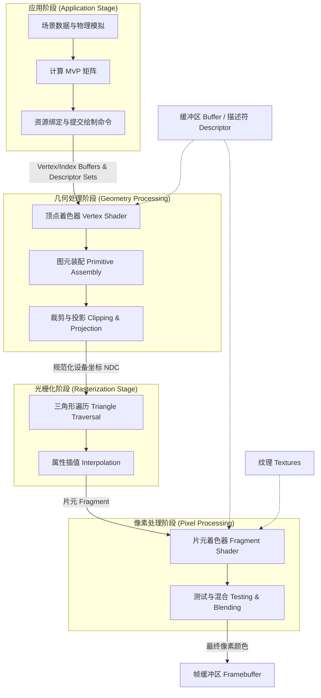

这份可视化指南基于 Week16 的课堂总结及相关课件，展示了从 CPU 应用阶段到 GPU 最终输出的完整**渲染管线(Rendering Pipeline)**数据流图 [1]。

### 渲染管线数据流架构图 (Mermaid Flowchart)

---

### 节点详细说明

#### 1. 应用阶段 (Application Stage)
*   **输入**：场景层级结构、物体的网格数据、材质属性、相机参数及用户输入 [1]。
*   **处理核心**：
    *   **MVP(Model-View-Projection, 模型-视图-投影变换矩阵)**：CPU 计算这些矩阵以实现从模型空间到世界空间、再到相机空间和裁剪空间的坐标转换 [2, 3]。
    *   **资源准备**：将顶点数据存入**顶点缓冲区(Vertex Buffer)**，并通过**描述符(Descriptor)**将常量数据（如 MVP）和**纹理(Textures)**绑定到管线 [3]。
*   **输出**：渲染状态配置及**绘制调用(Draw Call)**命令 [1, 3]。

#### 2. 几何处理阶段 (Geometry Processing)
*   **输入**：来自 CPU 的顶点流及通过**描述符集(Descriptor Set)**传入的统一变量（Uniforms，如 MVP 矩阵）[3]。
*   **处理核心**：
    *   **顶点着色器(Vertex Shader)**：对每个顶点应用模型、视图、投影变换，将坐标转换至裁剪空间 [1]。
    *   **齐次坐标(Homogeneous Coordinates)**：引入 $w$ 分量，使得平移、缩放、旋转等仿射变换能统一为 $4 \times 4$ 矩阵乘法，方便 GPU 硬件加速 [3]。
*   **输出**：变换后的顶点及其关联属性（如 UV 坐标）[1]。

#### 3. 光栅化阶段 (Rasterization Stage)
*   **输入**：裁剪空间的几何图元（通常是三角形）[1]。
*   **处理核心**：
    *   **扫描转换(Scan Conversion)**：将连续的几何三角形转换为离散的**片元(Fragment)**（即候选像素）[1, 4]。
    *   **重心坐标插值(Barycentric Interpolation)**：在三角形内部对顶点属性（如颜色、法线、纹理坐标）进行线性插值，为后续着色提供数据 [5]。
*   **输出**：带有插值属性的片元流 [1]。

#### 4. 像素处理阶段 (Pixel Processing)
*   **输入**：插值后的片元数据、绑定的纹理资源 [1]。
*   **处理核心**：
    *   **片元着色器(Fragment Shader)**：计算每个像素的最终颜色。包括执行 **Blinn-Phong 光照模型**计算及纹理采样 [1, 2]。
    *   **深度测试(Depth Test / Z-Buffer)**：比较当前片元与 **Z-缓冲区(Z-Buffer)** 中存储的深度值，仅保留更靠近相机的片元，解决遮挡问题 [1, 6]。
    *   **混合(Blending)**：对于半透明物体，根据 Alpha 值将片元颜色与缓冲区已有颜色进行合并 [1, 6]。
*   **输出**：确定亮度和颜色的像素数据 [1]。

#### 5. 帧缓冲区 (Framebuffer)
*   **输入**：通过所有测试和处理的最终像素 [1]。
*   **输出**：存储在显存中的完整图像，准备发送至显示器 [1]。

---
**来源标注：**
*   管线核心流程参考：[1], [7], [8]。
*   MVP 与变换原理参考：[2], [3], [9]。
*   数据绑定（Buffer/Descriptor）参考：[3], [10]。
*   测试与混合原理参考：[6], [1]。