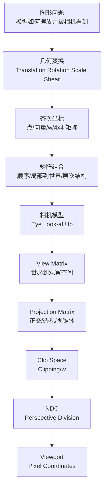

# Week 3-4 / Part 2 Knowledge Graph

> **主题**：几何变换、相机/观察变换、投影、裁剪空间与 NDC  
> **raw 输入**：Stage 1 `20260625-223828`，Stage 2 `20260625-224204`，Stage 3 `20260625-230612`  
> **整合原则**：以 Week 3-4 课堂记录、`课件03-Lecture03-2026`、`课件04-Lecture04-05-2025` 为主；Lecture05 可编程管线内容只作后续承接。

## 1. 认知阶梯

## 2. 节点清单

| 节点 | 认知目标 | 关键 raw | Agent 须补充 |
|------|----------|----------|--------------|
| 几何变换(Geometric Transformation) | 知道变换解决模型摆放、实例化和顶点处理问题 | `overview-skeleton`、`slide-skeleton-lecture03`、`concept-breakdown-geometric-transforms` | 把缩放、旋转、平移、错切统一成“改变顶点坐标”的图形问题 |
| 齐次坐标(Homogeneous Coordinates) | 理解为什么平移需要 `w`，点和向量如何区分 | `concept-breakdown-geometric-transforms` | 用 LaTeX 解释 $w=1$ 与 $w=0$；连接后续投影中的 $w$ |
| 矩阵组合(Matrix Composition) | 能解释列向量约定下矩阵从右到左应用 | `concept-breakdown-composition-hierarchy`、`examples-transform-order-matrix-chain` | Stage 3 数值 raw 有坐标排版异常；指南中保留思路，改用正确点例 |
| 层次结构(Transformation Hierarchy) | 理解父子节点矩阵链和 Scene Graph | `concept-breakdown-composition-hierarchy`、`examples-transform-order-matrix-chain` | 压缩为机器人手臂例，不展开动画系统 |
| 相机模型(Camera Model) | 理解 Eye、Look-at、Up 如何定义虚拟相机 | `slide-skeleton-lecture04`、`concept-breakdown-camera-view` | 解释“移动相机等价于反向移动世界” |
| 观察变换(Viewing Transformation) | 能构造 R/U/B 或 U/V/N 基向量与 View Matrix | `deep-dive-view-matrix-lookat` | 重点解释叉积顺序、右手坐标系、C2W 求逆 |
| 投影变换(Projection Transformation) | 区分正交和透视，理解 FOV/aspect/near/far | `concept-breakdown-projection`、`deep-dive-projection-clip-ndc` | 补相似三角形直觉，避免只背矩阵 |
| 裁剪空间(Clip Space) 与 NDC | 串起 Clip → Clipping → Perspective Division → NDC | `concept-breakdown-clip-ndc-viewport`、`deep-dive-projection-clip-ndc` | 解释为什么先裁剪再除以 $w$，算法只作了解 |
| 视口变换(Viewport Transformation) | 能把 NDC 映射到像素坐标 | `slide-module-detail-lecture04-part2`、`deep-dive-projection-clip-ndc` | 用公式和屏幕中心例子串联 |

## 3. 叙事承接表

| 指南章节 | 要回答 | 承接 | 引出 | raw |
|----------|--------|------|------|-----|
| 知识地图 | Part 2 在整条渲染管线中负责什么 | Week 1-2 已有点、向量、扫描转换 | 本 Part 先把几何送到可成像空间 | Stage 1 + `visual-explain-mvp-pipeline` |
| 几何变换 | 如何把局部模型摆到世界中 | Week 1-2 的矩阵语言 | 多个变换如何组合 | `concept-breakdown-geometric-transforms` |
| 组合与层级 | 为什么矩阵顺序不能乱 | 基本变换矩阵 | 相机也是一种坐标变换 | `concept-breakdown-composition-hierarchy`、`examples-transform-order-matrix-chain` |
| 相机与 View Matrix | 世界如何变成相机眼中的世界 | 局部/世界坐标转换 | 观察空间如何投到 2D | `concept-breakdown-camera-view`、`deep-dive-view-matrix-lookat` |
| 投影与空间链 | 3D 如何映射到 2D 并保持近大远小 | View Space | Clip、NDC、Viewport | `concept-breakdown-projection`、`deep-dive-projection-clip-ndc` |
| 串联与调试 | 黑屏、形变、坐标错乱从哪查 | 前面所有空间 | Week 5 光栅化 | `visual-explain-mvp-pipeline` |

## 4. Batch 到章节映射

- `overview-skeleton`：用于 Part 2 全局边界、主题顺序和管线定位。
- `slide-skeleton-lecture03`：用于 Lecture03 原序：变换导论、2D/3D 变换、3D 旋转、层次结构。
- `slide-skeleton-lecture04`：用于 Lecture04 原序：相机、观察变换、投影、裁剪、视口。
- `concept-breakdown-geometric-transforms`：用于几何变换与齐次坐标正文。
- `concept-breakdown-composition-hierarchy`：用于矩阵顺序、局部/世界坐标、层次结构。
- `concept-breakdown-camera-view`、`deep-dive-view-matrix-lookat`：用于相机与 View Matrix 深挖。
- `concept-breakdown-projection`、`deep-dive-projection-clip-ndc`：用于投影、Clip、NDC 和 Viewport 深挖。
- `concept-breakdown-clip-ndc-viewport`、`slide-module-detail-lecture04-part2`：用于裁剪、视口变换和课件原序对齐。
- `examples-transform-order-matrix-chain`：只采用其概念和公式结构；其中个别数值坐标排版异常，指南中不直接照抄。
- `visual-explain-mvp-pipeline`：用于 Mermaid 管线图、术语表和调试现象。

## 5. 课纲审计

- `课件04-Lecture04-05-2025` 覆盖 Lecture04 与 Lecture05。Part 2 指南只展开 Week 4 的相机、观察变换、投影、裁剪和视口变换；DirectX 10/11/12、可编程管线细节仅作为 Week 5 之后承接。
- Stage 3 `visual-explain-mvp-pipeline` 引用了 Week 5 的光栅化/Z-buffer 内容；指南仅用于说明 Part 2 输出会进入下一阶段，不把 Z-buffer 当作 Week 3-4 主线。
- NotebookLM 的个别数值例出现坐标排版异常；最终指南以课程公式和 Agent 校正后的 LaTeX 例子呈现，不伪造为 raw 原文。

## 6. Optional Stage 4 决策

不追加 optional stage-4。Stage 1-3 已覆盖核心概念、例题、视觉解释与课件原序；易混点和 Project 桥接可由 Agent 基于现有 raw 在 review-iteration 中自审整理，不需要额外 NotebookLM raw。
