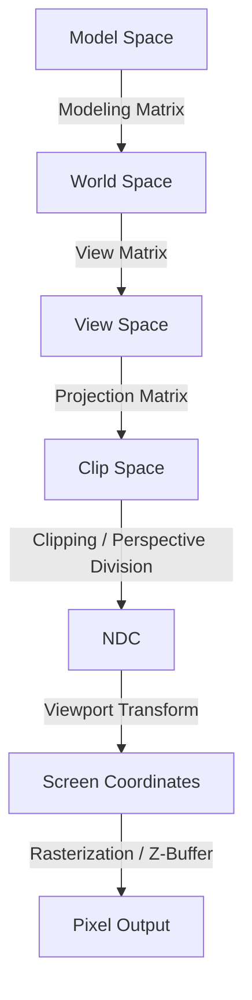

以下是基于 Week 3-4 课堂记录及相关课件整理的从 MVP 变换到像素输出的可视化解释素材。

### 渲染管线变换流程可视化素材

#### 1. 模型空间 (Model Space / Object Space)
*   **输入**：模型局部坐标系下的顶点数据 [1, 2]。
*   **输出**：待变换的局部顶点坐标。
*   **负责操作**：定义物体自身的几何形状，通常以模型中心为原点 [1, 3]。
*   **常见调试现象**：若模型坐标定义错误（如单位不统一或中心点偏移），导入场景后物体可能产生形变或位置异常 [2]。

#### 2. 世界空间 (World Space)
*   **输入**：模型空间坐标。
*   **输出**：统一坐标系下的场景坐标 [4]。
*   **负责矩阵**：**模型变换矩阵 (Modeling Transformation Matrix)**。包含平移 (Translation)、旋转 (Rotation)、缩放 (Scale) 等仿射变换 [4-6]。
*   **常见调试现象**：若多个模型变换顺序错误（如先平移后旋转），会导致物体围绕错误中心旋转，无法到达预定位置 [7, 8]。

#### 3. 观察空间 (View Space / Camera Space)
*   **输入**：世界空间坐标。
*   **输出**：以相机为原点的 **相机坐标 (Camera Coordinates)** [1, 9]。
*   **负责矩阵**：**视图变换矩阵 (View Transformation Matrix)**。通过定义 Eye Position (相机位置)、Look-at Point (观察目标) 和 Up Vector (向上向量) 构建 UVN 相机坐标系 [9, 10]。
*   **常见调试现象**：**“黑屏”**。通常是因为相机朝向错误（Back Vector 映射方向反了）或物体超出了相机的观察范围 [2, 11]。

#### 4. 裁剪空间 (Clip Space)
*   **输入**：观察空间坐标。
*   **输出**：**齐次裁剪坐标 (Homogeneous Clip Coordinates)**。
*   **负责矩阵**：**投影变换矩阵 (Projection Transformation Matrix)** [10, 12]。
    *   **透视投影 (Perspective Projection)**：模拟“近大远小”视觉，由 **FOV (Field of View，视场角)**、宽高比、近/远裁剪面定义 **视锥体 (Frustum)** [13, 14]。
    *   **平行投影 (Parallel Projection)**：投影线平行，无灭点，常用于工程制图 [13, 14]。
*   **负责操作**：**裁剪 (Clipping)**。剔除视锥体外的图元，常用 **Cohen-Sutherland (线段裁剪算法)** [15, 16]。

#### 5. 规范化设备坐标 (NDC, Normalized Device Coordinates)
*   **输入**：齐次裁剪坐标 $[x, y, z, w]$。
*   **输出**：范围在 $[-1, 1]^3$ 之间的规范化立方体坐标 [8]。
*   **负责操作**：**透视除法 (Perspective Division)**。将 $x, y, z$ 分量分别除以 $w$ 分量，实现透视收缩效果 [8, 14]。
*   **常见调试现象**：若投影矩阵 $w$ 分量计算错误，会导致画面产生极度扭曲或拉伸 [14]。

#### 6. 屏幕/视口坐标 (Screen Space / Viewport)
*   **输入**：NDC 坐标。
*   **输出**：二维窗口像素坐标 [8, 17]。
*   **负责操作**：**视口变换 (Viewport Transformation)**。将 $[-1, 1]$ 范围的 NDC 映射到具体的屏幕窗口范围（如 $1920 \times 1080$） [8, 18]。
*   **常见调试现象**：若宽高比设置不当，渲染出的圆形会变成椭圆形（被压扁或拉长） [19]。

#### 7. 像素坐标 (Pixel Coordinates / Output)
*   **输入**：屏幕空间几何图元。
*   **输出**：帧缓冲区 (Framebuffer) 中的像素颜色 [20, 21]。
*   **负责操作**：**光栅化 (Rasterization / Scan Conversion)**。将几何形状转换为像素点，并进行 **Z-Buffer (深度缓冲算法)** 测试以解决遮挡问题 [2, 22]。
*   **常见调试现象**：**Z-fighting (像素闪烁)**。当两个面距离极近时，由于深度精度不足，像素会交替闪烁 [22]。

---

### Mermaid Flowchart 逻辑参考

**标注来源：**
*   课程记录：Week 3 [6, 7, 23-27]、Week 4 [2, 9, 10, 14, 28, 29]、Week 5 [8, 16, 30-32]
*   课件：Lecture 03 [3-5, 33-49]、Lecture 04-05 [1, 11-13, 15, 17, 18, 20, 21, 50-57]