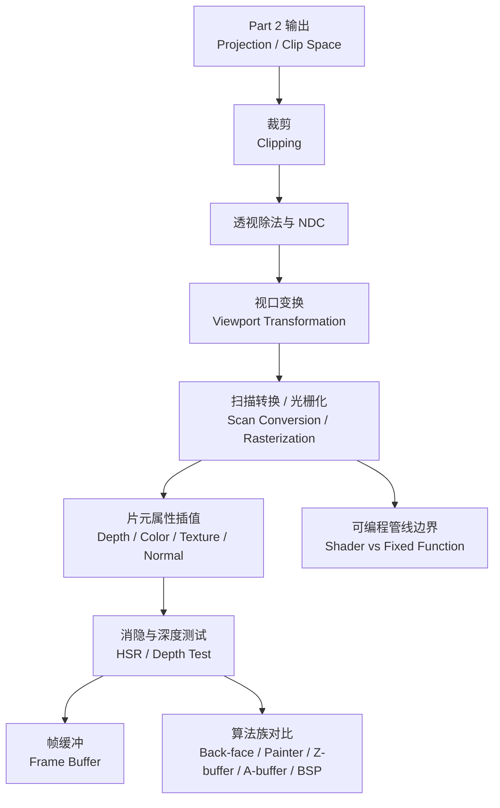

# Week 5-6 / Part 3 Knowledge Graph

> **对象**：P3 / `week5-6`  
> **主题**：光栅化、可见性与管线后段  
> **输入 raw**：Stage 1 `20260625-232348`、Stage 2 `20260625-232714`、Stage 3 `20260625-233327`  
> **状态**：已通读全部 stage-1/2/3 `*.answer.md` 后生成；未追加 optional stage-4。

## 1. 认知阶梯

## 2. 节点清单

| 节点 | 认知目标 | batch | 关键素材 | Agent 须补充 |
|------|----------|-------|----------|--------------|
| Post-projection pipeline | 知道 P3 接在 P2 哪一步后面 | `overview-skeleton`、`concept-breakdown-pipeline-after-projection`、`visual-explain-post-projection-pipeline` | Clipping、Viewport、Rasterization、Depth Test 的输入输出 | 用 Mermaid 串成一条空间链，避免阶段割裂 |
| Clipping / Viewport | 理解裁剪和像素坐标映射 | `slide-skeleton-lecture04-05-part3`、`concept-breakdown-clipping-viewport` | Cohen-Sutherland outcode、Liang-Barsky 参数化、window-to-viewport 公式 | 修正 raw 中 `$t \\in [11]$` 排版噪声为 $t \in [0,1]$ |
| Rasterization / Scan Conversion | 理解连续几何如何变片元 | `concept-breakdown-scan-conversion-rasterization`、`examples-rasterization-scanline-interpolation` | pixel center、triangle coverage、scan-line span、Bresenham、interpolation | 用小扫描线例题解释，不扩展未验证的硬件调度 |
| Programmable Pipeline | 定位 shader 与固定功能阶段 | `concept-breakdown-programmable-pipeline` | vertex shader、fragment shader、tessellation、geometry shader、Vulkan / DX12 | 压缩成工程定位，不让 API 细节压过 P3 主线 |
| HSR 总览 | 明白消隐为什么存在 | `slide-skeleton-lecture06`、`concept-breakdown-hidden-surface-overview` | back-facing、occluded、overlap、intersect；object-space vs image-space | 建立算法族表，首次解释术语 |
| Z-buffer / Depth Test | 掌握现代 GPU 可见性基石 | `concept-breakdown-depth-buffer-algorithms`、`deep-dive-zbuffer-depth-test` | 初始化、比较、更新、顺序无关、透明 / aliasing / precision 局限 | 给同一像素两个片元的数值例，解释 depth precision 与 z-fighting |
| 其他 HSR 算法 | 识别各算法适用场景 | `compare-hidden-surface-algorithms` | A-buffer、BSP Tree、Scan-line、Area Subdivision、Ray Casting、Painter | 用安全 Markdown 表格对比，避免术语未解释 |

## 3. 叙事承接表

| 指南章节 | 要回答 | 承接 | 引出 | raw |
|----------|--------|------|------|-----|
| 1. 知识地图 | P3 在管线中接在哪里？ | P2 的 MVP / Clip Space / NDC | Clipping 到 Frame Buffer | `visual-explain-post-projection-pipeline` |
| 2. 裁剪与视口 | 为什么不能直接把投影结果画到屏幕？ | Projection 后仍有视野外图元和标准坐标 | Rasterization 输入需要屏幕坐标 | `concept-breakdown-clipping-viewport` |
| 3. 光栅化 | 连续三角形怎样变成 fragment？ | Viewport 输出屏幕坐标 | Fragment 带属性，才能进入 shading / depth test | `examples-rasterization-scanline-interpolation` |
| 4. 可编程管线 | 哪些阶段是 shader，哪些是硬件固定功能？ | 光栅化与 shader 容易混 | HSR / Depth Test 属于后段固定功能主线 | `concept-breakdown-programmable-pipeline` |
| 5. 消隐总览 | 为什么要 Hidden Surface Removal？ | 多个 fragment 可能覆盖同一像素 | Z-buffer 是现代硬件主力 | `concept-breakdown-hidden-surface-overview` |
| 6. Z-buffer | 深度测试具体怎样工作？ | HSR 算法族 | 算法局限、透明和 z-fighting | `deep-dive-zbuffer-depth-test` |
| 7. 算法对比与复习 | 如何区分 Painter、BSP、Ray Casting 等？ | Z-buffer 不是唯一算法 | P4 的 shader / lighting / texture | `compare-hidden-surface-algorithms` |

## 4. batch → 章节映射

| batch | 整合深度 | 章节 |
|-------|----------|------|
| `overview-skeleton` | 中 | 知识地图、source 缺口说明 |
| `slide-skeleton-lecture04-05-part3` | 中 | 裁剪、视口、扫描转换 |
| `slide-skeleton-lecture06` | 高 | 消隐总览、算法族 |
| `concept-breakdown-pipeline-after-projection` | 高 | 知识地图、全景节 |
| `concept-breakdown-clipping-viewport` | 高 | 裁剪 / 视口 |
| `concept-breakdown-scan-conversion-rasterization` | 高 | 光栅化与插值 |
| `concept-breakdown-programmable-pipeline` | 中 | shader / fixed-function 边界 |
| `concept-breakdown-hidden-surface-overview` | 高 | HSR 总览 |
| `concept-breakdown-depth-buffer-algorithms` | 高 | Z-buffer 与其他算法 |
| `visual-explain-post-projection-pipeline` | 高 | Mermaid 管线图 |
| `examples-rasterization-scanline-interpolation` | 高 | 扫描线例题、插值 |
| `deep-dive-zbuffer-depth-test` | 高 | 深度测试流程、数值例 |
| `compare-hidden-surface-algorithms` | 高 | 算法对比表 |

## 5. 课纲审计

- `semester-parts.md` 与 16 周梳理把 P3 规划为 W5-W6：光栅化 / 可见性 / 采样。
- NotebookLM source list 未发现 Week 6 课堂笔记，也未发现 Project / Assignment 文档。
- Stage 1-3 raw 对“可见性 / 消隐 / Z-buffer”覆盖充分，对“扫描转换 / 光栅化”有基础覆盖，对“采样 / 抗锯齿”仅通过 A-buffer 的 aliasing 动机间接触及。
- 最终指南应把“采样 / 抗锯齿”压缩为资料缺口与后续建议，不应编造成完整课程内容。
- Stage 3 的 `examples-rasterization-scanline-interpolation` 混入 Week 7/8/9 关于 shading / texture 的承接素材；指南中仅用于说明插值为后续着色服务，不展开 P4 内容。
