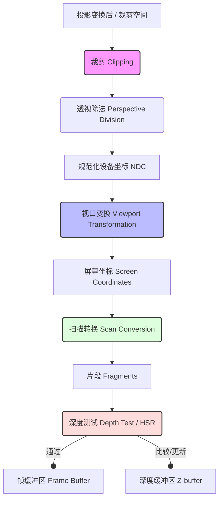

以下是基于 Week 5 课堂记录及相关课件整理的从投影变换（Projection Transformation）后到帧缓冲区（Frame Buffer）前的图形管线可视化解释素材。

### 1. 管线阶段详解

本指南按数据在管线中的流动顺序，解释各步骤的输入输出、坐标状态及责任边界：

#### **A. 裁剪 (Clipping)**
*   **输入/输出状态**：输入为**裁剪空间(Clip Space)**中的几何图元；输出为保留在视锥体内的几何片段 [1, 2]。
*   **坐标状态**：在进行**透视除法(Perspective Division)**之前。
*   **责任边界**：
    *   **Cohen-Sutherland 线段裁剪算法**：通过为区域分配 4 位二进制编码（Outcode）进行快速剔除或接受 [3, 4]。
    *   **核心任务**：剔除位于窗口/视口外的图元部分，仅保留可见部分，避免后续无效计算 [1, 3]。
*   **后续处理**：裁剪完成后，执行透视除法，将坐标转化为 **NDC(Normalized Device Coordinates, 规范化设备坐标)**，范围通常为 $[-1, 1]^3$ [2]。

#### **B. 视口变换 (Viewport Transformation)**
*   **输入/输出状态**：输入为 NDC 坐标；输出为**屏幕坐标(Screen Coordinates)** [2, 5]。
*   **坐标状态**：从单位立方体空间映射到实际的**图像坐标系(Image Coordinate System)**，即像素单位 [5]。
*   **责任边界**：
    *   执行窗口到视口的映射（Window-to-viewport mapping），计算顶点在屏幕上的具体像素位置 [5]。

#### **C. 扫描转换/光栅化 (Scan Conversion / Rasterization)**
*   **输入/输出状态**：输入为屏幕空间下的 2D 图元；输出为**片段(Fragments)** [1, 6]。
*   **坐标状态**：离散化的像素网格。
*   **责任边界**：
    *   **多边形填充**：使用扫描线算法（Scanline Algorithm）或针对三角形的并行光栅化技术，确定图元覆盖了哪些像素 [7, 8]。
    *   **差值计算**：计算每个片段的属性（如颜色、深度值 $Z$ 等），这些值通常由顶点属性插值得到 [6]。

#### **D. 隐藏面消除(Hidden Surface Removal) / 深度测试(Depth Test)**
*   **输入/输出状态**：输入为光栅化生成的片段；输出为通过测试并写入**帧缓冲区(Frame Buffer)**的最终像素颜色 [6, 9]。
*   **坐标状态**：**Z-buffer(Depth-Buffer Algorithm, 深度缓冲算法)**。
*   **责任边界**：
    *   **可见性确定**：解决物体间的遮挡关系 [10, 11]。
    *   **深度测试过程**：将当前片段的深度值与存储在 **Z-buffer(Depth Buffer, 深度缓冲区)** 中的值比较。若当前片段更近（$Z$ 值更小），则更新深度缓冲区并将其颜色写入帧缓冲区；否则丢弃 [6]。
    *   **最终输出**：结果进入 **Frame Buffer(Frame Buffer, 帧缓冲区)** 供显示器读取 [6, 11]。

---

### 2. Mermaid 流程图节点素材

以下内容可直接用于构建 Mermaid 流程图，展示管线的逻辑拓扑：

### 3. 核心可视化要素摘要表

| 步骤 | 坐标系状态 | 关键缩写/术语 | 核心责任 | 来源 |
| :--- | :--- | :--- | :--- | :--- |
| **裁剪** | 裁剪空间 | Cohen-Sutherland | 快速剔除视口外图元 | [3, 4] |
| **坐标规范化**| **NDC** | **NDC**(Normalized Device Coordinates) | 透视除法映射到 $[-1, 1]^3$ | [2] |
| **视口变换** | 屏幕坐标 | **VT**(Viewport Transformation) | 映射到像素坐标网格 | [2, 5] |
| **光栅化** | 片段空间 | **Scan Conversion** | 图元离散化为潜在像素 | [1, 6] |
| **深度测试** | 图像空间 | **HSR**(Hidden Surface Removal) | **Z-buffer** 可见性判定 | [6, 10] |
| **最终存储** | 像素数据 | **Frame Buffer** | 存储最终显示颜色 | [6, 11] |