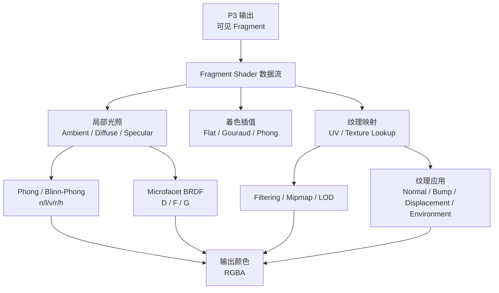

# Week 7-9 / Part 4 Knowledge Graph

> **对象**：P4 / `week7-9`  
> **主题**：着色、光照、BRDF 与纹理映射  
> **输入 raw**：Stage 1 `20260625-234034`、Stage 2 `20260625-234459`、Stage 3 `20260625-235132`  
> **状态**：已通读全部 stage-1/2/3 `*.answer.md` 后生成；未追加 optional stage-4。

## 1. 认知阶梯

## 2. 节点清单

| 节点 | 认知目标 | batch | 关键素材 | Agent 须补充 |
|------|----------|-------|----------|--------------|
| Fragment Shading Pipeline | 知道 P4 接在 P3 哪一步后面 | `concept-breakdown-shader-data-flow`、`visual-explain-fragment-shading-pipeline` | vertex attributes、rasterizer interpolation、fragment inputs、uniform、sampler、output color | 用 Mermaid 明确 P3/P4 边界 |
| Local Illumination | 理解局部光照解决的颜色计算问题 | `concept-breakdown-local-shading-phong` | 法线、光源方向、视线方向、材质参数 | 先讲图形问题，再讲公式 |
| Lambert / Phong / Blinn-Phong | 掌握 ambient / diffuse / specular | `deep-dive-phong-blinn-lighting-example`、`source-skeleton-improved-illumination` | $\max(0,n\cdot l)$、$(r\cdot v)^p$、$(n\cdot h)^p$ | 给高光指数数值例 |
| Microfacet BRDF | 理解现代物理着色基础 | `concept-breakdown-microfacet-brdf`、`deep-dive-microfacet-brdf-visual` | BRDF 输入输出、D/F/G、Fresnel、roughness | 避免只堆公式，用视觉直觉解释 |
| Shading Interpolation | 区分 Flat / Gouraud / Phong Shading | `concept-breakdown-shading-interpolation`、`compare-shading-interpolation-methods` | 计算频率、插值对象、缺陷 | 用安全表格对比 |
| Texture Mapping | 理解 3D 表面到 2D 纹理空间 | `concept-breakdown-texture-mapping-basics` | parameterization、UV、perspective-correct interpolation | 修正 raw 中 UV 范围排版噪声为 $[0,1]$ |
| Texture Filtering | 理解采样走样与 Mipmap | `concept-breakdown-texture-filtering-applications`、`examples-texture-uv-filtering-applications` | nearest、bilinear、mipmap、trilinear、LOD、$D=\log_2 L$ | 解释 footprint 和 minification |
| Texture Applications | 认识纹理不仅存颜色 | `slide-skeleton-lecture08`、`examples-texture-uv-filtering-applications` | bump、normal、displacement、environment、illumination mapping | 明确“扰动法线”和“改变几何”的区别 |

## 3. 叙事承接表

| 指南章节 | 要回答 | 承接 | 引出 | raw |
|----------|--------|------|------|-----|
| 1. 知识地图 | P4 在管线中负责什么？ | P3 已生成可见 fragment | 片元颜色计算 | `visual-explain-fragment-shading-pipeline` |
| 2. 局部光照 | 表面点为什么有明暗和高光？ | fragment 有法线和位置 | Lambert / Phong / Blinn-Phong | `concept-breakdown-local-shading-phong` |
| 3. Microfacet BRDF | 经典高光如何走向物理材质？ | Blinn-Phong 半程向量 | D/F/G、Fresnel、roughness | `deep-dive-microfacet-brdf-visual` |
| 4. 着色插值 | 光照在哪个频率计算？ | P3 插值属性 | Flat / Gouraud / Phong 对比 | `compare-shading-interpolation-methods` |
| 5. Shader 数据流 | fragment shader 需要哪些输入？ | rasterizer 输出 fragment | uniform、sampler、output color | `concept-breakdown-shader-data-flow` |
| 6. Texture Mapping | 如何把图像贴到 3D 表面？ | fragment 有 UV | 透视校正与 texture lookup | `concept-breakdown-texture-mapping-basics` |
| 7. Filtering 与应用 | 纹理为什么会锯齿、模糊？ | UV lookup 需要采样 | mipmap、normal/displacement/environment | `examples-texture-uv-filtering-applications` |

## 4. batch → 章节映射

| batch | 整合深度 | 章节 |
|-------|----------|------|
| `overview-skeleton` | 中 | 知识地图、P3 承接 |
| `slide-skeleton-lecture07` | 高 | BRDF / microfacet |
| `slide-skeleton-lecture08` | 高 | Texture Mapping |
| `source-skeleton-improved-illumination` | 中 | Phong、Whitted、Fresnel、历史承接 |
| `concept-breakdown-local-shading-phong` | 高 | 局部光照公式 |
| `concept-breakdown-microfacet-brdf` | 高 | BRDF / D/F/G |
| `concept-breakdown-shading-interpolation` | 高 | Flat/Gouraud/Phong |
| `concept-breakdown-shader-data-flow` | 高 | Shader 数据流 |
| `concept-breakdown-texture-mapping-basics` | 高 | UV / 透视校正 |
| `concept-breakdown-texture-filtering-applications` | 高 | Filtering / applications |
| `visual-explain-fragment-shading-pipeline` | 高 | Mermaid 数据流 |
| `deep-dive-phong-blinn-lighting-example` | 高 | 公式与高光指数例 |
| `deep-dive-microfacet-brdf-visual` | 高 | Microfacet 视觉解释 |
| `compare-shading-interpolation-methods` | 高 | 对比表 |
| `examples-texture-uv-filtering-applications` | 高 | 纹理例子与应用 |

## 5. 课纲审计

- P4 在 `semester-parts.md` 与 16 周梳理中定义为 W7-W9：着色 / 光照 / 纹理。
- NotebookLM source 与该范围匹配：Week 7/8/9 笔记、Lecture07 Local Shading、Lecture08 Texture Mapping、Improved Illumination Model 论文。
- `overview-skeleton` 混入 Visibility / HSR，但该主题已在 P3 深入处理；P4 指南只作为 fragment 可见性承接，不重复展开。
- 未发现单独 GLSL / Project 代码框架 source；指南讲 shader 数据流，不写具体 API 或作业实现。
- Stage 2/3 raw 中 UV 范围出现引用排版噪声，最终指南应审计并写为 $[0,1]$。
