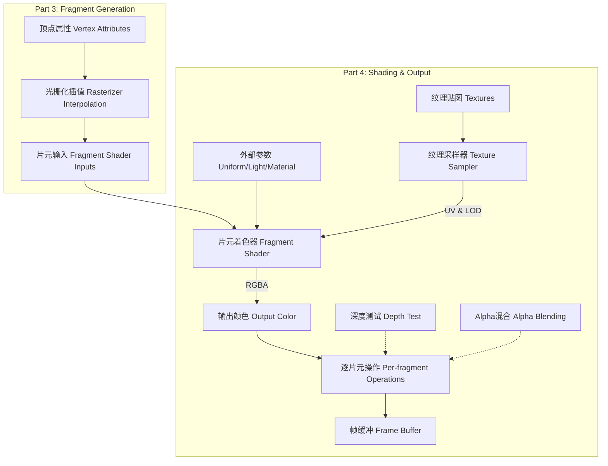

以下是根据 Week 7-9 课堂记录、课件 06 (Lecture 07) 及课件 07 (Lecture 08) 整理的从片元(Fragment)到最终颜色输出的数据流可视化解释素材。

### 1. 数据流步骤分解

#### 第一步：光栅化插值 (Rasterizer Interpolation)
*   **输入**：**顶点属性(Vertex Attributes)**，包括空间坐标 $(x, y, z)$、**纹理映射坐标 UV(UV Mapping，纹理映射坐标)**、顶点法线等 [1, 2]。
*   **处理**：**光栅化器(Rasterizer)** 遍历三角形覆盖的像素，利用 **重心坐标插值(Barycentric Coordinates Interpolation)** 将顶点属性分配到每个 **片元(Fragment)** [3, 4]。为了确保视觉正确，需执行 **透视校正插值(Perspective Correct Interpolation)** [1]。
*   **输出**：**片元着色器输入(Fragment Shader Inputs)**，即每个像素位置对应的插值属性 [2, 5]。

#### 第二步：外部参数注入 (Parameters Injection)
*   **输入**：
    *   **全局常量 Uniform(Uniform Variables，统一变量)**：由 CPU 设置，在所有片元中保持不变，如相机位置、光源参数 [3, 6]。
    *   **光源参数(Light Parameters)**：包括 **平行光/方向光 Directional Light(Directional Light，平行光)** 的方向、**点光源 Point Light(Point Light，点光源)** 的位置与衰减系数等 [3, 4]。
    *   **材质参数(Material Parameters)**：定义表面的 **双向反射分布函数 BRDF(Bidirectional Reflectance Distribution Function，双向反射分布函数)** 属性，如环境光系数 $k_a$、漫反射系数 $k_d$、高光系数 $k_s$ 和高光指数 $p$ [3, 4]。
*   **输出**：参与光照计算的数值常量 [3]。

#### 第三步：纹理采样 (Texture Sampling)
*   **输入**：插值得到的 UV 坐标、**纹理采样器(Texture Sampler)** [2]。
*   **处理**：
    *   采样器根据 UV 坐标在纹理图像中查找像素 [2]。
    *   为了防止 **走样(Aliasing)**，会根据 **多细节层次 LOD(Level of Detail，多细节层次)** 选择合适的 **多级纹理映射 Mipmapping(Mipmapping，多级纹理映射)** 层级进行三线性插值，或使用 **各向异性过滤(Anisotropic Filtering)** 提升斜视效果 [1, 2]。
    *   可结合 **法线贴图(Normal Map)** 对插值法线进行扰动，增加细节 [1, 3]。
*   **输出**：采样的颜色值或法线扰动值 [1]。

#### 第四步：片元颜色计算 (Color Calculation)
*   **输入**：插值属性、外部参数、纹理采样结果。
*   **处理**：在片元着色器中执行光照模型（如 **冯氏着色 Phong Shading** 或其变体 **Blinn-Phong**）。计算 **环境光(Ambient)**、**漫反射(Diffuse)** 和 **镜面高光(Specular)** 的总和 [3, 4]。
*   **输出**：**输出颜色(Output Color)**，通常为包含 **阿尔法通道(Alpha Channel)** 的 RGBA 值 [4, 7]。

#### 第五步：逐片元操作与输出 (Per-fragment Operations)
*   **输入**：计算出的片元颜色、当前片元的深度值。
*   **处理**：
    *   **深度测试 Depth Test(Depth Test，深度测试)**：将片元深度与 **深度缓冲区 Z-Buffer(Depth Buffer，深度缓冲区)** 中的值比较，若被遮挡则丢弃 [4, 5]。
    *   **Alpha混合(Alpha Blending)**：若物体半透明，则根据 Alpha 值将当前颜色与 **帧缓冲(Frame Buffer)** 中的底色混合 [7]。
*   **输出**：更新后的 **帧缓冲(Frame Buffer)** [5]。

---

### 2. Mermaid 流程图素材

可以使用以下节点和逻辑构建流程图：

### 3. 核心边界明确 (Focus Map)
*   **顶点属性边界**：从建模数据到光栅化前的原始输入 $(x,y,z,u,v,n)$ [2, 8]。
*   **插值边界**：光栅化器将顶点属性转换为像素级片元属性的过程 [3, 4, 9]。
*   **着色器边界**：片元着色器是计算核心，它接收插值数据、Uniform 参数并调用采样器 [3, 4, 6]。
*   **缓冲区边界**：深度测试决定了片元是否能最终写入帧缓冲，是可见性确定的最后防线 [5, 10]。